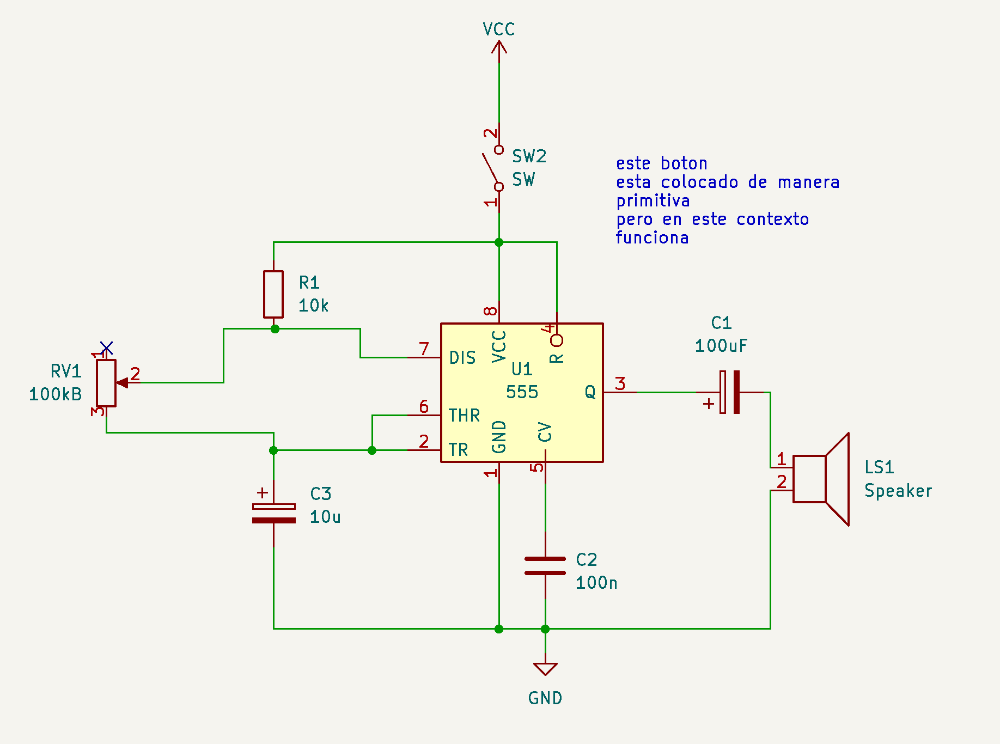

# sesion-03a

martes 24 marzo 2026

hoy trabajamos con la salida del circuito astable del 555, que era originalmente un LED con un resistor.

reemplazamos el LED y resistor, por un capacitor y un parlante.

para hacer las conexiones usamos cables caimán / alligator clip.

vimos los efectos de cambiar una resistencia y un capacitor en el circuito, y cómo afecta la frecuencia de oscilación del circuito.

## encargo-03a

1. expandir el circuito usado, agregando más interruptores para crear el circuito toy organ disponible en <https://www.555-timer-circuits.com/toy-organ.html>. otra versión del circuito se incluye a continuación, diagramada por misaa hoy. documentar todos los aciertos y errores en la bitácora.
2. ver documental variaciones espectrales sobre la vida de josé vicente asuar, disponible en <<https://www.youtube.com/watch?v=sJ9EZWBZee8>. incluir apuntes e investigación asociada a la bitácora.

