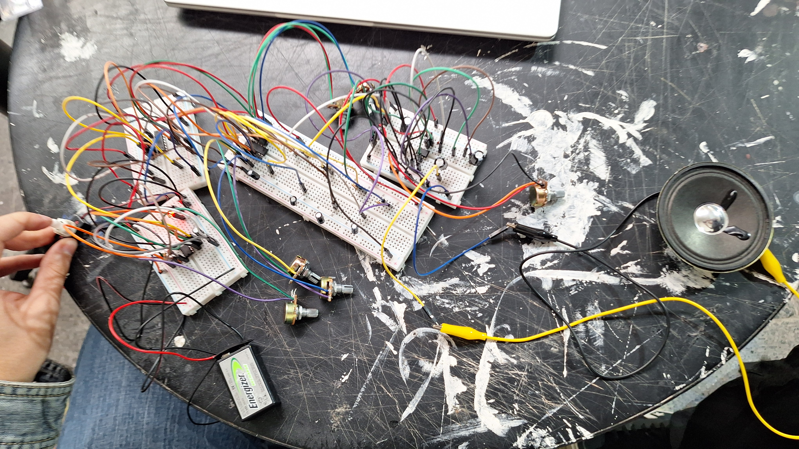
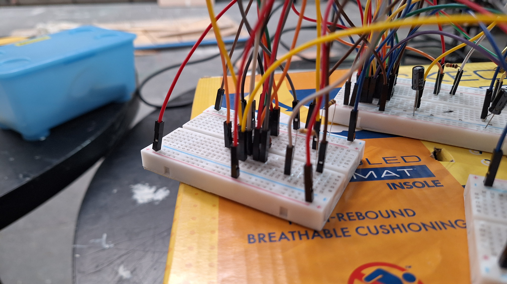
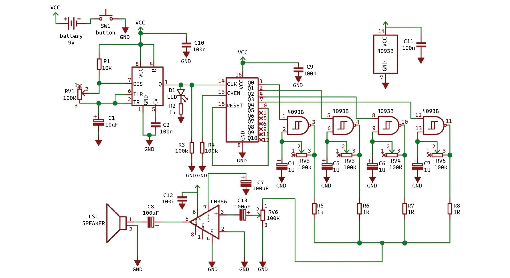
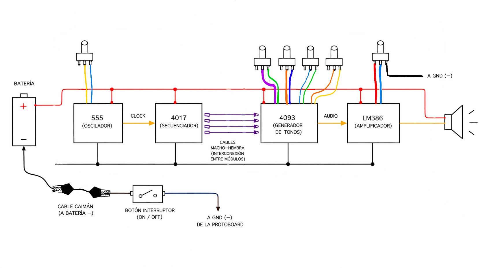
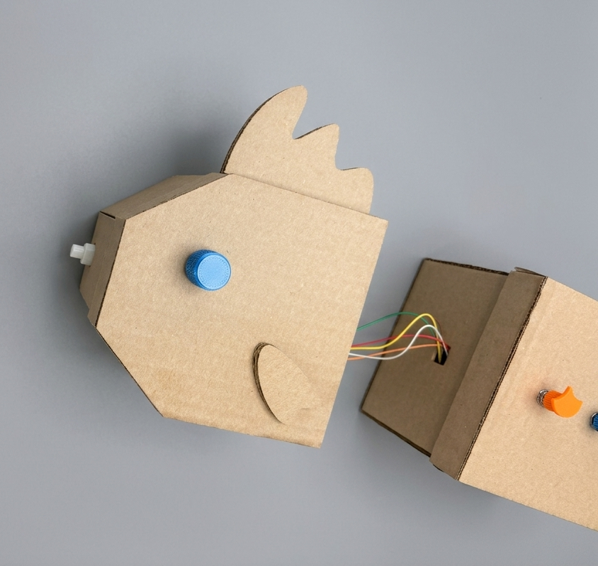

# grupo-02

Pescado Rabioso

## integrantes

- Benjamín Álvarez - benjaminalvarez21
- Tomás Catrileo - tomascatri
- Anays Cornejo - Anaysval

## descripción del sintetizador realizado

Este proyecto consiste en la construcción de un sintetizador que permite generar y modificar sonidos. Lo construimos utilizando dos cajas de cartón que forman un pez, donde organizamos los componentes en distintas partes.

En la cabeza del pez instalamos un temporizador 555, un secuenciador 4017 y un interruptor ON/OFF para encender y apagar el sistema. El 555 genera pulsos que se envían al 4017, haciendo que active sus salidas una por una y cree la secuencia. Además, agregamos un potenciómetro en la posición del ojo, que permite controlar la velocidad del ritmo. La cabeza se conecta con el cuerpo mediante cables macho-hembra, donde se ubica un 4093 que modifica la señal y aporta la textura del sonido, junto con cuatro potenciómetros en el lomo que permiten variar los tonos.

La señal parte en el 555, pasa al 4017 que genera la secuencia, luego el 4093 modifica el sonido y finalmente el LM386 lo amplifica antes de llegar al parlante. En la parte trasera se encuentra el potenciómetro de volumen, ubicado cerca de la cola, que permite ajustar la intensidad del sonido. Esto permite que cualquier persona pueda interactuar con el sintetizador y modificar el ritmo, los tonos y el volumen en tiempo real.

### Sintetizador en su contexto

### Video sintetizador

## proceso y resultados del reloj y secuenciador

### Generador de clock (555)

El primer chip que utilizamos fue el 555 en modo astable, lo que significa que funciona como un oscilador capaz de generar una señal cuadrada continua.

- El pin 1 se conecta a GND y el pin 8 a VCC.
- Los pines 2 (Trigger) y 6 (Threshold) están conectados entre sí, lo que permite que el circuito detecte cuándo comenzar y reiniciar el ciclo de temporización.
- La frecuencia del oscilador se controla mediante el potenciómetro (RV1) junto con el capacitor C1, lo que nos permite ajustar el tempo del clock.
- El pin 3 es la salida, desde donde obtenemos la señal cuadrada (LFO). Esta salida se conecta a un LED (para visualizar el pulso) y también al pin 14 (CLK) del 4017.

### Problemas y resultados con el 555

No tuvimos problemas al armar el circuito. El único inconveniente fue que varios chips 555 se nos quemaban, y hasta ahora seguimos sin saber la causa exacta de por qué pasaba.

Esto nos frustró un poco, pero después de varios intentos logramos que funcionara correctamente.

### Secuenciador (4017)

El segundo integrado es el 4017, un contador decimal que activa sus salidas de forma secuencial con cada pulso de reloj recibido.

- El pin 14 (CLK) recibe la señal proveniente del 555.
  
Utilizamos las salidas:

- Q0 (pin 3) → STEP 1
- Q1 (pin 2) → STEP 2
- Q2 (pin 4) → STEP 3
- Q3 (pin 7) → STEP 4
  
Cada una de estas salidas activa un LED, permitiendo visualizar la secuencia de pasos.

### Problemas y resultados con el 4017

El 4017 no presentó problemas al inicio. En una protoboard grande, el circuito funcionaba correctamente al conectarlo solo con el 555.

Pero al integrarlo con el resto del sistema (4093 y LM386), el sonido resultaba muy bajo. Esto ocurría porque los LEDs conectados al 4017 consumían demasiada corriente, reduciendo la energía disponible para la etapa de audio.

La solución que nos recomendaron fue retirar los LEDs del circuito del 4017. Una vez hecho esto, el sistema funcionó correctamente y el sonido volvió a escucharse fuerte.

Finalmente, para optimizar el espacio, trasladamos el 4017 a una protoboard más pequeña sin afectar su funcionamiento.

### Protoboard anterior

### Protoboard actualizada

## proceso y resultados de osciladores y amplificador

En la segunda parte del circuito se encuentran los osciladores y el amplificador, formados por el 4093 y el LM386. El 4093 tiene 4 compuertas NAND con disparador Schmitt, las cuales utilizamos como osciladores para generar sonido. Cada una de estas compuertas está controlada por un potenciómetro junto a un condensador, lo que permite variar su frecuencia. En otras palabras, cada potenciómetro cambia el tono del sonido, haciéndolo más agudo o más grave.

Durante la construcción del 4093 tuvimos un problema que nos frustró, ya que no nos dimos cuenta de que habíamos conectado mal algunos cables. Debido a esto, el circuito no funcionaba correctamente, por lo que decidimos desarmarlo y armarlo nuevamente de forma más ordenada, fijándonos bien en las conexiones. Después de eso, el circuito funcionó correctamente.

| Compuertas Individuales | Pruebas de Conjunto |
| :--- | :--- |
| **1. Primera compuerta sola**    | **3. Dos compuertas juntas**    |
| **2. Segunda compuerta sola**    | **5. Tres compuertas juntas**    |
| **4. Tercera compuerta sola**    | **7. Cuatro compuertas juntas**    |
| **6. Cuarta compuerta sola**    | **8. Circuito Completo**    |

Cada una de estas señales se conecta al potenciómetro de volumen, que permite controlar qué tan fuerte se escucha el sonido antes de enviarlo al amplificador. Así, se pueden ajustar y combinar los distintos tonos de forma más simple.

Finalmente, la señal llega al LM386, que es el amplificador de audio del circuito. En este caso no utilizamos los pines 1 y 8, por lo que la ganancia se mantiene en su valor básico. La salida se obtiene a través del pin 5, el cual está conectado a un parlante de 8 ohm, completando así el circuito de sonido. Además, observamos que al cambiar los condensadores del LM386 cambia la intensidad del sonido: con uno de 100 µF el sonido se escuchaba más fuerte y más grave; con uno de 10 µF se escuchaba más bajo y más agudo; y con uno de 1 µF aún más bajo y agudo.

### Prueba de Condensadores

| Componente | Video |
| :--- | :--- |
| **Condensador 1uF** |  |
| **Condensador 10uF** |  |
| **Condensador 100uF** |  |

Terminamos usando el condensador de 100 µF  ya que era el que se escuchaba mejor y más fuerte.

## modificaciones realizadas a los circuitos originales

Hicimos algunos cambios para que el circuito funcionara mejor. Primero, quitamos los LEDs del 4017, ya que consumían demasiada corriente y hacían que el sonido se escuchara muy bajo. Al sacarlos, el sonido se escuchó más fuerte, también fue necesario quitar sus resistencias.

### 4017 con luces LEDs

### 4017 sin luces LEDs

Además, agregamos un botón de encendido y apagado (ON/OFF). Lo pusimos en la misma zona donde está el 555, pero no es parte de ese circuito, lo hicimos así solo para ahorrar espacio, ya que es una conexión pequeña.

| Configuración | Video |
| :--- | :--- |
| **Sintetizador sin botón** |  |
| **Sintetizador con botón** |  |

Por último, soldamos los potenciómetros a cables para poder alejarlos del circuito y ubicarlos en distintas partes de la estructura.

### Potenciómetro antes (sin soldar)

### Potenciómetro después (soldado)

## carcasas de cartón

Nuestra idea inicial era separar el circuito en dos módulos: por un lado el 555 junto al 4017, y por otro el 4093 y el LM386. Al comienzo tuvimos distintas propuestas que no nos convencían completamente, por lo que seguimos conversando hasta que surgió el comentario de que las cajas parecían latas de sardinas. A partir de eso, pensamos en trabajar con la idea de una lata y un pez, lo que finalmente evolucionó hacia un diseño de pez dividido en dos módulos: cabeza y cuerpo. Esta propuesta nos gustó bastante, por lo que decidimos desarrollarla y comenzamos a bocetear su forma.

Posteriormente, realizamos un modelado 3D de la caja y la enviamos a corte láser, para lograr un mejor oficio. La carcasa fue construida con cartón corrugado de 3 mm, material que compramos para el desarrollo del proyecto.

La disposición de los componentes se basó en la estructura del circuito, organizándolos de izquierda a derecha, comenzando con el 555 y terminando en el LM386. En cuanto a las decisiones estéticas, definimos que un potenciómetro representara el ojo del pez, mientras que el botón de ON/OFF funcionara como su boca. Las conexiones macho-hembra que unen la cabeza con el cuerpo se hicieron pasar por un pequeño orificio, simulando de cierta manera las tripitas del pez.

En la caja correspondiente al cuerpo se ubicaron los cinco potenciómetros de forma ordenada. Estos se integraron visualmente como parte del diseño del pez, ya que cada uno cuenta con una pequeña cubierta impresa en 3D con forma de escama, lo que ayuda a representar la superficie externa del pez.  Además, ubicamos el parlante cerca de la cola, tanto para respetar el recorrido del circuito como para aprovechar mejor el espacio disponible. Finalmente, incorporamos aletas y cola para reforzar la forma del pez.

### Proceso carcasa

### Carcasa vacía

## interconexión entre módulos

Para la conexión entre los distintos módulos se utilizaron cables de colores con el fin de facilitar la organización del circuito. Las conexiones de alimentación positiva se realizaron con cables rojos y naranjos. Las conexiones a tierra (negativo) se identificaron con colores oscuros como negro, café o azul.

El parlante se conectó mediante cables caimán. El botón interruptor no se conecta directamente a la protoboard, sino que se fija mediante su soporte de montaje, y desde ahí se enlaza al circuito mediante cables. La alimentación del sistema se realiza desde una batería: el terminal positivo se conecta directamente al positivo de la protoboard, mientras que el terminal negativo se conecta mediante un cable caimán a un terminal del botón interruptor. El otro terminal del botón se conecta a GND o negativo de la protoboard, permitiendo así el encendido y apagado del circuito mediante su accionamiento.

Los potenciómetros fueron soldados a cables con el objetivo de poder ubicarlos fuera de la protoboard, lo que facilita su manipulación durante el funcionamiento del circuito. Además, se utilizaron cables macho-hembra para interconectar los distintos módulos, específicamente entre los chips 4017 y 4093, permitiendo separar físicamente los dos módulos del circuito sin afectar su operación. Del mismo modo, este tipo de cables también lo usamos para extender la distancia de los potenciómetros, mejorando la movilidad y el ajuste dentro de la carcasa del proyecto.

El sistema se construyó utilizando cables Dupont tanto para el circuito principal como para las interconexiones entre módulos, permitiendo la conexión de los distintos componentes del circuito de forma ordenada y funcional.

## resultados finales

El resultado es un sintetizador modular funcional con forma de pez, hecho con cartón corrugado de 3 mm mediante corte láser. El sistema está dividido en dos partes (cabeza y cuerpo), lo que ayudó a ordenar mejor los componentes y sus conexiones.

El circuito permite generar, secuenciar y modificar sonidos. La señal parte en el 555, pasa al 4017 que crea la secuencia, luego el 4093 modifica los tonos y finalmente el LM386 amplifica el sonido hacia el parlante.

La interfaz permite que el usuario interactúe fácilmente mediante potenciómetros que controlan la velocidad, los tonos y el volumen. Estos están ubicados en distintas partes del pez, lo que hace más fácil usarlos.

El sintetizador funciona correctamente y responde a los cambios que hace el usuario, permitiendo variar el ritmo, el tono y la intensidad del sonido.

## aprendizajes y errores

- Aprendimos que las luces LED pueden afectar la potencia del sonido en el altavoz.

- A veces las protoboard largas no distribuyen bien la energía en las líneas positiva y negativa, por lo que hay que conectarlas con un cable para extender la alimentación.

- Cambiar los condensadores en el sintetizador hace que el sonido sea más agudo o más grave: a mayor valor (más µF), el sonido es más grave; a menor valor, más agudo.

- Si se cambian los condensadores en el LM386, también cambia el volumen: mientras mayor sea el valor (µF), mayor es el volumen.

- Descubrimos que el potenciómetro tiene una pequeña pieza metálica levantada, esta se llama pestaña anti rotación. Esto evita que todo el cuerpo del potenciómetro gire cuando giras la perilla para ajustar el volumen.

- Nos equivocamos al apresurarnos en dar alguna hipótesis de que algo podría estar mal como por ejemplo, culpar al chip de que estaba muerto, en vez de revisar bien las conexiones que estábamos haciendo.

- Y por último, aprendimos a no ser tan ansiosos y a celebrar nuestros pequeños logros.

## conclusiones

En este proyecto nos dimos cuenta de que separar el circuito en partes nos ayudó mucho, porque hacía todo más entendible y ordenado. Podíamos enfocarnos en una cosa a la vez y después juntar todo sin tanto enredo, lo que hizo el proceso más manejable.

Al trabajar con cartón como material principal nos costó al inicio pensar en una estética clara, pero gracias a las decisiones del grupo y al uso del corte láser logramos darle una mejor forma al proyecto, haciendo que la estructura quedara más ordenada y con una intención más clara.

La forma de pez dividida en dos partes nos ayudó a organizar mejor los componentes internos y también hizo que el proyecto fuera más llamativo e interactivo.
Como grupo, fue clave ir conversando todo. Al principio teníamos varias ideas que no nos convencían mucho, pero probando y discutiendo llegamos a un acuerdo. Durante el proceso tuvimos errores, pero entre los tres fuimos resolviendo las cosas y apoyándonos para que funcionara.

En la parte electrónica aprendimos harto haciendo, más que nada a prueba y error. Nos equivocamos varias veces, quemamos componentes, conectamos mal cosas y el sonido no siempre funcionaba como esperábamos. Pero todo eso sirvió para entender mejor cómo funciona el circuito y por qué cada conexión importa. También aprendimos a leer mejor los esquemáticos de los circuitos, lo que nos facilitó su construcción, y a dibujar nuestro propio esquemático.

Finalmente, usar modelado 3D y corte láser hizo que todo se viera más ordenado y que todo encajara mejor. En general, sentimos que el proyecto terminó siendo más completo, porque no era solo un circuito, sino un objeto que funciona y que también tiene una intención en cómo se ve y se usa.

## bibliografía

<https://www.elprocus.com/555-timer-pin-description-applications/>

<https://www.instructables.com/Know-Your-IC-LM386/>

<https://www.build-electronic-circuits.com/4000-series-integrated-circuits/ic-4093/>

<https://www.build-electronic-circuits.com/4000-series-integrated-circuits/ic-4017/>

<https://boardmix.com/es/knowledge/block-diagram/>
