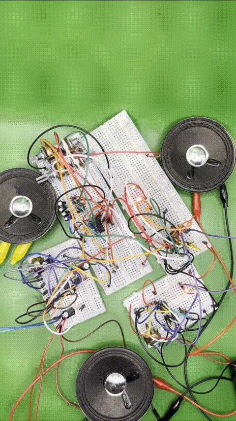
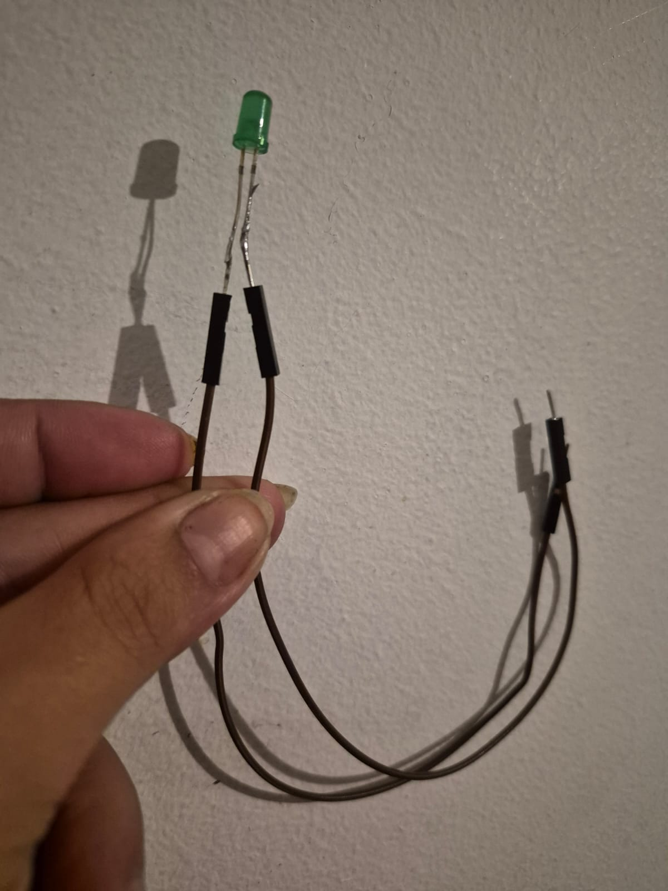

# grupo-03

## integrantes

- Catalina Balboa
- Catalina Jeria
- Angel Sabogal

## descripción del sintetizador realizado

Construimos un sintetizador a partir de 4 secciones que describiremos como: **Clock Generator** construido a partir de un chip 555 (el C1 "condensador" y RV1 "potenciómetro" controlan la frecuencia del clock) además de conectar el capacitor cerámico cerca del chip para brindarle mayor estabilidad a esta parte del circuito en concreto y posteriormente se le agregará también uno a cada chip del circuito con el fin de que tengan un circuito estable. La siguiente parte es el **Secuenciador** que se hace con el chip 4017, el cual tiene un led por cada conexión STEP "son 4" y a este se le conecta el Clock para poder comprobar que los electrones están fluyendo correctamente por el circuito y esto nos lo dicen los leds encendiéndose en secuencia uno después de otro. Continuamos con el **Sintetizador** tratándose esta vez del chip 4093 en donde a las patas 1, 5, 8 y 12 se les conectan respectivamente los STEPS 1, 2, 3 y 4 y desde las patas 3, 4, 10 y 11 pasando por las resistencias que convergen en un mismo punto se conecta el cable que une el mix y además se le conecta directamente del chip de la pata 7 a GND (Tierra) y la 14 a VCC (Positivo) "C y RV de cada compuerta controlan frecuencia de oscilador Schmit Trigger. POT Puede ser reemplazado por LDR, resistencia experimental, etc". Y por último para la salida el MIX que venía del sintetizador se conecta al potenciómetro que va conectado al chip LM386 de **Salida** y este potenciómetro es para el volumen por lo que en este mismo chip al tener ya todo conectado finalizamos colocando el parlante (lo que le da vida al sonido si todo está funcionando correctamente).

En nuestro caso utilizamos los condensadores predeterminados para terminar el circuito, los cuales funcionaron en el sintetizador sonando de manera aguda y vibrante en cada uno de sus 4 tiempos; de esto se encargan principalmente los chips y los potenciómetros, que les daban un tono distinto dependiendo de lo drástico que fuera cambiar la posición de la perilla. Por ejemplo, el primer potenciómetro marca la velocidad en la que cambia de un sonido a otro o de una luz a otra (la luz y el sonido actuaban a la misma vez dependiendo del Step en el que se encuentre); esto marca la velocidad de cambio. En la parte del sintetizador se encuentran las conexiones de los 4 potenciadores que actuaban directamente con cada uno de los 4 tiempos, pero de manera individual y solo le cambia el sonido al Step que esté asociado, produciendo que cambie su tonalidad al pasar por ese punto del circuito, y el volumen se puede cambiar con el potenciómetro del final del circuito para comodidad auditiva.

El sintetizador va a ser dispuesto en una caja de cartón producida para mayor comodidad del usuario que interactúe esto por medio de los cables (Jumpers) que van de la protoboard hasta los extremos de salida de la caja; puede ser soldando o reajustando de una manera estética, y así es como finalmente, gracias a todos los componentes y las explicaciones de los profesores durante clase, más el esquema y varios intentos fallidos, tenemos un sintetizador realizado con cada conexión precisa, ya que es importante tener conectada cada cosa en su lugar para que funcione correctamente, teniendo en cuenta que los chips pueden ser inestables y que las baterías son de 9 voltios recargables.

Acá, imagen del sintetizador en su primer contexto funcionando:

## proceso y resultados del reloj y secuenciador

Como describimos anteriormente, con los chips 555 y 4017 se nos hizo muy sencillo que funcionaran, más que nada por la práctica que teníamos con el 555. Conectamos de manera sencilla todos los LEDs, resistencias y condensadores, permitiendo cambiar la velocidad de cambio de luces con el potenciómetro, y lo único que cambia es que, en un principio es que desarrollamos cada circuito por separado, conectando así las protoboard en positivo y negativo por medio de Jumpers para transmitirles la señal del circuito.

Lo principal del chip 555 es que las patas 6, 2, 1, 5 y 3 se conectan a GND (tierra), y las 7, 8 y 4 a VCC, que sería el positivo, con el detalle de que convergen en las patas 7, 6 y 2 en el potenciómetro, lo que permite controlar, en el chip 4017, los LEDs conectados en las patas 3, 2, 4 y 7 (los que están asociados a los steps en el esquema).

## proceso y resultados de osciladores y amplificador

Con los chips 4093 y 386 sí fue un poco más complejo saber si funcionaban, ya que tuvimos varios chips que terminaron dañándose por hacer mal las conexiones o porque venían con fallas o con la funcionalidad limitada de fábrica, y a partir de que sonara o no, deducíamos si estaba mejor o peor conectado. También hicimos estas dos partes del circuito por separado, uniendo los polos positivo y negativo entre sí para mandar la señal de los electrones y que sonara.

El detalle de estos, en específico el 4093, era que en cada step de este (sintetizador) había que tener en cuenta que sonara a la vez que se prendía una luz en el secuenciador; de esto nos dábamos cuenta de que funcionaba, pero principalmente conectamos todo para poner a prueba definitivamente estos dos.

Las conexiones clave para estos son los “Mix” en el 4093, que salen de la conexión 3 de los potenciómetros. Se utilizan las 14 patas, la 7 sola yendo a GND y la 14 a VCC.

## modificaciones realizadas a los circuitos originales

incluir texto, imágenes sobre modificaciones realizadas a los circuitos originales, incluyendo el proceso de diseño, pruebas y resultados obtenidos.

incluir modificaciones en posición, chips, parámetros, valores, etc.

## carcasas de cartón

textos, imágenes

incluir origen de materiales, decisiones de posiciones de los componentes, decisiones estéticas, pruebas, resultados obtenidos.

## interconexión entre módulos

Para la conexión dentro del circuito y la protoboard se utilizaron jumpers, por donde se transmiten los electrones que circulan desde cada pata de los chips, pasando por los potenciómetros y los LEDs. En nuestro proyecto final reducimos las protoboards utilizadas, con el fin de mantener una estética más compacta, y seguimos usando jumpers, además de soldar los potenciómetros para que puedan extenderse más. El de la izquierda del parlante funciona como control de velocidad y el de la derecha como volumen.

Los otros cuatro, que sobresalen alejados del parlante, modifican el sonido de cada uno de manera individual. Todos estos sobresalen de la caja para funcionar como perillas. También se soldaron solo tres LEDs, excepto el cuarto, que ya sobresalía por sí mismo.

Los colores de los LEDs utilizados fueron naranja, rojo, verde y blanco. Con el parlante usamos caimanes para transmitir la señal, y todo quedó conectado mediante cables extraíbles en la protoboard que se encuentra dentro de la caja.

## resultados finales

Como resultado final para esta primera parte del proyecto, tenemos un sintetizador el cual su circuito esta dentro de una caja de cartón reciclada, en donde en la parte superior lo que primero vemos es el parlante, luego a sus lados dos potenciómetros y por el frente de este parlante tenemos las LEDS que van prendiendose mediante el patrón de sonido que podemos crear. En la parte lateral tenemos 4 potenciómetros, quienes son los responsables de crear el ritmo que deseemos. 

imagen

video / audio

## aprendizajes y errores

Una de las mejores lecciones que aprendimos es que el mundo es perfecto ni funciona como queremos, al igual que pasa con los chips cuando vienen defectuosos de fábrica y no funcionan a la primera. Los errores más comunes que nos ocurrían eran tener la batería descargada o que los cables estuvieran movidos una celda más de donde deberían, además de confusiones al conectar chips erróneos y cables sueltos que generaban conexiones inexistentes. Incluso las resistencias, que algunas tenían colores parecidos, nos causaban problemas.

Todos estos los fuimos resolviendo hablando con compañeros y compañeras que ya habían pasado por lo mismo o sabían cómo hacerlo, y también con quienes estaban en la misma etapa del circuito que nosotros. Así fuimos considerando distintos puntos de vista, repasando el esquema paso a paso, rearmando desde cero las partes que no funcionaban y cambiando aquellas que creíamos que podían haberse dañado.

## conclusiones

A modo de conclusión, podemos afirmar que el trabajo en equipo fue bastante positivo, ya que existió una muy buena relación y comunicación entre todos los integrantes. Cada uno aportó al equipo, ya fuera conectando cables, ayudando a interpretar los esquemáticos o registrando cada etapa del proceso. Sin embargo, no se trató de roles rígidos, sino que como grupo procuramos colaborar de manera conjunta en las distintas tareas del proyecto.

En cuanto al desarrollo del proyecto, podemos señalar que enfrentamos diversas complicaciones y errores, los cuales supimos resolver, ya sea de manera autónoma o solicitando apoyo a otros equipos. Una estrategia que resultó especialmente útil fue revisar cada esquema paso a paso, verificando que todas las conexiones estuvieran correctas; en caso contrario, optábamos por comenzar nuevamente o comprobar el funcionamiento de las partes por separado.

Durante el proceso también fue necesario adquirir más materiales, como dos protoboards de mayor tamaño, circuitos integrados (“chips”) adicionales y cables Dupont, entre otros.

En términos generales, como equipo quedamos bastante conformes con el resultado obtenido. Además, planeamos seguir trabajando en este proyecto a lo largo del semestre. Considerando que este fue nuestro primer acercamiento a la electrónica y a los sintetizadores, valoramos positivamente esta experiencia, teniendo en cuenta los errores cometidos y las lecciones aprendidas.
