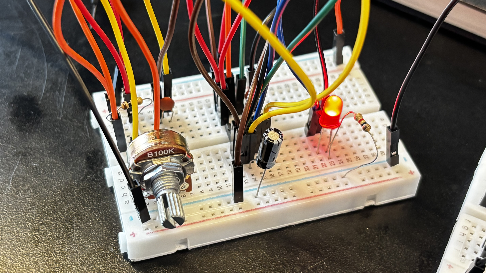
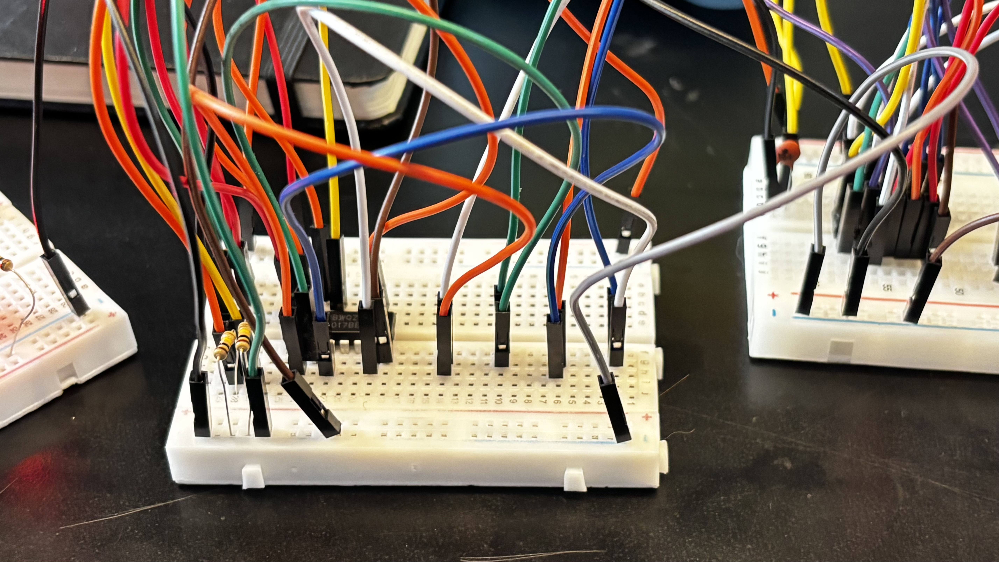
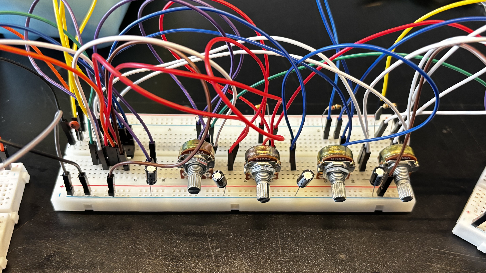
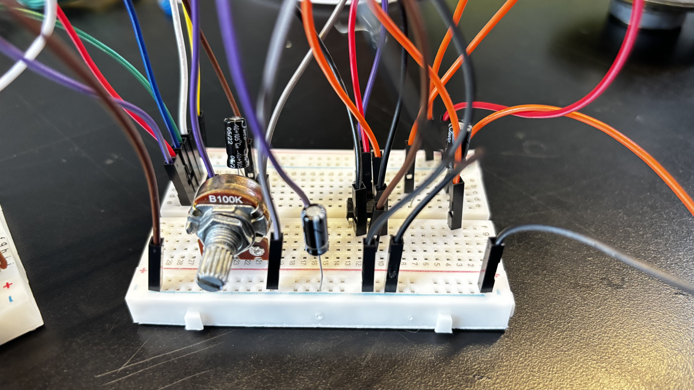
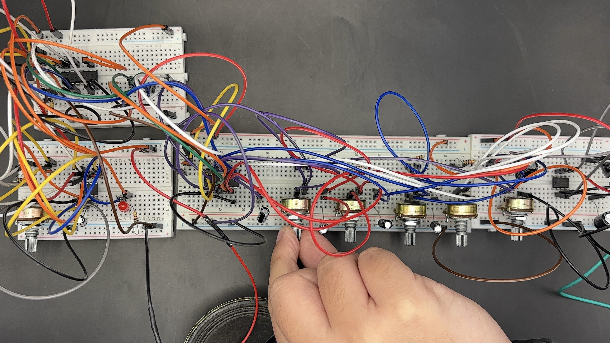

# el tincado-04

## integrantes
+ antonia loch
+ nicolás valdés
+ carla núñez

## descripción del sintetizador realizado

el tincado nace a partir de la práctica y aprendizaje que tuvimos a lo largo de las clases, donde como primer gran proyecto se nos propuso elaborar un sintetizador de cuatro pasos, el cual contiene los siguientes componentes: protoboard, chip NE555, chip CD4017, chip CD4093, chip LM386, cables dupont, resistencias (1k, 10k, 220Ω), capacitores (1µF, 10µF, 100µF), capacitores cerámicos (104 nF), potenciómetros (B100K), LED, parlante y batería 9v. con esto logramos seguir el esquemático que se nos otorgó para realizar nuestro propio módulo de sonido.

en nuestro caso, no hicimos variaciones dentro del esquemático que se nos entregó, ya que cuando logramos que funcionara el sintetizador fue gracias a la ayuda de nuestros compañeros Vania y Nicolás, los cuales, luego de escuchar que por fin el trabajo estaba emitiendo sonidos, nos recomendaron cambiar los capacitores que se encuentran dentro del circuito del chip 4093 por unos de 1µF. ya que nosotros los teníamos con capacitores de 10µF  y 100µF, lo cual no lograba hacer sonidos tan notorios como lo es ahora que solo tiene capacitores de 1µF, ya que este permite que circulen los electrones de manera más libre y así es como se logran los sonidos más agudos. a pesar de no tener cambios en los capacitores, sí tenemos cambios notorios en lo que es la parte del chip 555, el cual tuvo una intervención por nuestros compañeros y notamos un cambio en conexiones como lo es en el pin 4 y 8, lo cual desarrollaremos en su propia sección.

para adaptar los componentes a su carcasa, decidimos alargar los cables dupont usando cables con el sistema plug-jack, logrando así que alcancen una distancia más larga y poder soldar los potenciómetros y el LED a estos para poder ubicarlos en sus lugares correspondientes. en el caso del parlante, que estaba originalmente haciendo contacto con el circuito mediante pinzas caimanes que se unían a cables dupont, los cuales se ubicaban en el lugar que les correspondía dentro de la protoboard, decidimos soldar directamente a cables Dupont para así dejar atrás las pinzas caimán y poder seguir con nuestras vidas.

imagen del sintetizador en su contexto

audio o video del sintetizador en acción

## proceso y resultados del reloj y secuenciador

### NE555

durante las clases no tuvimos problemas con el circuito del 555, pero al momento de hacerlo para el sintetizador modular tuvimos muchas confusiones y errores al momento del cableado. Como, por ejemplo, en un momento no entendíamos por qué el LED no demostraba las oscilaciones que se supone que debían estar sucediendo, hasta que nos dimos cuenta de que nos faltaba conectar el pin 7 a la resistencia de 10k, el cual se conectaba luego al segundo pin. otro problema que tuvimos con este chip fue que en un momento se reflejaba en el LED la velocidad de las oscilaciones que cambiabamos con el potenciómetro, pero en el parlante se seguía escuchando como si tuviera la misma velocidad; por lo que revisamos el circuito y Aarón se percató de que el dupont que hacía la interconexión entre la salida del 555 (pin 3) y la entrada del 4017 (pin 14) estaba conectado en el lado negativo del LED, lo cual no permitía que pasara mucho voltaje como lo haría en el lado positivo del LED.

+ adjuntamos link de registro de chip 555 funcionando: <https://youtu.be/ED_o7qv52xU>

### CD4017

el chip 4017 fue el único con el cual no tuvimos problemas, ya que cuando lo conectamos al 555 para probar si realmente estaba funcionando como secuenciador con los LEDs conectados, funcionó todo a la perfección y fue hermoso.

+ adjuntamos link de registro de chip 4017 funcionando: <https://youtu.be/dC0rdd23vHk>

incluir texto e imágenes sobre cableado, pruebas, resultados obtenidos.
## proceso y resultados de osciladores y amplificador

### CD4093 y LM386 

con los chips que más tuvimos problemas fueron el 4093 y el 386, ya que al inicio, cuando los armamos por primera vez y los conectamos al parlante para ver si sonaba, no pasó nada. como no entendíamos cuál era el problema, fuimos a buscar ayuda con Misa y nos explicó que deberíamos probar de manera independiente cada chip antes de conectar todo y probar con el parlante, por lo que hicimos exactamente eso. cuando probamos si funcionaba el 386, seguimos el esquemático que hizo Misa en la pizarra y no logramos ver que funcionara, por lo que pedimos ayuda a nuestros compañeros Vania y Nicolás que estaban junto a nosotros en el Laboratorio de Interacción Digital. Vania se acercó a ver nuestros circuitos, pero no pudo quedarse por mucho tiempo ya que tenía cosas que hacer, por lo que Nicolás se quedó con nosotros durante horas rehaciendo todos los circuitos y comparando nuestro trabajo con el de ellos para lograr identificar el problema, hasta que horas después logramos que sonara, pero de manera muy sutil gracias a la magia de nuestro compañero Nicolás, es decir que utilizamos las mismas conexiones que nuestro compañero Nicolás.

+ adjuntamos video de nuestro sinte funcionando de forma débil: <https://youtube.com/shorts/CgsAztNBeqE?feature=share>

cuando volvimos al LID, Aarón nos dijo que probáramos los potenciómetros que se encontraban en el circuito del chip 4093 de manera independiente, pero no entendimos mucho, así que nuestra compañera Cami nos ayudó a entender cómo se tenían que intercambiar los cables que estaban en cada potenciómetro para poder probar el sonido de cada uno de manera independiente. cuando lo hicimos, nos sorprendió que todos sonaban, pero al momento de conectar todo dejaban de funcionar. como teníamos clases, tuvimos que abandonar el trabajo por unas horas y nuestros compañeros Vania y Nicolás se volvieron a ofrecer para revisar nuestro trabajo, ya que el de ellos ya estaba listo, así que les agradecimos el apoyo y les dejamos nuestro trabajo mientras nosotros estábamos ausentes. cuando volvimos, nuestros compañeros nos informaron que el sintetizador finalmente estaba sonando, pero que tal vez sería buena idea cambiar el valor de los capacitores que teníamos en cada potenciómetro del 4093, ya que teníamos muchos condensadores de alto valor (10 uF, 100 uF) y esto afectaba al sonido que emitía nuestro sintetizador, por lo que decidimos cambiarlos todos a capacitores de 1 uF.

+ adjuntamos video de nuestro sintetizador funcionando: <https://youtu.be/AOrCcJQTMjA>

incluir texto e imágenes sobre cableado, pruebas, resultados obtenidos.

## modificaciones realizadas a los circuitos originales

incluir texto, imágenes sobre modificaciones realizadas a los circuitos originales, incluyendo el proceso de diseño, pruebas y resultados obtenidos.

incluir modificaciones en posición, chips, parámetros, valores, etc.

## carcasas de cartón

para la carcasa de nuestro sintetizador, utilizamos cartón corrugado simple, pegamento (uhu) y cinta americana. decidimos diseñar un archivo en rhino para facilitar el trabajo y realizar el corte en láser, esto nos permitió enfocarnos mucho más en el circuito de nuestro proyecto. nos centramos en una estructura simple de forma rectangular, tomando como referente los sintetizadores del laboratorio de interacción digital.

### la caja se diagramó por caras:
+ **cara superior:** contiene el sintetizador, el chip **4093** con los cuatro potenciómetros (**B2, B3, B4 y B5**), el clock generator, el chip **555** con el potenciómetro **B1**, un LED y el parlante para la salida de sonido.
+ **cara delantera:** contiene el estabilizador y el chip **LM386** con el potenciómetro **B6**.
+ **caras restantes:** consisten en cartón liso sin perforaciones.

textos, imágenes

incluir origen de materiales, decisiones de posiciones de los componentes, decisiones estéticas, pruebas, resultados obtenidos.

## interconexión entre módulos

textos, imágenes, diagramas de interconexión

## resultados finales

texto

imagen

video / audio

## aprendizajes y errores

las mejores lecciones aprendidas y los errores más comunes y cómo los resolvieron

## conclusiones

sobre modularidad, materialidad, trabajo en equipo, trabajo electrónico, trabajo maquinal.
