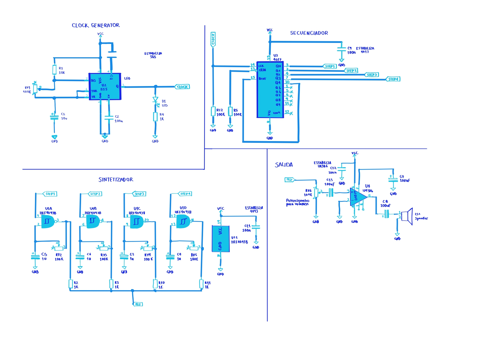
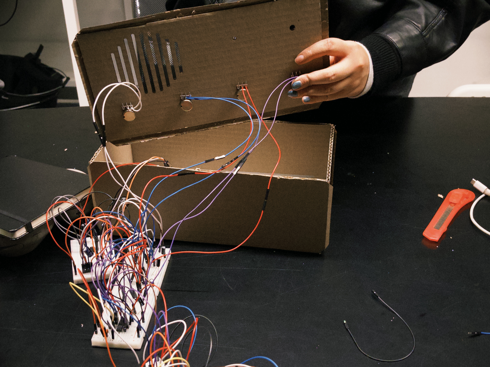
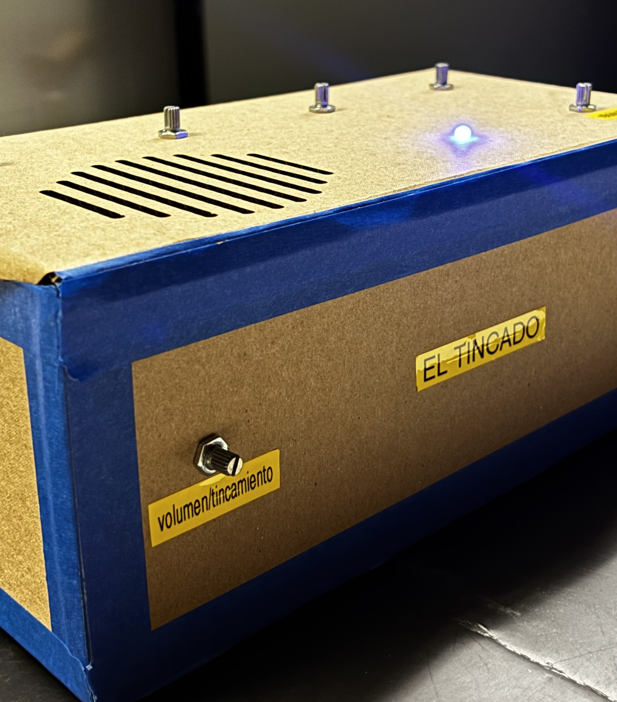
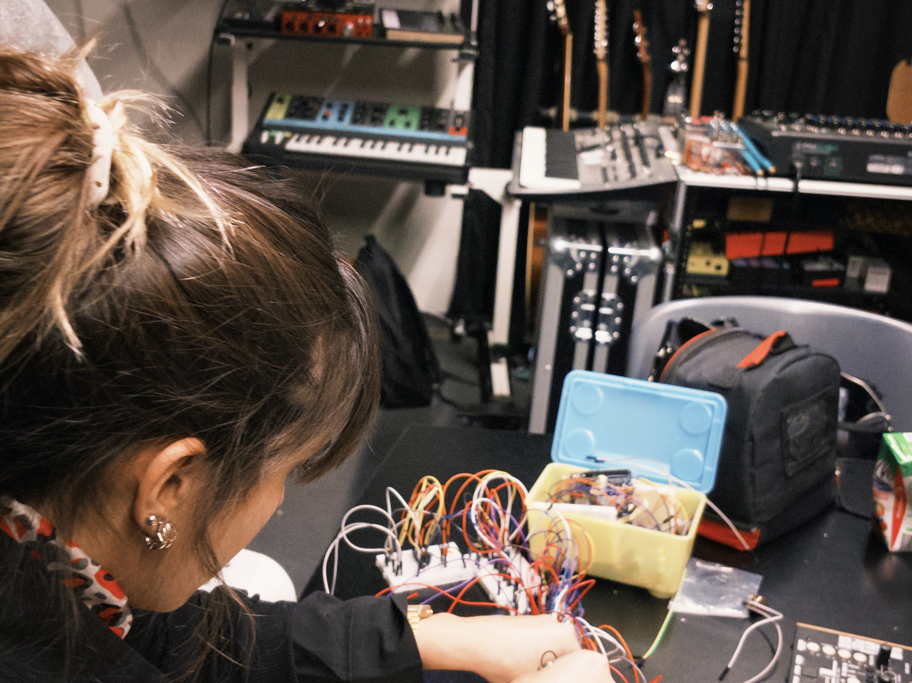
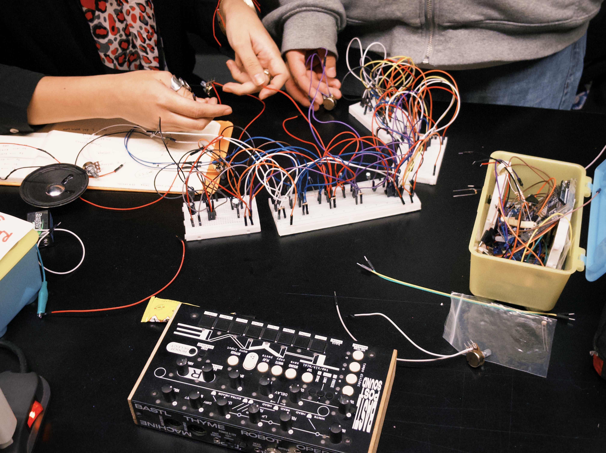

# el tincado-04

## integrantes

+ antonia loch
+ nicolás valdés
+ carla núñez

## descripción del sintetizador realizado

el tincado nace a partir de la práctica y aprendizaje que tuvimos a lo largo de las clases, donde como primer gran proyecto se nos propuso elaborar un sintetizador de cuatro pasos, el cual contiene los siguientes componentes: protoboard, chip NE555, chip CD4017, chip CD4093, chip LM386, cables dupont, resistencias (1k, 10k, 220Ω), capacitores (1µF, 10µF, 100µF), capacitores cerámicos (104 nF), potenciómetros (B100K), LED, parlante y batería 9v. con esto logramos seguir el esquemático que se nos otorgó para realizar nuestro propio módulo de sonido.

en nuestro caso, no hicimos variaciones dentro del esquemático que se nos entregó, ya que cuando logramos que funcionara el sintetizador fue gracias a la ayuda de nuestros compañeros Vania y Nicolás, los cuales, luego de escuchar que por fin el trabajo estaba emitiendo sonidos, nos recomendaron cambiar los capacitores que se encuentran dentro del circuito del chip 4093 por unos de 1µF. ya que nosotros los teníamos con capacitores de 10µF  y 100µF, lo cual no lograba hacer sonidos tan notorios como lo es ahora que solo tiene capacitores de 1µF, ya que este permite que circulen los electrones de manera más libre y así es como se logran los sonidos más agudos. a pesar de no tener cambios en los capacitores, sí tenemos cambios notorios en lo que es la parte del chip 555, el cual tuvo una intervención por nuestros compañeros y notamos un cambio en conexiones como lo es en el pin 4 y 8, lo cual desarrollaremos en su propia sección.

para adaptar los componentes a su carcasa, decidimos alargar los cables dupont usando cables con el sistema plug-jack, logrando así que alcancen una distancia más larga y poder soldar los potenciómetros y el LED a estos para poder ubicarlos en sus lugares correspondientes. en el caso del parlante, que estaba originalmente haciendo contacto con el circuito mediante pinzas caimanes que se unían a cables dupont, los cuales se ubicaban en el lugar que les correspondía dentro de la protoboard, decidimos soldar directamente a cables Dupont para así dejar atrás las pinzas caimán y poder seguir con nuestras vidas.

+ adjuntamos video de el interior de el tincado: <https://youtube.com/shorts/Cf6fAJbL6Gk>

### código, cableado y composición

establecimos un codigo de colores específico, donde cada color determina una cierta función permitiéndonos seguir un orden en el circuito.

| colores | funcionalidad |
| :--- | :--- |
| negro 🖤 | GND |
| rojo ❤️ | VCC, potenciómetro (B3)|
| gris 🩶 | capacitores |
| naranjo 🧡 | interconexiones entre pins, vcc entre protoboards  |
| cafe 🤎| GND entre protoboards|
| amarillo 💛 | capacitores cerámicos (104nF) |
| blanco 🤍 | resistencias |
| azul 💙 | LED, potenciómetro (B4) |
| morado 💜 | potenciómetro (B2) |

### composición

| componente  | funcionalidad | cantidad |
| ------------- | ------------- | ------------- |
| capacitor 1µF | almacenan energía electrostática en un campo eléctrico y la distribuyen al circuito según sea necesario  | 4 |
| capacitor 10µF  | "  | 1 |
| capacitor 100µF | " | 2 |
| capacitor 100nF  | "  | 3 |
| resistencia 1k  | regula el flujo de la corriente | 1 |
| resistencia 10k  | "  | 2 |
| resistencia 220  | " | 0 |
| NE555 | clock generator | 1 |
| CD4017 | secuenciador | 1 |
| CD4093 | sintetizador | 1 |
| LM386 | estabilizador | 1 |
| LED | mide la velocidad de las oscilaciones de el chip 555 | 1 |
| potenciometro | interfaz de control para la manipulacion de la constante de tiempo en los circuitos osciladores| 6 |

## proceso y resultados del reloj y secuenciador

### NE555

durante las clases no tuvimos problemas con el circuito del 555, pero al momento de hacerlo para el sintetizador modular tuvimos muchas confusiones y errores al momento del cableado. Como, por ejemplo, en un momento no entendíamos por qué el LED no demostraba las oscilaciones que se supone que debían estar sucediendo, hasta que nos dimos cuenta de que nos faltaba conectar el pin 7 a la resistencia de 10k, el cual se conectaba luego al segundo pin. otro problema que tuvimos con este chip fue que en un momento se reflejaba en el LED la velocidad de las oscilaciones que cambiabamos con el potenciómetro, pero en el parlante se seguía escuchando como si tuviera la misma velocidad; por lo que revisamos el circuito y Aarón se percató de que el dupont que hacía la interconexión entre la salida del 555 (pin 3) y la entrada del 4017 (pin 14) estaba conectado en el lado negativo del LED, lo cual no permitía que pasara mucho voltaje como lo haría en el lado positivo del LED.

+ adjuntamos link de registro de chip 555 funcionando: <https://youtu.be/ED_o7qv52xU>

### CD4017

el chip 4017 fue el único con el cual no tuvimos problemas, ya que cuando lo conectamos al 555 para probar si realmente estaba funcionando como secuenciador con los LEDs conectados, funcionó todo a la perfección y fue hermoso.

+ adjuntamos link de registro de chip 4017 funcionando: <https://youtu.be/dC0rdd23vHk>

## proceso y resultados de osciladores y amplificador

### CD4093 y LM386

con los chips que más tuvimos problemas fueron el 4093 y el 386, ya que al inicio, cuando los armamos por primera vez y los conectamos al parlante para ver si sonaba, no pasó nada. como no entendíamos cuál era el problema, fuimos a buscar ayuda con Misa y nos explicó que deberíamos probar de manera independiente cada chip antes de conectar todo y probar con el parlante, por lo que hicimos exactamente eso. cuando probamos si funcionaba el 386, seguimos el esquemático que hizo Misa en la pizarra y no logramos ver que funcionara, por lo que pedimos ayuda a nuestros compañeros Vania y Nicolás que estaban junto a nosotros en el Laboratorio de Interacción Digital. Vania se acercó a ver nuestros circuitos, pero no pudo quedarse por mucho tiempo ya que tenía cosas que hacer, por lo que Nicolás se quedó con nosotros durante horas rehaciendo todos los circuitos y comparando nuestro trabajo con el de ellos para lograr identificar el problema, hasta que horas después logramos que sonara, pero de manera muy sutil gracias a la magia de nuestro compañero Nicolás, es decir que utilizamos las mismas conexiones que Nicolás.

+ adjuntamos video de nuestro sinte funcionando de forma débil: <https://youtube.com/shorts/CgsAztNBeqE?feature=share>

cuando volvimos al LID, Aarón nos dijo que probáramos los potenciómetros que se encontraban en el circuito del chip 4093 de manera independiente, pero no entendimos mucho, así que nuestra compañera Cami nos ayudó a entender cómo se tenían que intercambiar los cables que estaban en cada potenciómetro para poder probar el sonido de cada uno de manera independiente. cuando lo hicimos, nos sorprendió que todos sonaban, pero al momento de conectar todo dejaban de funcionar. como teníamos clases, tuvimos que abandonar el trabajo por unas horas y nuestros compañeros Vania y Nicolás se volvieron a ofrecer para revisar nuestro trabajo, ya que el de ellos ya estaba listo, así que les agradecimos el apoyo y les dejamos nuestro trabajo mientras nosotros estábamos ausentes. cuando volvimos, nuestros compañeros nos informaron que el sintetizador finalmente estaba sonando, pero que tal vez sería buena idea cambiar el valor de los capacitores que teníamos en cada potenciómetro del 4093, ya que teníamos muchos condensadores de alto valor (10 uF, 100 uF) y esto afectaba al sonido que emitía nuestro sintetizador, por lo que decidimos cambiarlos todos a capacitores de 1 uF.

+ adjuntamos video de nuestro sintetizador funcionando: <https://youtu.be/AOrCcJQTMjA>

## modificaciones realizadas a los circuitos originales

como mencionamos al inicio, nuestro sintetizador no tuvo muchas variaciones ya que seguimos el esquemático que se nos entregó y preferimos dejarlo intacto, incluyendo los valores de los capacitores ya que nos pareció que sonaba mejor así. el único cambio que hubo en nuestro sintetizador es en la parte del 555, ya que esta fue intervenida por nuestros compañeros para ayudarnos a que funcione y como notamos que hubieron cambios en el pin 8 y 4 de este chip, preferimos dejarlo de manera intacta ya que gracias a lo que hicieron nuestros compañeros es que ahora mismo está funcionando el tincado.

## carcasas de cartón

para la carcasa de nuestro sintetizador, utilizamos cartón corrugado simple, pegamento (uhu), cinta americana y masking-tape azul. decidimos diseñar un archivo en rhino para facilitar el trabajo y realizar el corte en láser, esto nos permitió enfocarnos mucho más en el circuito de nuestro proyecto. nos centramos en una estructura simple de forma rectangular, tomando como referente los sintetizadores del laboratorio de interacción digital.

### la caja se diagramó por caras

+ **cara superior:** contiene el sintetizador, el chip **4093** con los cuatro potenciómetros (**B2, B3, B4 y B5**), el clock generator, el chip **555** con el potenciómetro **B1**, un LED y el parlante para la salida de sonido.
+ **cara delantera:** contiene el estabilizador y el chip **LM386** con el potenciómetro **B6**.
+ **caras restantes:** consisten en cartón liso sin perforaciones.

el posicionamiento de cada potenciómetro lo determinamos mediante pruebas con el sintetizador. al estar sin carcasa y con todos los circuitos unidos por los cables, muchas veces se nos dificultó el movimiento de los B100K, así que por esto decidimos dividirlos por cara y que tuvieran suficiente espacio entre ellos para que fuera mucho más cómodo su uso.  además en la cara superior agregamos ranuras para ubicar el parlante. el volumen (B6), lo situamos en la cara delantera, debido a que en nuestro caso es uno de los potenciometros que menos movemos y es por esto que lo aislamos de los demás.

## interconexión entre módulos

como grupo generamos un código de colores el cual ya hemos mencionado en donde los colores principales para formar interconexiones entre cada módulo de cada chip es mediante cables naranjos (alimentación entre protoboards e interconexión entre pins) y cables cafés (gnd entre protoboards). para lograr extender nuestros potenciómetros y LEDs a cada orificio que hicimos en la caja, se soldaron cables dupont con el sistema plug-jack para poder conectar otro dupont a los que soldamos y que éstos se logren conectar a la protoboard junto a todas las conexiones que ya teníamos hechas de antemano. aquí una fotografía de cómo se ven los potenciómetros soldados a los cables y puestos ya en la caja:

## resultados finales

el desarrollo de este sintetizador, que decidimos llamar "el tincado", representó un proceso evolutivo que tuvo múltiples fases. el nombre hace honor a la esencia del proyecto, donde equilibramos lo técnico y la experimentación práctica. durante el trayecto superamos desafíos de diseño electrónico para asegurar lo que hoy es un sistema funcional de síntetis sonora. en el manejo de oscilaciones implementamos con éxito una interfaz de cotrol manual que nos permite manipular de forma precisa las oscilaciones de cada ciclo. de esta manera se nos etrega la libertad creativa para definir la melodía de este sintetizador de cuatro pasos.

integramos de manera estrategica capacitores con polaridad logrando estabilizar la corriente y filtrar los sonidos que no queríamos. en cuanto al ritmo demostramos una transición fluida entre los ciclos, permitiendo que nuestra "tincada" (siendo esta una intuición propia) se traduzca a patrones con ritmos más estables y que se pueden repetir.

+ adjuntamos video de el tincado funcionando a la perfección: <https://youtu.be/hrRX-CuZbwI>

## aprendizajes y errores

alcanzar el resultado actual de nuestro sintetizador no fue para nada un camino lineal. avanzamos entre innumerables prueba y error, existieron horas de frustración y momentos en los que todo nos invitaba a rendirnos, aun que no nos lo permitimos. como grupo aprendimos a darnos ánimo y tratando de mantener la paciencia siempre.

en el proceso cometimos errores súper básicos, que para nosotros en ese momento lo veíamos como el fin del mundo y luego nos dabamos cuenta que solo habiamos conectado mal el positivo y negativo, un cable estaba mal posicionado o el led estaba quemado, también algunos más serios, se quemaron muchos chips (rip), protoboards malas, capacitores exageradamente grandes y nuestra propia ambicion.

más alla de los circuitos y las soldaduras, descubrimos que la electrónica es como la vida misma, necesita armonía espacial. aprendimos que no fracasabamos por cometer un error, solo bastaba una pausa para entender como fluía la energía. el tincado nos enseñó que la persistencia es lo que mantiene viva nuestras señales y cuando todo lo técnico falla, el equipo es el filtro para transformar el ruido.

## conclusiones

lo que realmente define a el tincado y a nuestro grupo es el salto que logramos dar desde las primeras clases, donde no teniamos idea de lo que era una resistencia, un capacitor, un cable dupont y mucho menos lo que era leer un esquemático, hasta llegar a realizar un objeto electrónico funcional. las primeras etapas del proyecto fueron intensas, pasamos de un montaje sobre las protoboards llenas de cables, buses de alimentación y los circuitos integrados, a un sistema real que nos permitió organizar el flujo de la señal sin perder el control. no fue solo conectar cables, también fue entender como funcionaba cada etapa, desde los potenciómetros hasta la salida de audio, todo debía integrarse para que pudieramos interactuar con el sintetizador.

ver el tincado terminado y finalmente funcionando es mucho más que ver un circuito con luces, es ver el resultado de todas las horas que nos pasamos descifrando por qué un componente no respondía o cómo hacer para que todo el cableado entrara en la caja sin morir en el intento. el paso del trabajo electrónico en la protoboard a un objeto sólido tiene una carga emocional súper fuerte para nosotros.

lo más lindo fue el trabajo en equipo, al encender ese led azul bautizado por nuestro amor al color de la linea 4 del metro de santiago y mover los potenciómetros, no solo vemos técnica, sino que mucho esfuerzo compartido y ganas de que todo esto saliera bien. el tincado termina siendo reflejo de nuestro aprendizaje, de las veces que nos equivocamos (demasiadas) y de la satisfacción de haber creado algo tan entretenido y con nuestro sello propio, que pasó de ser un montón de componentes sueltos a una maquinita con corazón.

