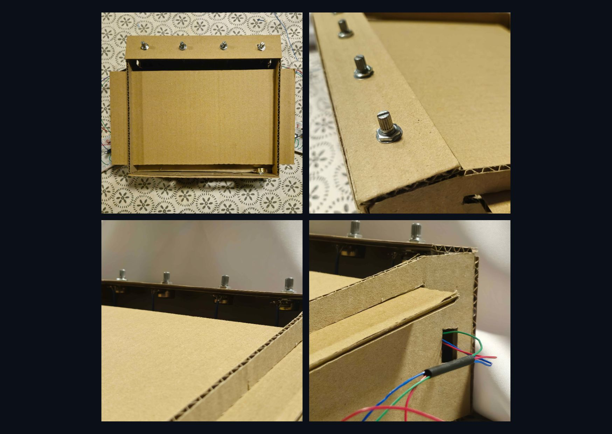
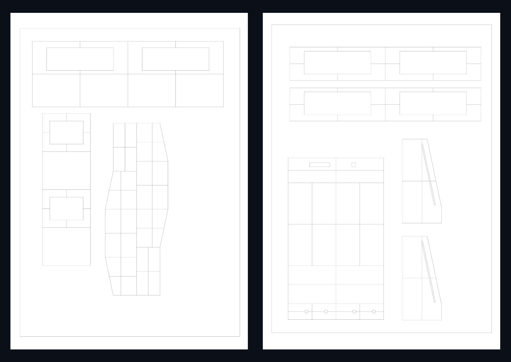
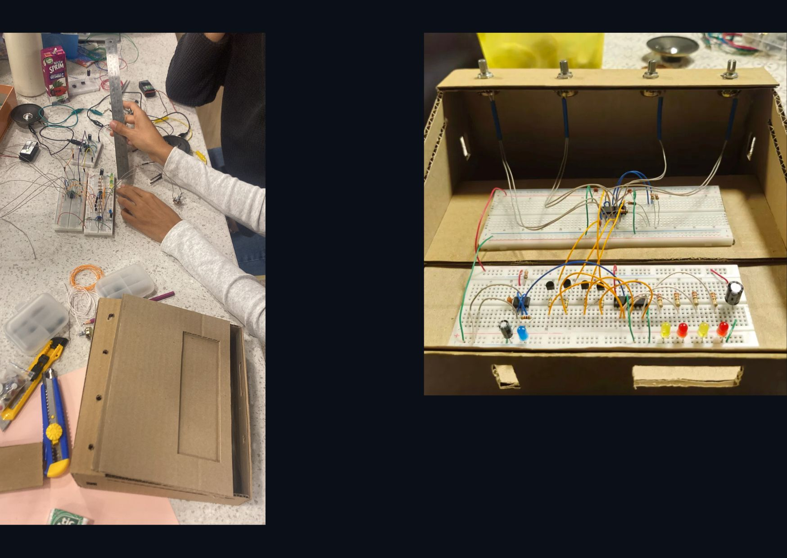

# grupo-05

## Integrantes

- Antonia Améstica   antoniaamc
- Sebastián Guevara  sebastianguevaralarotta
- Luisa Toro         Luisaatoro9

## Descripción del sintetizador realizado 
**OPEN-BEAT KRAFT**

*Un sintetizador secuencial que apuesta por la transparencia técnica (Open), el ritmo constante (Beat) y la honestidad de los materiales reciclables (Kraft).*

### Descripción del Proyecto

Este proyecto consiste en un sintetizador rítmico de 4 notas basado en una arquitectura modular que combina generación de pulsos y modulación de sonido. El corazón del ritmo es un temporizador NE555 configurado para enviar una señal de reloj a un contador decimal CD4017, el cual secuencia las 4 notas de forma sucesiva. Para visualizar el funcionamiento en tiempo real, incluimos una interfaz de LEDs que indican tanto la velocidad del pulso (desde el pin 3 del 555) como la nota activa en la secuencia, permitiendo un control visual del tempo.

La generación del tono se realiza mediante un chip CD4093 (NAND gates), cuyas entradas son activadas por transistores 2N2222 que actúan como interruptores controlados por el secuenciador. Para expandir las posibilidades sonoras, cada nota cuenta con un potenciómetro de B100K y una combinación de capacitores cerámicos ("lentejas") de distintos valores (103, 104 y 471). Esta configuración permite al usuario un rango amplio de frecuencias, pudiendo manipular el sonido desde tonos muy graves hasta agudos profundos, personalizando cada una de las 4 etapas del ciclo.

Finalmente, la señal resultante se procesa a través de una etapa de potencia dual compuesta por dos chips LM386, cada uno dedicado a un parlante independiente para evitar la sobrecarga de un solo componente y mejorar la respuesta sonora. El circuito está estabilizado por una batería de 9V con capacitores de filtrado de 100uF a la entrada y salida para reducir el ruido, además de capacitores de 10uF en la etapa de amplificación. El resultado es un instrumento robusto y rítmico con una salida de audio clara y una interfaz táctil y visual intuitiva.

--------------------------------------

## proceso y resultados del reloj y secuenciador

En esta etapa logramos la sincronía entre la generación del pulso (reloj) y la distribución rítmica (secuenciador). El montaje en la protoboard se organizó siguiendo un flujo vertical para mantener la claridad en las conexiones de los chips NE555, CD4017 y transistores. 

### Cableado y Estructura

Para asegurar el funcionamiento y facilitar el testeo, implementamos un código de colores estricto:

    🔴 Rojo: Conexión directa al polo positivo de la fuente de alimentación para energizar el circuito.
    🟢 Verde: Conexión directa al polo negativo (GND), cerrando el circuito para que la corriente fluya.
    ⚪ Blanco: Conexión directa desde las salidas del secuenciador hacia los indicadores LED, cada uno con su resistencia de 220Ω (rojo-rojo-café).
    🟠 Naranja: Puentes de señal que llevan el pulso desde el secuenciador hacia la base de los 4 transistores 2N2222.
    🔵 Azul: Puentes de configuración interna y retroalimentación. Se utilizaron en ambos integrados para definir su comportamiento: en el NE555 para unir los pines de disparo y umbral (2 y 6), y en el CD4017 para habilitar el chip y configurar el ciclo de reinicio (Reset).

### Configuración y Montaje

Etapa 1: Generador de Pulsos (NE555 Astable)

El corazón del sintetizador es un temporizador NE555 configurado en modo astable, encargado de generar el pulso de reloj constante. La configuración final de sus pines es la siguiente:

* **Estabilización de Voltaje (Pines 1 y 8):** Instalamos un capacitor cerámico "lenteja" 103 (10nF) entre el pin 1 (GND) y el pin 8 (VCC) para filtrar el ruido de la fuente y asegurar un funcionamiento estable.
* **Configuración de Disparo (Pines 2 y 6):** Realizamos un puente entre estos pines para permitir que el chip se auto-dispare, manteniendo el ciclo de oscilación continuo.
* **Control de Carga (Pin 2 y Capacitor):** Conectamos un capacitor electrolítico de 10uF desde el pin 2 hacia el positivo, el cual determina la temporización del pulso junto con las resistencias.
* **Habilitación (Pines 4 y 8):** Ambos pines se conectaron directamente a positivo para mantener el integrado activo y evitar reinicios accidentales.
* **Salida de Señal (Pin 3):** Se instaló una resistencia de 1kΩ (marrón-negro-rojo) para proteger un LED testigo conectado a negativo, permitiendo visualizar la frecuencia del pulso.
* **Descarga y Protección (Pin 7):** Se colocó una resistencia de 1kΩ (marrón-negro-rojo) hacia positivo para gestionar la descarga del capacitor y proteger el ciclo interno del chip.

Resultados Obtenidos (NE555)

A través del pin 3, logramos una salida de señal cuadrada constante. Para verificar el éxito de esta etapa, instalamos un LED conectado a negativo que parpadea según la frecuencia configurada.

* **Resultado Visual:** El LED muestra con total claridad la rapidez de los pulsos, permitiendo una referencia visual inmediata del tempo.
* **Rango de Ajuste:** El potenciómetro de 100K otorga un control preciso, permitiendo pasar de pulsos individuales lentos a una frecuencia lo suficientemente alta como para ser la base de una nota musical.

**Etapa 2: Secuenciador de Pasos (CD4017)**
En esta fase, el integrado CD4017 actúa como el "cerebro" que distribuye el pulso recibido para crear la secuencia musical. La configuración final quedó establecida de la siguiente manera:

* **Control de Ciclo y Reset (Pines 15 y 10):** Realizamos un puente entre el Pin 15 (Reset) y el Pin 10 (Salida 4). Esto fuerza al chip a reiniciar la cuenta inmediatamente después de la cuarta nota, logrando un bucle infinito de 4 pasos.
* **Habilitación y Tierra (Pines 13 y 8):** Conectamos ambos pines al polo negativo (GND). El Pin 13 (Clock Enable) debe estar en bajo para que el chip "escuche" y procese los pulsos entrantes.
* **Entrada de Reloj (Pin 14):** Recibe la señal cuadrada directamente desde el Pin 3 del NE555, sincronizando el avance de la secuencia con la velocidad del temporizador.
* **Salidas de Notas (Mapeo Lógico):** Para obtener la secuencia correcta, conectamos las salidas a indicadores LED protegidos con resistencias de 220Ω (rojo-rojo-café) hacia negativo siguiendo el orden lógico de las salidas QQ:

        Nota 1 (Q0Q0): Pin 3
        Nota 2 (Q1Q1): Pin 2
        Nota 3 (Q2Q2): Pin 4
        Nota 4 (Q3Q3): Pin 7

Resultados Obtenidos (CD4017)

Al integrar el secuenciador CD4017, logramos transformar los pulsos del 555 en un ciclo lógico de pasos. Para verificar el éxito de esta etapa, mapeamos las salidas y configuramos el reinicio del chip, obteniendo los siguientes resultados:

* **Sincronía Lógica:** El chip responde con total precisión a la señal de reloj proveniente del pin 3 del 555, permitiendo que el ritmo de la secuencia sea perfectamente estable y ajustable.
* **Mapeo de Secuencia:** Tras identificar que las salidas no son correlativas físicamente, establecimos el orden correcto (Pines 3, 2, 4 y 7) para que las notas se activen en la secuencia musical deseada.
* **Ciclo de Bucle Infinito:** Mediante la conexión del Pin 15 (Reset) al Pin 10, logramos que el chip reinicie la cuenta inmediatamente al llegar a la cuarta nota, eliminando silencios y creando un bucle continuo de 4 pasos.
* **Habilitación Operativa:** La conexión del Pin 13 (Clock Enable) a negativo garantizó que el chip se mantenga siempre receptivo a los pulsos, asegurando la fluidez constante de la melodía sin interrupciones.

https://github.com/user-attachments/assets/ca56fdc2-1322-43c1-b279-125fb3cec267

**Etapa 3: Control de Frecuencia y Conmutación (Transistores 2N2222)**

En esta etapa, los transistores actúan como interruptores lógicos que seleccionan qué nota debe sonar en cada paso de la secuencia. Orientando el transistor con su lado plano hacia nosotros, realizamos las siguientes conexiones:

* **Emisor (Pata Izquierda):** Conectamos los emisores de los cuatro transistores directamente a negativo (GND), estableciendo una referencia común de tierra.
* **Base (Pata Central):** Recibe la señal desde el CD4017 a través de un cable naranja y una resistencia de 100kΩ (marrón-negro-amarillo). Esta corriente es la que "abre" el transistor para activar la nota.
* **Colector (Pata Derecha):** Es la vía de salida que lleva la información de control hacia el CD4093 (oscilador de audio). Al activarse el transistor, el colector permite que el circuito del 4093 genere el tono específico asignado a ese paso de la secuencia.

https://github.com/user-attachments/assets/26c198c3-9297-478d-9f7f-ea9b3e70d59e

---------------------------------

## proceso y resultados de osciladores y amplificador

**Etapa 4: Generación de Tonos (Osciladores NAND CD4093)**

En esta fase final, utilizamos el integrado CD4093 para convertir las señales de control en frecuencias audibles. Configuramos las cuatro compuertas NAND del chip para que funcionen como osciladores independientes para cada nota:

+ Configuración de Compuertas: Para habilitar los osciladores, puenteamos las entradas de cada compuerta: 1-2, 5-6, 8-9 y 12-13.
+ Entrada de Control (Desde Transistores): Las señales provenientes de los colectores (pata derecha) de los transistores se conectaron a las entradas de cada compuerta (Pin 1, 5, 8 y 12 respectivamente).
+ Sintonización por Capacitores (Lentejas): Instalamos capacitores hacia negativo en las entradas para definir el rango de frecuencia de cada oscilador:

   Nota 1 (Pin 1): Capacitor 104 (100nF).
   Nota 2 (Pin 5): Capacitor 103 (10nF).
   Nota 3 (Pin 8): Capacitor 103 o 471 (según el tono deseado).
  Nota 4 (Pin 12): Capacitor 471 (470pF).
  
* **Control Individual de Notas (Potenciómetros):** Para permitir el ajuste manual de cada tono, integramos 4 potenciómetros. En cada uno, unimos las patas 1 y 3 y conectamos:
  
   Desde la salida de la compuerta (Pines 3, 4, 10 u 11) hacia un extremo del potenciómetro.
   Desde la pata central (2) hacia las entradas de la compuerta correspondiente (Ej: Pin 1-2, 5-6, etc.), cerrando el lazo de retroalimentación.

Mezcla de Salida: Las salidas de audio de cada nota (Pines 3, 4, 10 y 11) se unificaron a través de resistencias de 1kΩ (marrón-negro-rojo) para proteger el circuito y preparar la señal para la etapa de amplificación o salida de audio.

https://github.com/user-attachments/assets/a5ddcd5b-b5ca-4290-a9f5-d321d8b5eed9

https://github.com/user-attachments/assets/7f18e280-71e7-4099-baa8-180db060f60d

https://github.com/user-attachments/assets/cb528754-b904-4f95-8b57-198918ad8c18

-----------------------------------

## modificaciones realizadas a los circuitos originales

A partir del esquema base (ver imagen de referencia), el desarrollo del **OPEN-BEAT KRAFT** implicó una serie de ajustes tanto funcionales como estructurales. Estas modificaciones responden a problemas detectados durante el montaje y a decisiones de diseño orientadas a mejorar la estabilidad, legibilidad e interacción del sistema.

### Adaptación del ciclo del secuenciador (CD4017)

El circuito original contemplaba un conteo completo del CD4017 (10 pasos). Se modificó su lógica conectando el pin 15 (Reset) al pin 10 (Q4), forzando un reinicio anticipado.

- Se reduce el ciclo a 4 pasos.
- Se obtiene un bucle rítmico continuo.
- Se mejora la legibilidad del comportamiento del sistema.

### Reconfiguración del reloj (NE555)

Se ajustaron los valores de los componentes para obtener un rango de frecuencia más usable musicalmente:

- Reemplazo de resistencias por valores de 1kΩ para evitar frecuencias demasiado lentas.
- Uso de un capacitor de 10uF para hacer perceptible el pulso en los LEDs.
- Incorporación de un capacitor de desacoplo de 10nF entre VCC y GND para estabilizar la señal.

Esto permitió transformar el reloj en un elemento controlable y estable.

### Incorporación de etapa de conmutación con transistores (2N2222)

Se añadieron transistores entre el secuenciador y los osciladores, lo cual no estaba presente en el circuito original.

- Aíslan las etapas de control y generación de sonido.
- Mejoran la estabilidad del disparo de cada nota.
- Funcionan como interruptores activados por cada paso del secuenciador.

### Modulación independiente de osciladores (CD4093)

Se modificó la etapa de generación de sonido para permitir mayor control:

- Se asignó un potenciómetro independiente a cada compuerta NAND.
- Se utilizaron capacitores de distintos valores por canal.
- Cada nota puede ajustarse de forma independiente.

Esto permite una mayor diversidad sonora dentro del sistema.

### Mezcla resistiva de señales

Se incorporó una etapa de mezcla mediante resistencias de 1kΩ:

- Unifica las salidas de los osciladores.
- Protege el circuito de interferencias entre señales.
- Entrega una señal más estable a la salida.

### Rediseño de la etapa de amplificación (LM386)

El circuito original consideraba una sola salida de audio. Se modificó para incluir:

- Dos amplificadores LM386.
- Dos parlantes independientes.

Esto reduce la carga sobre un solo componente y mejora la respuesta sonora.

### Ajustes en alimentación y filtrado

Se reforzó la estabilidad general del circuito:

- Capacitores de 100uF en la entrada y salida de alimentación.
- Uso de una fuente de 9V estable.
- Organización del cableado para reducir ruido eléctrico.

En conjunto, estas modificaciones transforman el circuito original en un sistema optimizado para interacción, estabilidad y exploración sonora, pasando de un esquema funcional a un instrumento electrónico.

--------------------------------------

## carcasas de cartón

La carcasa del sintetizador se desarrolló utilizando **cartón corrugado reciclado**, principalmente por su **disponibilidad, bajo costo y facilidad para hacer pruebas y modificaciones rápidas**. Esto permitió **iterar el diseño** sin depender de procesos más complejos. Al mismo tiempo, el material se mantiene visible como parte del resultado, sin ocultar su condición de **prototipo**.

### Estructura  
Consiste en una **caja cerrada con una apertura frontal**, que funciona como punto de visualización. Esta permite ver parcialmente el interior (específicamente los **LEDs**) mientras el resto del circuito se mantiene contenido, ayudando a **ordenar visualmente el sistema** y evitar la sobreexposición de componentes.

### Distribución  
Responde a una **lógica de uso**: los **controles** se ubicaron en la parte superior para facilitar la manipulación directa, mientras que los **LEDs** se posicionaron en la cara frontal, alineados, permitiendo una **lectura clara de la secuencia o estado del sistema**. El circuito se organizó internamente para no interferir entre **interacción y visualización**, manteniendo además acceso para ajustes.

  
Muestras de la carcasa.

### Proceso  
El proceso de diseño comenzó revisando *referentes y sintetizadores existentes*, para luego definir qué queríamos mostrar y cómo queríamos que funcionara la interfaz. A partir de esto, se realizó un **modelado 3D** inicial, considerando la posibilidad de fabricación mediante **corte láser**, lo que finalmente no se pudo concretar. En su lugar, se utilizó el modelo como base para generar una **plantilla calcada sobre láminas (A1)**, que luego se transfirió a **cartón corrugado** para corte y armado manual.

https://github.com/user-attachments/assets/30f01b61-87bd-45d3-be96-2d65fa92969e

  
Plantilla impresa en pliego de papel A1.

La mayoría de las pruebas se realizaron entre el *modelado 3D* y la *medición directa de los componentes* en la protoboard, utilizando como referencia su forma y dimensiones dentro de la interfaz. Esto permitió ajustar posiciones, proporciones y relaciones entre los elementos antes del armado final.

  
Proceso de medición

En conjunto, la carcasa permite *contener el sistema, ordenar la interacción y hacer visible parte de su funcionamiento*.

## interconexión entre módulos

La interconexión del sistema se resolvió a partir de la necesidad de coordinar tres funciones principales: generación de pulso, secuenciación y producción de sonido. Más que módulos aislados, el circuito se organizó como una red continua donde cada etapa depende directamente de la anterior.

### Flujo de señal

El recorrido principal del sistema se estructura de la siguiente manera:

1. **Reloj (NE555)**  
   Genera una señal cuadrada constante desde el pin 3, que actúa como pulso base del sistema.

2. **Secuenciador (CD4017)**  
   Recibe el pulso del 555 y lo distribuye en sus salidas (Q0–Q3), activando cada paso de la secuencia de forma sucesiva.

3. **Etapa de conmutación (Transistores 2N2222)**  
   Cada salida del 4017 se conecta a la base de un transistor, permitiendo activar o bloquear el paso de señal hacia los osciladores.

4. **Osciladores (CD4093)**  
   Los transistores habilitan cada compuerta NAND, generando una frecuencia específica por paso.

5. **Mezcla y salida (LM386)**  
   Las señales se unifican mediante resistencias y se envían a la etapa de amplificación.

---

### Interconexión física y módulos independientes

El sistema se distribuye en dos protoboards de 400 puntos, conectadas entre sí mediante puentes de señal y alimentación. Esta separación permitió organizar el circuito por funciones, pero manteniendo su continuidad eléctrica.

La etapa de amplificación se resolvió como módulos independientes: cada LM386 se encuentra en una protoboard separada, junto a su respectivo parlante. Estos módulos están contenidos en pequeñas cajas individuales, lo que permite moverlos físicamente y ubicarlos a cada lado de la carcasa principal.

Esta decisión introduce una dimensión espacial al sonido, separando la salida en dos puntos y evitando concentrar toda la carga en un solo canal.

---

### Organización del cableado

La interconexión se resolvió mediante un sistema de puentes entre protoboards, lo que permitió separar físicamente las etapas pero mantener su continuidad eléctrica.

- Los cables largos (principalmente naranjos) funcionan como enlaces de señal entre módulos.
- Las líneas de alimentación (VCC y GND) se distribuyen de forma paralela a lo largo de ambas placas.
- Las conexiones verticales permiten bajar la señal desde el secuenciador hacia la etapa de transistores y osciladores.

Esta disposición, aunque funcional, evidenció que el orden visual no siempre coincide con el orden eléctrico. Durante el proceso, pequeños cambios en la posición o conexión de los cables afectaron directamente la continuidad de la señal, generando pérdidas de sonido o fallas en la activación de los módulos.

---

### Alimentación

El sistema se alimenta mediante baterías que se mantienen ocultas dentro de la carcasa. Esta decisión responde a una intención de limpiar visualmente el objeto y evitar interferencias en la interacción, manteniendo visibles únicamente los elementos necesarios para su uso (controles y retroalimentación visual).

---

### Consideraciones

La interconexión no se definió solo desde el esquema, sino también desde la prueba en protoboard. Esto implicó:

- Ajustar recorridos de señal en función del espacio físico
- Reorganizar conexiones para evitar cruces críticos
- Verificar constantemente continuidad y puntos de tierra

En este sentido, el cableado deja de ser un elemento neutro y pasa a ser parte activa del comportamiento del sistema.

## resultados finales

El sistema logró funcionar de manera estable en sus etapas principales: el generador de pulsos (NE555), el secuenciador (CD4017) y la activación de los osciladores (CD4093) respondieron correctamente, permitiendo una lectura clara del ritmo y la secuencia a través de los LEDs. Sin embargo, la salida de audio no se concretó, ya que los parlantes no lograron emitir sonido. Esta falla se relaciona con la interconexión y reorganización del circuito, donde la señal de salida no llegó correctamente a la etapa de amplificación. A pesar de esto, el comportamiento general del sistema permitió validar su lógica de funcionamiento y la relación entre sus módulos.

https://github.com/user-attachments/assets/2396a852-f256-4639-a1d5-042e236e8b4d

https://github.com/user-attachments/assets/be2ac0c0-f38f-4a27-934a-5b8dc7a7526f

------------------------------------------

## aprendizajes y errores

A lo largo del desarrollo del OPEN-BEAT KRAFT, el proceso estuvo marcado por pruebas, fallas y ajustes que permitieron comprender el comportamiento del circuito más allá de su esquema.

### Estabilidad del reloj (NE555)

**El error:** El pulso presentaba ruido e inestabilidad, afectando directamente al resto del sistema.  
**La solución:** Se incorporó un capacitor de desacoplo (10nF) entre VCC y GND.  
**Aprendizaje:** La estabilidad de la alimentación es fundamental, ya que pequeñas variaciones afectan todo el circuito.

---

### Control de velocidad y percepción

**El error:** El pulso era demasiado rápido o demasiado lento para ser percibido correctamente en los LEDs.  
**La solución:** Se ajustaron los valores de resistencia y se utilizó un capacitor de 10uF.  
**Aprendizaje:** No basta con que el circuito funcione; también debe ser legible y controlable desde la experiencia.

---

### Lógica del secuenciador (CD4017)

**El error:** Las salidas no seguían un orden intuitivo y el ciclo no se cerraba correctamente.  
**La solución:** Se mapearon las salidas reales (pines 3, 2, 4 y 7) y se conectó el reset para generar un bucle de 4 pasos.  
**Aprendizaje:** El comportamiento real de los componentes no siempre coincide con lo esperado desde el esquema.

---

### Interconexión y reorganización del circuito

**El error:** Al desarmar el circuito para ordenarlo visualmente, se perdió el funcionamiento general, especialmente en la salida de audio.  
**La solución:** Se revisaron conexiones críticas, continuidad y distribución de tierra.  
**Aprendizaje:** La disposición física del circuito es parte de su funcionamiento; el orden visual puede alterar el orden eléctrico.

---

### Salida de audio y amplificación

**El error:** A pesar de que el resto del sistema funcionaba, los parlantes no lograron emitir sonido.  
**La posible causa:** Problemas en la conexión entre la etapa de mezcla y los módulos de amplificación (LM386), o pérdida de señal en la interconexión entre protoboards.  
**Aprendizaje:** La etapa de salida es especialmente sensible, y requiere continuidad clara de la señal y correcta distribución de alimentación y tierra.

---

En conjunto, estos errores permitieron entender el circuito como un sistema interdependiente, donde cada decisión (tanto eléctrica como física) afecta directamente el resultado.

---------------------------------------------

## conclusiones

El desarrollo del OPEN-BEAT KRAFT permitió entender el circuito desde sus errores y ajustes. Los desarmes y fallas evidenciaron su sensibilidad al cableado y a la disposición física, mostrando que el orden es tanto visual como eléctrico.

La interconexión entre protoboards y los módulos de salida independientes (LM386 + parlante) confirmó que el recorrido de la señal y la ubicación de los componentes afectan directamente el resultado. La separación en módulos móviles y el ocultamiento de las baterías ayudaron a ordenar la interacción sin exponer el sistema.

Las modificaciones implementadas no solo resolvieron problemas técnicos, sino que permitieron construir un sistema más claro, controlable y abierto a seguir siendo ajustado.

----------------------------------------------

## bibliografía

Build Electronic Circuits. (s.f.). *How transistors work*. https://www.build-electronic-circuits.com/how-transistors-work/

Reddit. (s.f.). *Crackle box synth* [Publicación en foro]. https://www.reddit.com/r/synthesizers/comments/1ctrhdj/crackle_box_synth/?tl=es-419

Build Electronic Circuits. (s.f.). *IC 4093 (4000 series integrated circuits)*. https://www.build-electronic-circuits.com/4000-series-integrated-circuits/ic-4093/
