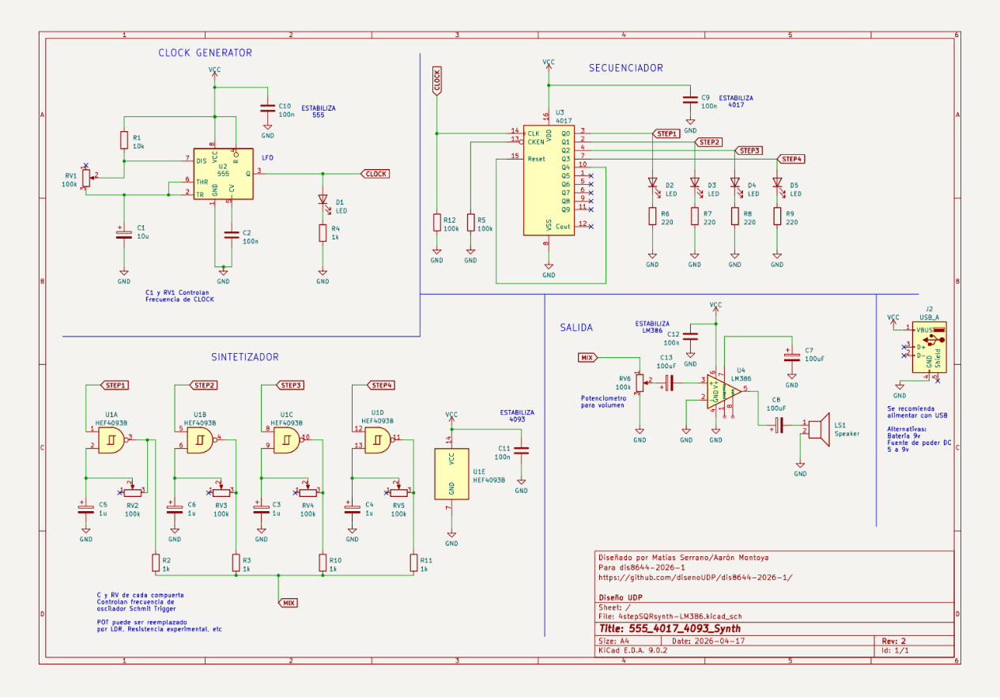
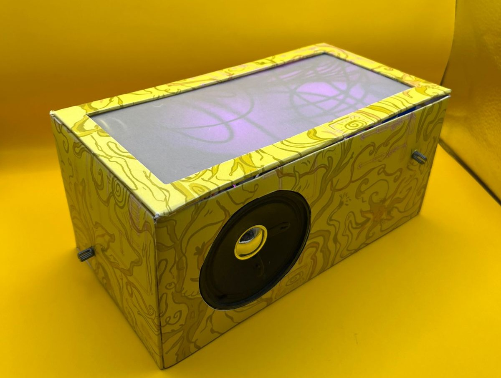
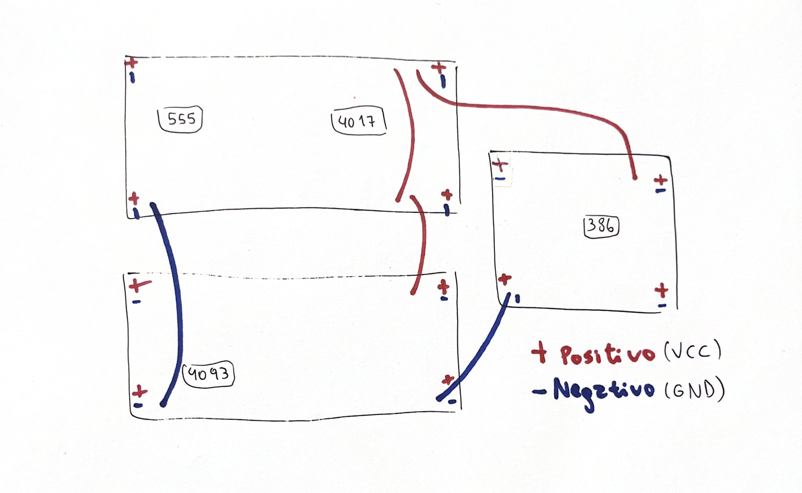

# grupo-08

## integrantes

- Antonella Aguilar / antokiaraa
- Catalina Oyanedel / catalinaoyanedel-01
- Yaira Ruiz / yairaruiz

## descripción del sintetizador realizado

Nuestro proyecto se basa en la construcción de un sintetizador modular, compuesto por los chips 555, 4017, 4093 y LM386. Para lograr que nuestro sintetizador pueda funcionar, se requiere seguir el paso a paso de nuestros chips: Primero, el chip 555 genera el pulso base (clock), que luego este pasa al 4017 el cual distribuye la señal en 4 distintos pasos, funcionando como secuenciador. A partir de ahí la señal se conecta al 4093 donde se genera el sonido mediante oscilación y finalmente el LM386 amplifica la señal para que pueda escucharse a través del parlante. En este sentido el sintetizador funciona de forma modular donde cada parte del circuito se puede entender por separado, pero en realidad solo tiene sentido cuando todo está conectado. Cada módulo cumple una función distinta y la conexión entre ellos es lo que finalmente permite generar sonido.

Mantuvimos el circuito con el esquemático que nos entregaron, realizando modificaciones mínimas que no cambiaron el sonido del sintetizador, ya que al probar con distintos condensadores, por ejemplo, no nos terminaban de convencer los cambios de estos sonidos. Partiendo por lo básico, el proyecto cuenta con distintas perillas (potenciómetros) que permiten modificar el sonido en tiempo real: la del 555 controla la frecuencia del pulso base, las cuatro perillas del 4093 generan variaciones en el tono y la textura del sonido, y la del LM386 regula el volumen del parlante. Esto hace que el sonido no sea fijo, sino que es variable según cómo se manipule y se pueden ir experimentando diferentes combinaciones.

En base a que no profundizamos en los cambios de sonidos, quisimos diseñar de mejor manera la experiencia al manipularlo, es por eso que le dimos el título de “Naturalezas Interconectadas”. Este título simboliza que somos distintos tipos de naturalezas interactuando la una con la otra, en nuestro caso, personas, interactuando con este circuito a través del sonido y las luces. Así, quisimos integrar dentro del diseño de la carcasa las luces como parte del sintetizador, haciendo que al interactuar no solo se le diera protagonismo al sonido, sino también a las reacciones lumínicas.

## proceso y resultados del reloj y secuenciador

En la realización de los primeros módulos, se nos presentó nuestro primer error. Veíamos que las luces no oscilaban como debían hacerlo, al conectar la batería solo se nos prendía una luz, al sacarla y volver a colocarla, una luz distinta, y así sucesivamente. Con la ayuda de Aaron nos dimos cuenta que el problema estaba en el potenciómetro, lo teníamos conectado de una manera enredada, sin seguir el orden en físico del esquemático y además, se econtraba al revés de cómo nos lo recomiendan (mirando hacia nosotros). Al solucionar esto, nuestras leds funcionaron como debían.

_Ejemplo de cómo se veía el error._

## proceso y resultados de osciladores y amplificador

Con la base del circuito ya funcionando (clock y secuenciador) avanzamos hacia la etapa del sintetizador y salida, al finalizar el armado, no obtuvimos la señal del parlante y para encontrar el problema, realizamos una revisión por etapas. En primer lugar, confirmamos que tanto el clock (555) y el secuenciador (4017) funcionaban correctamente. Luego, revisamos las conexiones generales del circuito, incluyendo la tierra común y las posibles fallas en componentes específicos.

Con la recomendación de Misa, empezamos a probar el circuito del sintetizador de manera aislada en otra protoboard. Probamos el funcionamiento del 4093 utilizando un solo potenciómetro, y también verificamos el amplificador 386 por separado, conectándolo directamente a la salida de audio. Este proceso permitió detectar algunos errores, identificamos que los condensadores en el circuito del 386 estaban mal conectados, también consideramos la recomendación de Misa de desconectar un LED porque interfiere en el funcionamiento.  

Finalmente decidimos rehacer la etapa del sintetizador desde cero, además, se incorporó un condensador de 100uF en la etapa del 386, lo que ayudó a estabilizar la señal. Tras estos ajustes y una reorganización general del circuito, finalmente logramos obtener sonido en el parlante.

## modificaciones realizadas a los circuitos originales

Durante el desarrollo del proyecto tuvimos que realizar algunas modificaciones tanto por problemas de funcionamiento como por la integración del sintetizador en la carcasa. Al tener 4 LEDs funcionando el circuito no lograba soportarlo, lo que generaba interferencias en la señal y hacía que no se emitiera sonido, Misa nos comentó que para evitar esto debíamos quitar alguno de los LEDs, o en nuestro caso lo que hicimos fue quitar solamente la resistencia de este para que empezara a sonar, por lo que el circuito final tiene los 4 LEDs pero solo 3 de ellos se encienden, también notamos que según el LED que desactivaramos, el sonido cambiaba, en el resultado final sería el Step 2 el que está desactivado.

También probamos modificar los valores de los condensadores para explorar cómo afectaban el sonido. En el caso del 4093, cambiamos los condensadores de 1uF por otros de 10uF y 100uF en los potenciómetros, pero el resultado no nos convenció, el sonido se volvía más grave y menos variable al mover las perillas. Por esto, decidimos mantener los condensadores de 1uF, ya que permitían un mayor rango de variación y un comportamiento más interesante del sonido.

Otra modificación fue la conexión de 2 de los potenciómetros, el del 555 y el del LM386, que para que pudiesen quedar cómodamente funcionales en la carcasa los sacamos de la protoboard mediante cables dupont M-H (macho-hembra).

## carcasas de cartón

La caja en la que se encuentra nuestro sintetizador, partió siendo una caja de zapatos, pero quisimos darle más vida y expresión. Se realizó una ilustración con la base del esquemático y se rodeó de ramas, flores y distintas formas de vida, algunas reales y otras abstractas. Estas formas se entrelazan con el circuito y hay espirales que surgen de los chips, indicando que es lo que le da vida a toda esta red. Esta idea surgió de la similitud de los cables con las raíces, tallos y ramas, como principal inspiración, y le dio vida al nombre del proyecto “naturalezas interconectadas”. Este nombre nos permite interpretar que finalmente, somos distintos tipos de naturalezas interactuando las unas con las otras. Ya seamos nosotros, seres humanos, a través de las perillas con este sintetizador o de esta idea ficticia, donde el circuito es uno con lo natural en la ilustración. Finalmente, estamos todos conectados a tierra.

Para profundizar en lo estético, quisimos destacar los cables que dieron forma a esta conceptualización, utilizando un papel vegetal para que las luces led, también elegidas dentro de una paleta de colores natural, se difuminaran y pudieran visibilizar este mundo que se conecta con el diseño exterior, volviéndose también parte de la interacción, acompañando al sonido.

Los potenciómetros fueron colocados a los costados de la caja. La parte del chip 4093, fue la segunda pared que levantamos, y nos dimos cuenta que las perillas no sobresalían bien, pero al intentar cambiar esa sección que tiene muchos potenciómetros, se nos complicaba, ya que tendríamos que haber reordenado todo y ya nos había costado lograrlo antes, así que lo dejamos como estaba y nos adaptamos, realizando unas “tarjetas” que se introducían en la ranura de la perilla para poder manejarlo de mejor manera. Los otros potenciómetros fueron levantados y pegados a las paredes interiores, como se mencionó anteriormente, para que sus perillas pudieran sobresalir bien y así poder interactuar directamente con el componente.

En cuanto al resultado, estamos muy satisfechas con cómo se ve visualmente, y sentimos que, aunque no fuera nuestra intención, terminó pareciendo una radio antigua por el parlante y la perilla, así que estamos contentas con lo que pudimos lograr, haciendo una interacción interesante a través del sonido y las luces/colores!

## interconexión entre módulos

Usamos dos protoboards de 830 puntos para realizar el circuito del clock, el secuenciador y el sintetizador. Primero nos enfocamos en hacer la extensión de los positivos y negativos con cables, para asegurar una alimentación común y ordenada en todo el circuito. En una protoboard de 400 puntos realizamos el circuito de salida de audio. Esta protoboard se conectó a las anteriores compartiendo los mismos positivos y negativos, permitiendo así que todas las etapas del circuito quedarán interconectadas y funcionando en conjunto.

Las conexiones en la protoboard se realizaron principalmente con cables dupont macho-macho. En el caso de los potenciómetros del 555 y del 386, estos se extendieron mediante cables macho-hembra para facilitar su manipulación. Finalmente, el parlante se conectó utilizando caimanes con conectores macho.

Utilizamos un criterio de color para organizar las conexiones y facilitar la lectura del circuito. Los colores como rojo y naranjo, se utilizaron para las conexiones de positivo, mientras que los colores como azul, café y verde se destinaron a negativos. Para las uniones entre potenciómetros y módulos usamos colores más neutros como morado y blanco, lo que ayudó a diferenciar este tipo de conexiones del resto.

Además, intentamos mantener un orden secuencial en el uso de los colores, de manera que si una conexión comenzaba con un color específico, se continuaba con ese mismo criterio a lo largo del recorrido.

## resultados finales

Resultado final de nuestro proyecto “Naturalezas Interconectadas”  

Se logró un montaje final funcional, donde organizamos el circuito dentro de la carcasa y los componentes quedaron correctamente distribuidos y las perillas accesibles, agregando pequeñas piezas en resina impresas en 3D para 4 de los potenciómetros que corresponden al chip 4093 permitiendo su manipulación sin interferir en el funcionamiento del sistema. El circuito responde a las variaciones de los potenciómetros generando cambios en la frecuencia, modulación y amplitud de la señal.

## aprendizajes y errores

Uno de nuestros principales aprendizajes fue la importancia de trabajar de forma organizada en la protoboard. Mantuvimos siempre orden en el cableado, usando cables cortos para conexiones cercanas y respetando colores para diferenciar cada tipo de conexión (por ejemplo, alimentación, tierra y señal).

Esto nos ayudó a evitar cruces innecesarios y a que el circuito no se viera saturado de cables. Se nos hizo mucho más fácil tanto el armado como la lectura del circuito. Podíamos seguir visualmente las conexiones sin confundirnos, lo que fue necesario al momento de revisar errores o hacer cambios.  

El trabajo en equipo fue un aspecto muy positivo para nosotras. Avanzamos de manera más rápida y nos apoyamos mutuamente en la resolución de los problemas. El hecho de que empezáramos haciendo cada parte por separado fue un gran error, porque dificulta la integración final del circuito y generó confusiones en las conexiones.

<https://github.com/user-attachments/assets/b09d2e3b-e0e3-4841-a123-3b2d43d66c03>

Los errores más comunes en relación al armado fueron principalmente el uso de chips malos, como el 555, que nos impidió el encendido correcto de los LED. Otro error común fue que no nos fijamos que una resistencia de 220 se había soltado en la parte del secuenciador, lo que hacía fallar el funcionamiento del circuito.

La conexión incorrecta de componentes en el chip 386, específicamente los condensadores, fue un error importante porque impedía la salida de audio. Al corregir estas conexiones e incorporar el condensador de 100uF, se logró estabilizar la señal.

<https://github.com/user-attachments/assets/d09eb3bf-f310-4373-b5a1-2eff0198916e>

A pesar de las dificultades técnicas logramos completar el circuito y obtener el sonido, lo que fue un avance importante para el grupo. El tener errores nos permitió comprender de mejor manera la relación entre las distintas etapas del sistema, clock, secuenciador, sintetizador y salida y evidenció la importancia de un montaje ordenado y colaborativo.

<https://github.com/user-attachments/assets/3ae745df-500d-4cb4-a659-6ccba9d3c515>

## conclusiones

La realización de este proyecto ha sido muy enriquecedora, partimos de saber muy poco o nada a realizar un sintetizador del que nos sentimos orgullosas. Gran parte de esta sensación se ha formado gracias a la paciencia de los profes cuando les pedíamos ayuda con algún error, y con la obligación de anotar más los procesos y así poder comprender lo que está pasando al interior del circuito.

Nuestra primera lección de modularidad fue que no sirve sólo separarse las tareas y luego juntar, de esta manera el circuito no funcionó y sólo al estar juntas y crearlo al mismo tiempo podíamos notar detalles que otra no. Así también aprendimos la importancia (una vez más) del trabajo en equipo.

Creo que hemos ido aprendiendo de manera inconsciente a través de la práctica lecciones que nos han llevado a entender de mejor manera las conexiones eléctricas. Entre más errores teníamos, podíamos entender mejor el por qué de las cosas, desde en qué módulo se podía encontrar y qué tipo de componente se relacionaba con el resultado no esperado que estábamos teniendo.

Podemos concluir que este proceso lleno de altos y bajos que, como hemos mencionado anteriormente, nos ha enseñado mucho y que nos dejó con un proyecto que nos tiene muy contentas.

## bibliografía

- Instituto NCB. (s.f.). Conozca el 4017. <https://www.incb.com.mx/index.php/articulos/53-como-funcionan/769-conozca-el-4017-art124s>
- Build Electronic Circuits. (s.f.). CD4093 - An IC with four Schmitt trigger NAND gates. <https://www.build-electronic-circuits.com/4000-series-integrated-circuits/ic-4093/>
- Cults3D. (s.f.). 10k pot shaft extender. <https://cults3d.com/en/3d-model/various/10k-pot-shaft-extender>
- Audiomáquinas. (s.f.). Taller: Sonidos en la protoboard. <https://www.audiomaquinas.com/taller-sonidos-protoboard/>
