# grupo-09

## Integrantes

* Catalina Catalán / [Catalina Catalán](https://github.com/disenoUDP/dis8644-2026-1/tree/main/06-terroiblea)
* Nicolás Miranda / [Nicolás Miranda](https://github.com/disenoUDP/dis8644-2026-1/tree/main/19-Nicolas-Miranda1312)
* Vania Paredes / [Vania paredes](https://github.com/disenoUDP/dis8644-2026-1/tree/main/25-paredesvania)

## La caja 

La caja es un dispositivo de experimentación sonora diseñado para desafiar lo predecible a través de un ritmo secuencial. Nuestro objetivo, no es buscar una armonía tradicional, más bien propone una exploración pura del ruido, donde una pulsación constante se convierte en el panel de intervención directa con el usuario. Visualmente, el artefacto adopta una estética de honestidad industrial exponiendo parte de sus "tripas" de cables. La estructura de cartón se intervino con perforaciones inspiradas en la geometría del píxel, funciona también como una pantalla donde se puede ver la luz rítmica del interior.

El ciclo del sonido comienza con un chip 555 que marca el pulso (clock), el cual es distribuido por un contador 4017 en cuatro pasos secuenciales que se activan de forma sucesiva. Posteriormente, el integrado 4093 entra para configurar el carácter del sonido como sintetizador (mediante la manipulación de resistencias y condensadores), se generan ondas cuadradas que permiten al usuario deformar texturas sonoras hasta alcanzar una distorsión caótica. 

La secuencia se percibe dinámica, produciendo sonidos agudos, nerviosos y repetitivos. Su sonoridad transita entre una alarma insistente y la señal errática de una nave espacial, creando momentos de tensión y espacios de silencio que rompen los patrones creados. 

[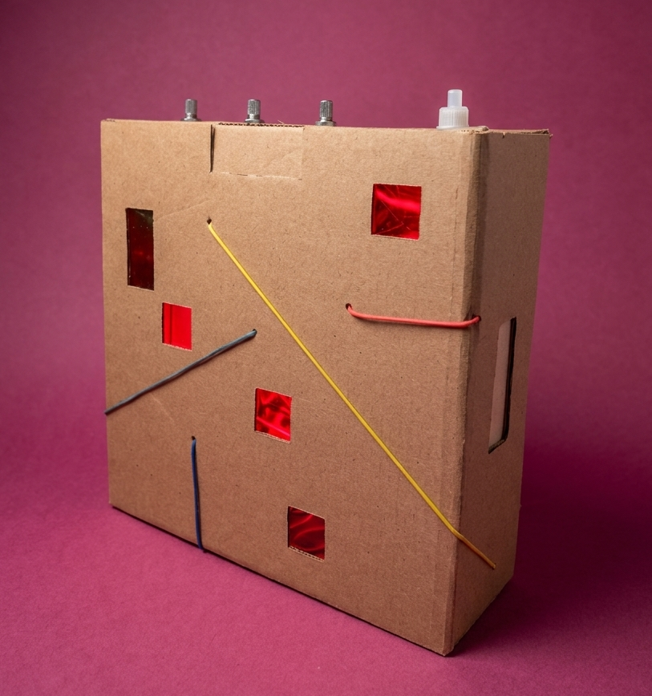](https://youtube.com/shorts/fcjKkdh8bFI?feature=share)

## Circuito base 

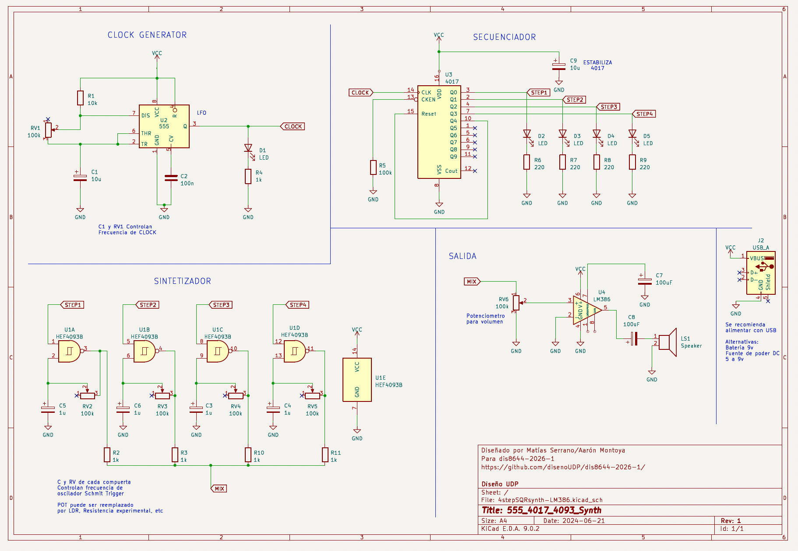

* Paso 1: Clock.
* Paso 2: Secuenciador.
* Paso 3: Sintetizador.
* Paso 4: Salida (audio).

### Chips 555 y 4017

El **NE555** es el corazón del ritmo. Lo configuramos en modo astable, que significa que genera una onda cuadrada continua, como tick, tick, tick eléctrico que no para. Ese pulso es lo que le dice al **CD4017** cuándo avanzar.

El 4017 es un contador: recibe el pulso del 555 y activa sus salidas una por una, en orden. Tiene 10 salidas posibles (Q0 a Q9), pero nosotros solo usamos 4 pasos. El resultado es un loop eterno: paso 1 -> paso 2 -> paso 3 -> paso 4 -> volver al inicio.


### Chips 4093 y 386

El **HEF4093B** Tiene cuatro puertas NAND con trigger Schmitt. Cada una de esas puertas, conectada con una resistencia y un condensador genera su propia frecuencia de oscilación, básicamente, su propio tono. El CD4017 le dice a cada puerta cuándo sonar dentro de la secuencia.

La señal de audio que sale del 4093 pasa al **LM386**, un amplificador de audio que le da la potencia suficiente para mover un parlante. 

## Proceso y resultados del reloj y secuenciador

Nuestra primera aproximación al uso en conjunto del chip 555 y el chip 4017 comenzó en la sesión-05b, donde realizamos un circuito secuenciador donde los LEDs se iban prendiendo en distintos tiempos según se manipulaba el potenciómetro del circuito. Durante esta etapa no se presentaron problemas de funcionamiento, ya que el circuito respondió correctamente en las pruebas iniciales.


En la siguiente sesión (06a) el circuito antes realizado se acompleja al incluir las demás partes del circuito total: sintetizador y amplificador (4 partes). Para mejorar la organización y facilitar la lectura del sistema, se implementó un código de colores para cada step del secuenciador:

* Step 1: Azul.
* Step 2: Verde.
* Step 3: Amarillo.
* Step 4: Rojo.

Este sistema permitió ordenar mejor las conexiones, redistribuir algunos componentes y reducir errores al seguir el esquema. Además, se revisó completamente el cableado para asegurar que todas las conexiones estuvieran correctamente realizadas.

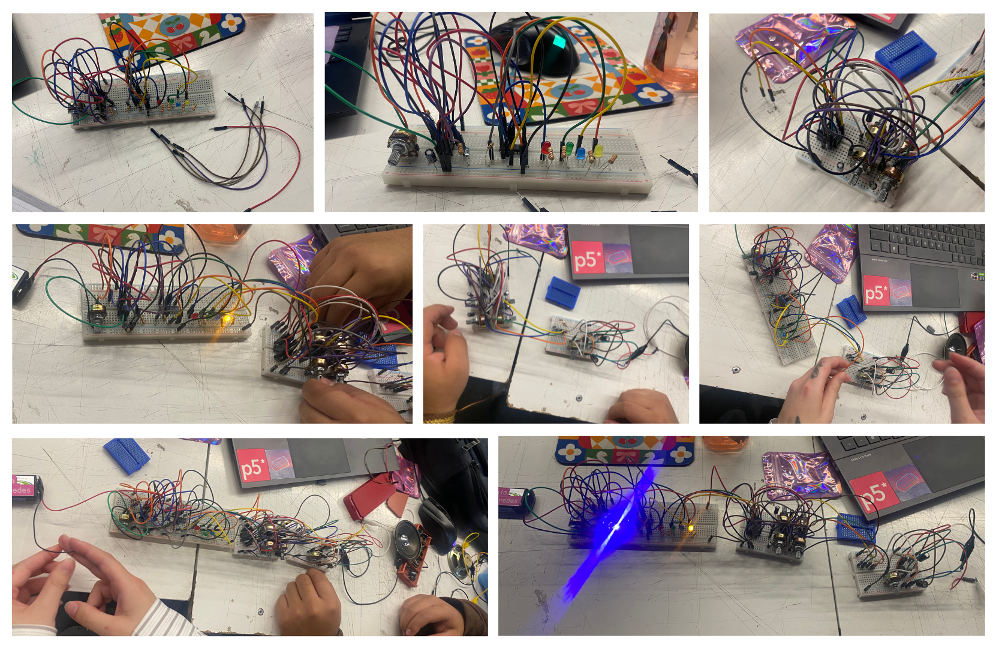

En la sesión-06b, comenzaron los problemas ya que al reconectar el circuito armado anteriormente, este dejó de funcionar (el LED no parpadeaba y no se generaba la secuencia de pasos). Debido a esto, se decidió desarmar completamente el circuito y reconstruirlo desde cero. Para mejorar el orden y el espacio de trabajo, se utilizaron protoboards de mayor tamaño. Durante este proceso se quemaron dos chips 555, los cuales fueron reemplazados. Una vez cambiados e incluyendo las modificaciones realizadas por misa, la secuencia volvió a funcionar correctamente.

## Proceso y resultados de osciladores y amplificador

Nuestra primera aproximación al uso del chip 4093 se realizó en la sesión 05a, donde comprendimos que se trata de un circuito integrado que contiene cuatro compuertas NAND con disparador Schmitt. Estas permiten trabajar tanto con señales digitales como analógicas, ampliando las posibilidades de uso dentro del sistema. Para la amplificación de audio se integró el chip 386, el cual permitió elevar la señal generada por los osciladores hasta un nivel audible.

En la sesión-06a a la par que se solucionaban los problemas del reloj y el secuenciador nos dimos cuenta que los potenciómetros estaban afectando a toda la secuencia, en lugar de controlar cada step de forma individual. Y por su parte, el potenciómetro del amplificador (que debe controlar el volumen y la distorsión del audio) hacía que el circuito no sonará, de hecho, había que poner la perilla en un punto muy exacto y no volver a tocarlo para poder generar sonidos.

En base a esos problemas, revisamos distintas opciones de lo que podría estar causando la situación, para ver si tal vez había algo mal conectado o algún componente en mal estado, pero todo se veía bien, así que no entendíamos qué era lo que estaba fallando. 

Pero para la siguiente clase (sesión-06b) cuando volvimos a conectar todo en base a los cambios que mandó misa persiste el problema de que cada potenciómetro estaba afectando toda la secuencia de sonido, en lugar de operar paso a paso como esperábamos. Hacia el final de la clase siguiendo la sugerencia de Misa, se retiraron los LEDs y las resistencias del step 02, lo que permitió corregir el problema. Tras esta modificación, cada step pasó a ser controlado por su propio potenciómetro, logrando un funcionamiento más estable y preciso del sistema.

El resultado final fue un circuito con mejor control individual, mayor claridad en la respuesta sonora y un comportamiento más consistente durante las pruebas. 

Al lograr un buen resultado base del sintetizador comenzamos nuestra fase exploratoria para buscar los sonidos que nos gustará más como grupo, por lo que comenzamos a  jugar con el cambio de condensadores. 

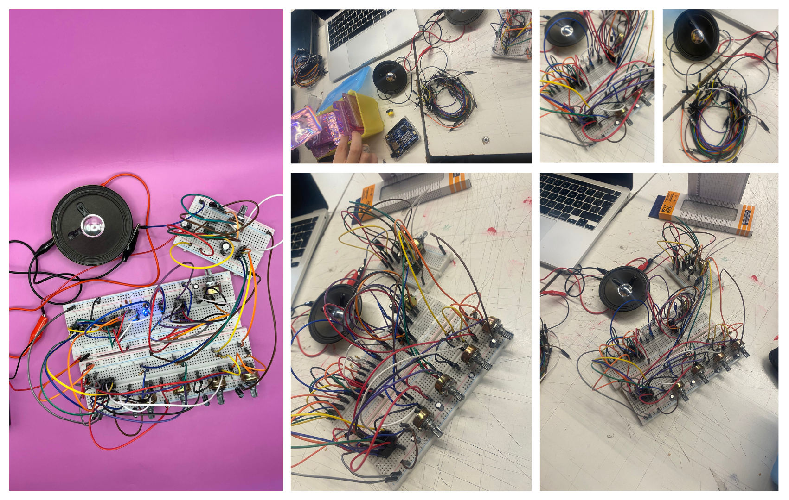

## Modificaciones realizadas a los circuitos originales

Cuando empezamos a construir, usamos como referencia el esquemático original `555_4017_4093_Synth` diseñado por Misa. Ese circuito ya era funcional, nuestro trabajo fue entenderlo, armarlo, y después preguntarnos qué queríamos que fuera diferente.
 
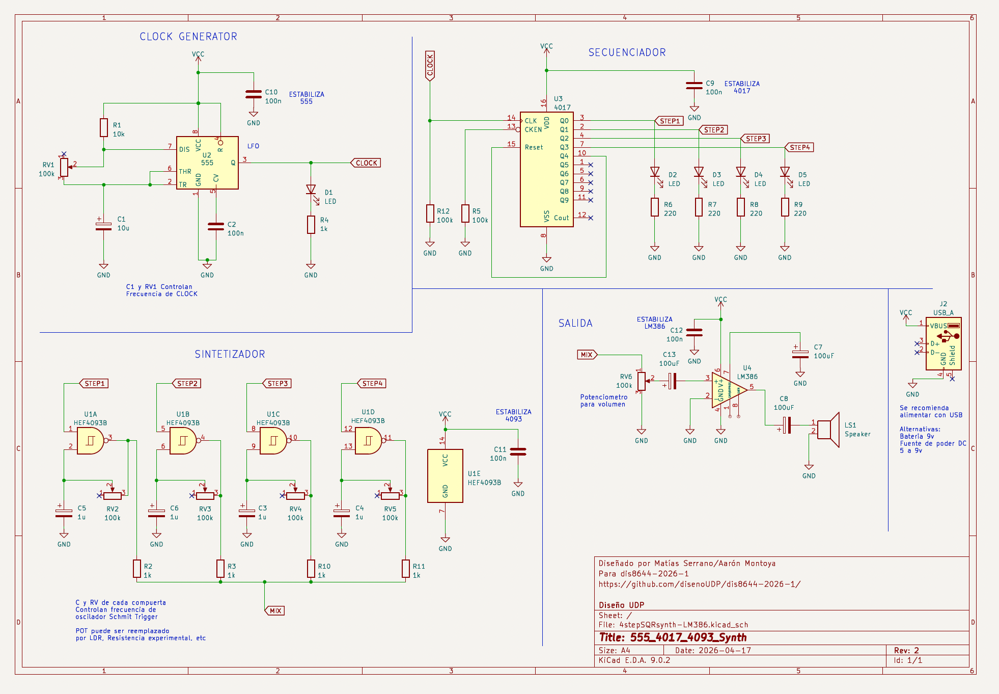
 
Las modificaciones que terminamos haciendo no fueron todas planeadas desde el inicio, algunas las descubrimos probando y otras surgieron de errores.

### Modificación 1 - condensadores de los osciladores
 
**Original:** los cuatro osciladores del 4093 (U1A, U1B, U1C, U1D) usaban condensadores de **1µF** (C5, C6, C3, C4) con potenciómetros de 100kΩ.
 
**Nuestro proceso:** Mantuvimos el 1µF como punto de partida pero experimentamos con distintos valores para encontrar el rango de frecuencias que buscábamos.  

El circuito terminó con una combinación:

| Oscilador | Ref. condensador | Valor final | Dónde está en el rango |
|-----------|-----------------|-------------|------------------------|
| STEP1 (U3A) | C5 | 1µF | Tono medio-agudo |
| STEP2 (U3B) | C6 | 4.7µF | Tono más grave |
| STEP3 (U3C) | C3 | 1µF | Tono medio-agudo |
| STEP4 (U3D) | C4 | 0.47µF | Tono más agudo |
 
No llegamos directamente a esos valores de condensadores, fuimos probando de a poco. Probamos con 10, 4.7, 0.22, 0.47, 33 y 22µF, en cada paso escuchamos el resultado y decidimos si queríamos ir más arriba o más abajo en frecuencia. 

Con C = 0.47µF y R = 100kΩ la frecuencia sube considerablemente. Con C = 4.7µF baja. Tener valores distintos en cada paso hace que la secuencia no sea monótona, con eso logramos que cada uno de los cuatro pasos tenga su propio carácter de tono.
 
### Modificación 2 — interruptor de encendido 
 
**Original:** El circuito de referencia no tiene interruptor físico, para apagarlo y prenderlo había que desconectar la batería directamente.
 
**Nuestro circuito:** Se incorporó un **interruptor** al sistema para controlar la alimentación del circuito. La entrada del switch fue conectada a los **9V** provenientes de la batería, mientras que la salida se conectó a la línea de **VCC**, permitiendo encender y apagar el circuito de forma controlada sin desconectar la fuente de energía.
El **GND** se conectó de forma directa desde la batería al circuito, sin pasar por el interruptor. 

### Modificación 3 — segundo NE555 para luces decorativas
 
**Original:** el circuito de referencia usa **un solo NE555** (U1) como generador de reloj para el secuenciador. Nada más.
 
**Nuestro circuito:** agregamos un **segundo NE555** (U5) independiente del circuito de audio, dedicado únicamente a hacer parpadear LEDs decorativos visibles desde afuera de la carcasa. Tiene un potenciómetro para controlar su frecuencia y no interactúa con el sonido. Lo único que comparte con el resto del circuito es la alimentación: está conectado al mismo VCC que pasa por el interruptor, así que cuando enciendes *La Caja*, las luces también se encienden. Cuando la apagas, todo para junto.
 
Es una decisión puramente estética. Queríamos que la caja tuviera vida propia visible desde afuera, que se notara que algo estaba pasando adentro sin necesidad de escucharla.

## Carcasas de cartón

La carcasa de *La Caja* está hecha de **cartón corrugado de desecho**, caja que rescatamos de un filamento de PLA. 

### Diseño  

El diseño de la carcasa de La Caja se basa en una estética de “honestidad constructiva”, donde la estructura del cartón adopta un enfoque industrial (estilo industrial) que deja a la vista ciertas partes de la complejidad interna de los cables por medio de unos pocos calados que representan la geometría del píxel, todo esto acompañado de costura de tripas electrónicas (cables). 

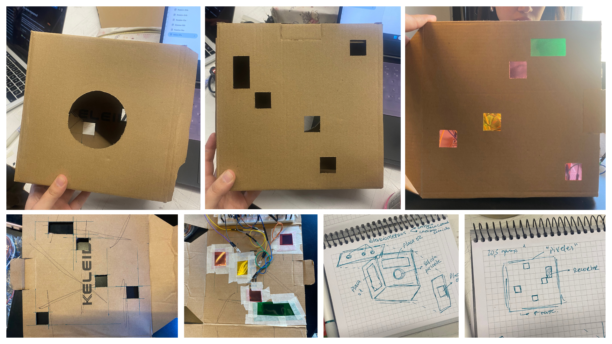

### Proceso decorativo

Al ser una caja ya existente nuestra idea era hacerlo todo a mano (no utilizar por ejemplo corte láser para los agujeros de los componentes) por lo que parte de nuestros desafíos fue cortar el cartón con exactitud ya que por ejemplo los agujeros para los potenciómetros tienen que ser del tamaño justo, sí quedan muy grandes se mueven, si quedan muy chicos no entran, la de los pixeles y el agujero para el parlante lo ideal era que quedara con muy buen oficio por lo que terminamos usando mucha paciencia. 

Ocupamos también papel celofán que se pegó con masking tape por el interior al igual que los cables que fueron reforzados con silicona caliente para mayor fijación. 

### Dónde pusimos cada cosa y por qué
 
| Componente | Ubicación | Por qué ahí |
|------------|-----------|-------------|
| Potenciómetro de tempo | Panel superior, izquierda | Es el control principal, queríamos que estuviera a mano porque la velocidad era una modificación interesante con la cual interactuar |
| Potenciómetros sintetizadores x2 | Panel superior, centro | Son la interfaz principal, dejamos fuera los dos que encontrábamos que modificaban el tono de una manera más única y acorde a lo que queríamos hacer, dejando dentro de la caja a dos que hacen de sonido base ya que no se pueden modificar desde afuera |
| Interruptor on/off | Panel superior | Separado del flujo de uso|
| LEDs x4 | Panel frontal, en cada pixel| Para ver los colores mientras suena |
| Parlante | Panel trasero | Que no apunte directo hacia quien escucha ya que el sonido puede sonar algo fuerte o muy agudo lo que quizás puede ser molesto si se está muy cerca|
| Batería 9V | Interior, base | Que sea fácil moverla, sacarla y ponerla |
 
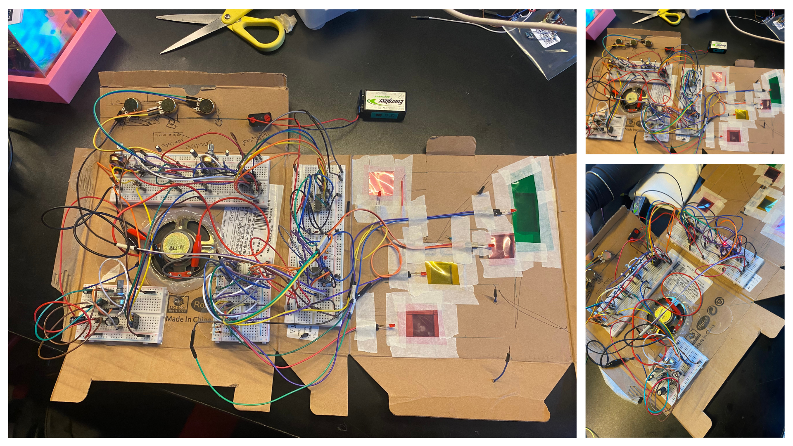
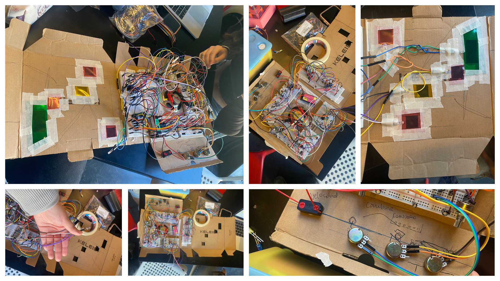
 
## Interconexión entre módulos

Los tres módulos se conectan en cadena, de izquierda a derecha:
 
```
[NE555]  →  [CD4017]  →  [HEF4093B]  →  [LM386]  →  [Parlante]
reloj      secuencia    osciladores    amplificador
```

| Desde | Señal | Hacia | Función |
|-------|-------|-------|---------|
| NE555 (pin 3) | Onda cuadrada | CD4017 (pin 14) | Pulso de reloj |
| CD4017 Q0–Q3 | Pulsos de secuencia | HEF4093B (entradas) | Activa cada oscilador |
| HEF4093B (salidas) | Señal de audio | LM386 (pin 3) | Entrada de audio |
| LM386 (pin 5) | Audio amplificado | Parlante | Sale como sonido |
| Batería 9V | Alimentación | Todo | Energía |
 
> Ver el esquemático KiCad adjunto para el diagrama completo de conexiones.
 
## Resultados finales

La caja es un dispositivo de experimentación sonora que se activa mediante un interruptor de encendido y apagado, funciona a partir de un ritmo secuencial constante que el usuario puede intervenir directamente. Cuenta con tres potenciómetros: dos permiten modificar las frecuencias del sonido, alterando su carácter y textura, mientras que el tercero controla la velocidad del ritmo. En su interior, luces osciladoras que se encienden y apagan proyectándose hacia el exterior a través de las ventanas “píxeles” de la estructura. Estas luces refuerzan la experiencia rítmica y visual, haciendo visible el comportamiento sonoro desde fuera.

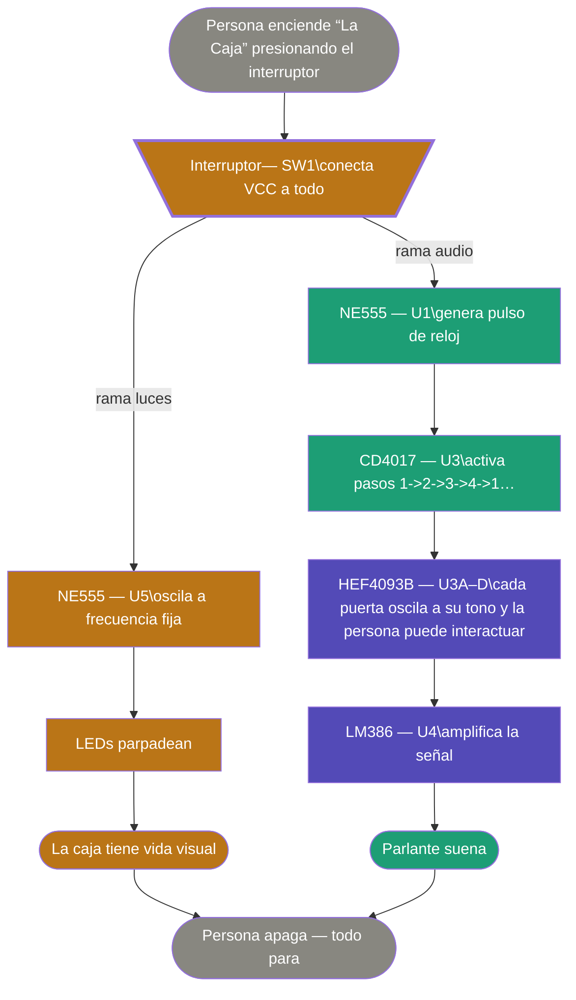
```mermaid
flowchart TD
    START([Persona enciende “La Caja” presionando el interruptor])
    SW[\Interruptor— SW1\conecta VCC a todo/]

    START --> SW

    SW -->|rama luces| U5[NE555 — U5\oscila a frecuencia fija]
    SW -->|rama audio| U1[NE555 — U1\genera pulso de reloj]

    U5 --> LEDS[LEDs parpadean]
    LEDS --> VIDA([La caja tiene vida visual])

    U1 --> CD[CD4017 — U3\activa pasos 1->2->3->4->1…]
    CD --> OSC[HEF4093B — U3A–D\cada puerta oscila a su tono y la persona puede interactuar]
    OSC --> AMP[LM386 — U4\amplifica la señal]
    AMP --> SPK([Parlante suena])

    VIDA --> OFF([Persona apaga — todo para])
    SPK --> OFF

    style START fill:#888780,color:#fff
    style SW fill:#BA7517,color:#fff,stroke-width:3px
    style U5 fill:#BA7517,color:#fff
    style LEDS fill:#BA7517,color:#fff
    style VIDA fill:#BA7517,color:#fff
    style U1 fill:#1D9E75,color:#fff
    style CD fill:#1D9E75,color:#fff
    style OSC fill:#534AB7,color:#fff
    style AMP fill:#534AB7,color:#fff
    style SPK fill:#1D9E75,color:#fff
    style OFF fill:#888780,color:#fff
```

[]((https://youtube.com/shorts/2OlexzJCbLg?feature=share))
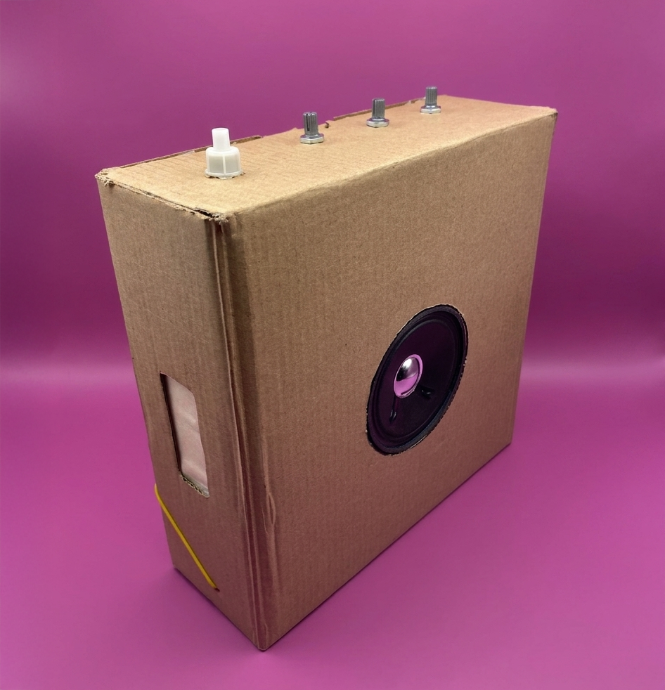
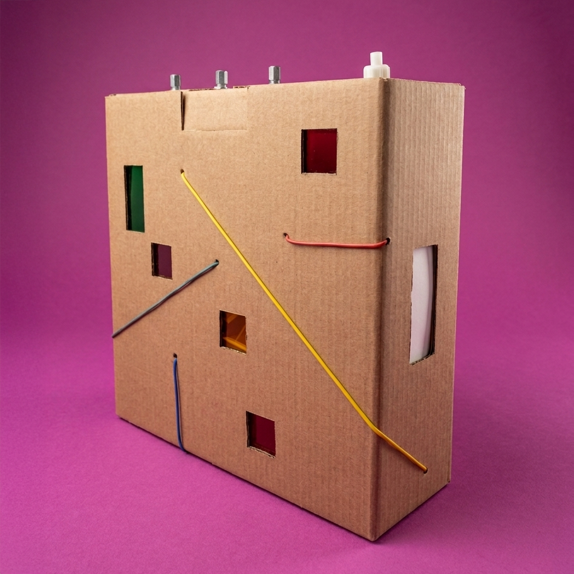
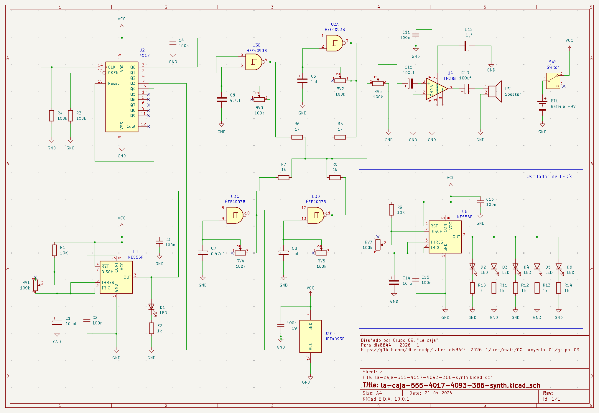

## Aprendizajes y errores

### Aprendizajes

Los chips pueden estar dañados o quemados, por lo que siempre es importante considerarlo al momento de detectar fallas.
Revisar el estado de la batería antes de comenzar, asegurando que esté cargada y funcionando correctamente. (recordar cargarla).
Un error pequeño puede escalar y generar problemas mayores en el sistema completo.
Mantener un orden claro en las conexiones facilita el armado, la revisión y la detección de errores.
Mantener el orden en el área de trabajo es fundamental para evitar errores, facilitar el armado del circuito y agilizar la detección de fallas.

### Errores 

* El circuito no sonaba correctamente debido a una conexión errónea del pin 9 del 4017 al voltaje, este pin no debía estar conectado a nada.
* Se quemaron tres chips 555 a causa de conexiones incorrectas.
* Se intentó conectar demasiados componentes a una fuente de bajo voltaje, lo que afectó el funcionamiento general del sistema.
* Se buscó encender cinco LEDs blancos con un voltaje insuficiente, lo que resultó problemático debido a que estos requieren un voltaje mayor al habitual, por lo que se cambiaron por LED´s rojos.
* La conexión a los potenciómetros se realizó inicialmente de forma inversa, lo que provocó una fuerte distorsión del sonido y un comportamiento fuera de los tiempos esperados.
* Las resistencias y los LEDs del contador de décadas interfirieron con el funcionamiento correcto del sintetizador, impidiendo un control adecuado de la señal, así que los sacamos.
* Al principio no sonaba sonido alguno de nuestras conexiones, descubrimos que el potenciómetro conectado a la salida debía estar en una posición específica para sonar.

### Imágenes de proceso y errores

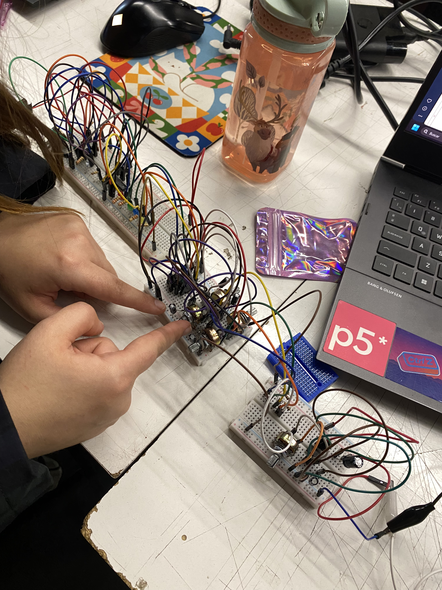
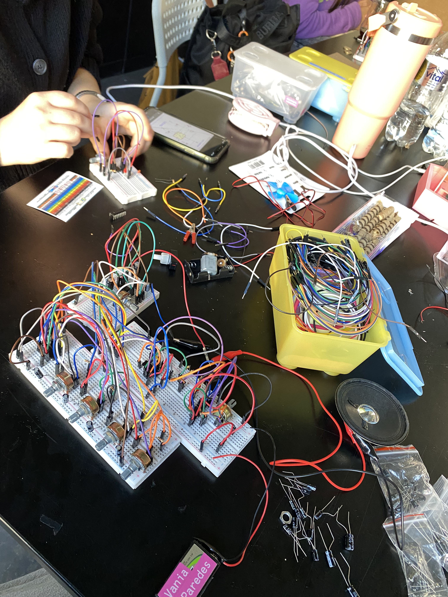
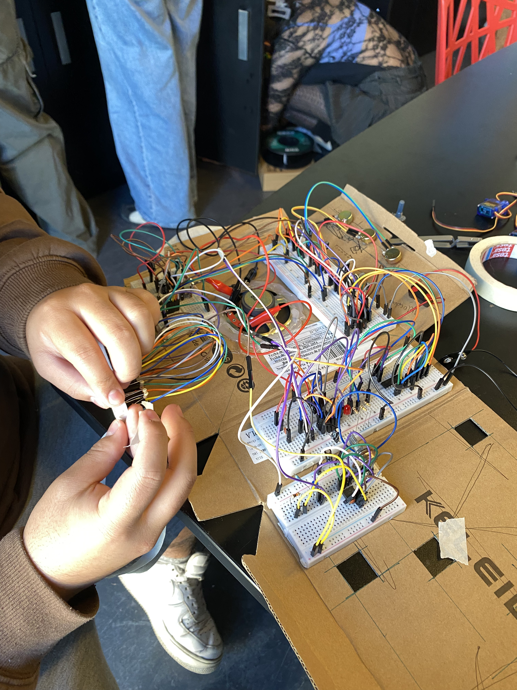

#### Sonido antiguo v/s sonido actual 

En la sesión 06b logramos obtener un sonido similar al de un arcade antiguo, lo que nos motivó a tomar esa referencia como objetivo para la entrega final. Sin embargo, durante la sesión 07a, debido a ciertas modificaciones en el circuito, no fue posible recuperar ese sonido inicial. Posteriormente, con la ayuda de Sebastián Sáez en un trabajo posterior a la sesión, logramos encontrar una configuración sonora que nuevamente llamó nuestra atención y se alineó con la propuesta que buscabamos.

[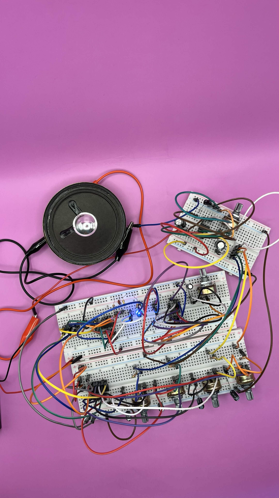]((https://youtube.com/shorts/4vf9a5yF5DE))
[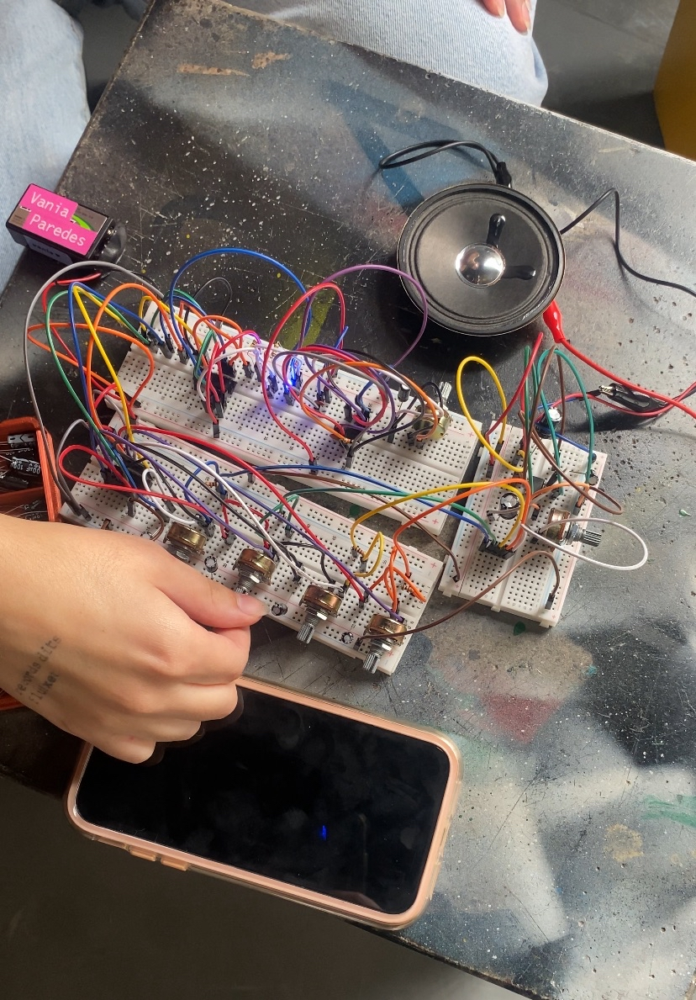]((https://youtube.com/shorts/4vf9a5yF5DE))
[]((https://youtube.com/shorts/2OlexzJCbLg?feature=share))

## Conclusiones

El desarrollo de *La Caja* permitió integrar los aprendizajes técnicos del taller en un objeto funcional que trasciende el armado de un circuito para convertirse en una pieza de diseño exploratorio. El proceso evidenció la importancia de la modularidad, el orden y el trabajo colaborativo para resolver problemas técnicos, así como el uso de una materialidad sencilla y una estética industrial honesta que hace visible su funcionamiento interno. En lo sonoro, el proyecto demostró que una máquina no tiene por qué ser predecible: la iteración y las limitaciones técnicas se transformaron en parte de su identidad. Como percepción final de nuestro trabajo, *La Caja* se manifiesta como **un insecto eléctrico atrapado en un loop, convencido de que si repite el mismo gesto suficientes veces va a encontrar la salida**, un sistema abierto que invita a la curiosidad y a la exploración constante.
