# grupo-10

## **LA TOSTADORA INASTABLE**

## integrantes

- Isidora Alvarez Olivares - isidoraalvarez

- Dayana Pañitrur - dayanapanitrur
  
- Carla Pino Barrios- Coff4

- Camila Ramirez Parra - Estrabismx

## descripción del sintetizador realizado

Para nuestro proyecto se nos dio la tarea de hacer un Sintetizador en base a diferentes chips que hemos ido estudiando a lo largo de estas semanas, con ello también era necesario hacer una carcasa para el circuito para una mayor practicidad

Por un lado tenemos los 4 chips en funcionamiento:

Comenzando por el 555: Este esta hecho para funcionar como el Clock generator de nuestro Sintetizador, dando periódicamente pulsos (los cuales pueden ser ajustados tanto por el condensador como por la resistencia) que se pueden evidenciar  en un LED, siendo este último una conexión directa a nuestro siguiente chip

4017: desde la conexión CLOCK se traspasan los pulsos a nuestro Secuenciador, que como su nombre indica, hace secuencias de manera ordenada y esto lo demuestra en los STEPS que son 4

4093: Los anteriormente mencionados STEPS son conectados al siguiente chip que es el “Sintetizador” del circuito. Gracias a las señales secuenciadas del anterior chip y con 4 potenciómetros, podemos variar los tonos/frecuencias

386: Para que se escuche todo nuestro circuito, es necesario este último chip, que funciona como amplificador gracias al parlante que va implementado, y en conjunto con un potenciómetro que regula el volumen de salida,  esto pasa por la conexión MIX que parte desde el 4093 y se termina conectando al 386 que transmite el sonido

Al menos lo básico de este:
Ya que este circuito está basado en el esquemático que se nos pasó en clases. Por lo tanto se nos dio la libertad de modificar varias partes de este para lograr diferentes objetivos, desde la fuente de energía, la conexión a través de duponts y otras cosas que se irán viendo a lo largo de la presentación.

Y por otro lado:
Tenemos el tema de la carcasa, la cual es diseñada tanto para la practicidad como por la comodidad del usuario que vaya a manipularlo, con una materialidad de cartón a nuestra disposición y variados métodos para hacer las conexiones, tomamos en cuenta cada variable para crear un sintetizador estable y constante para el disfrute del usuario.

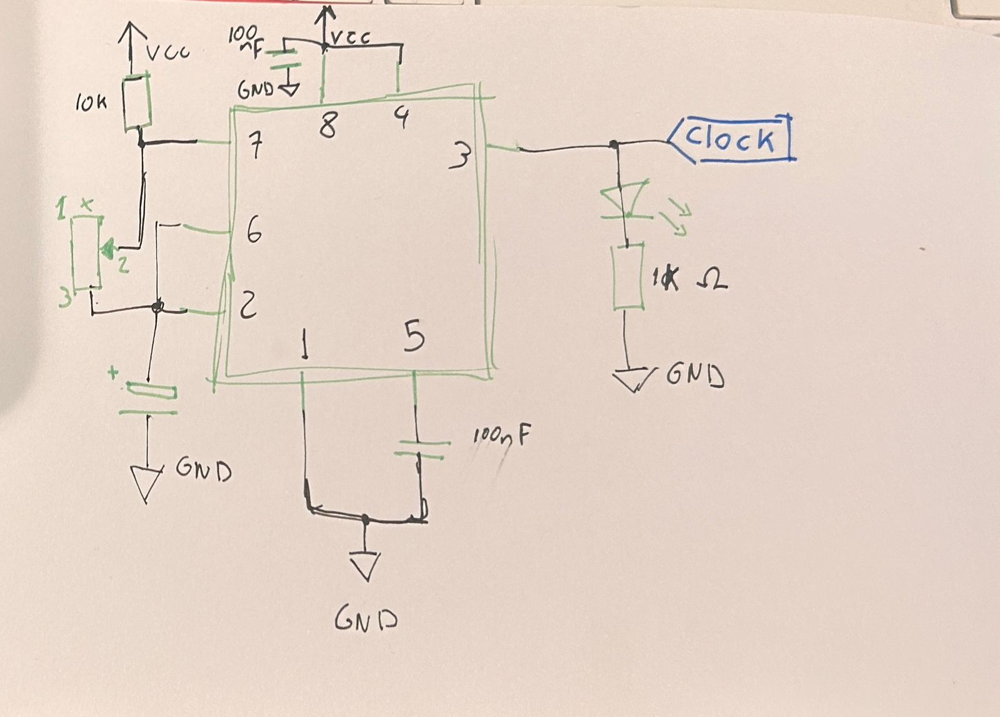

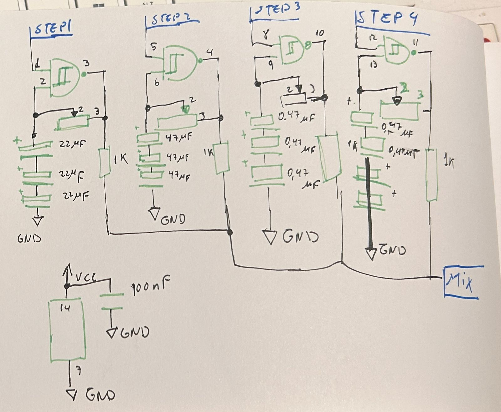

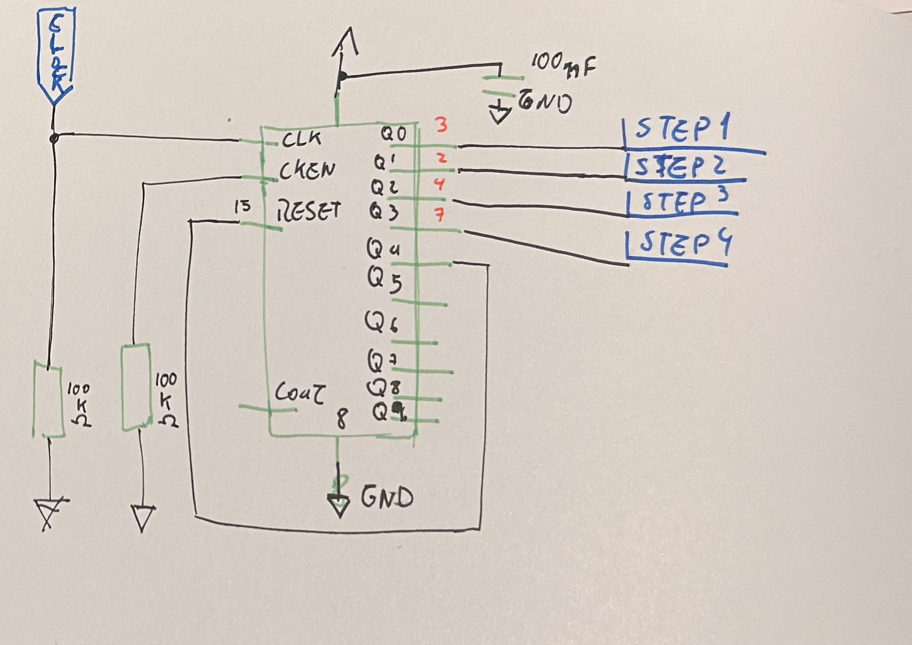

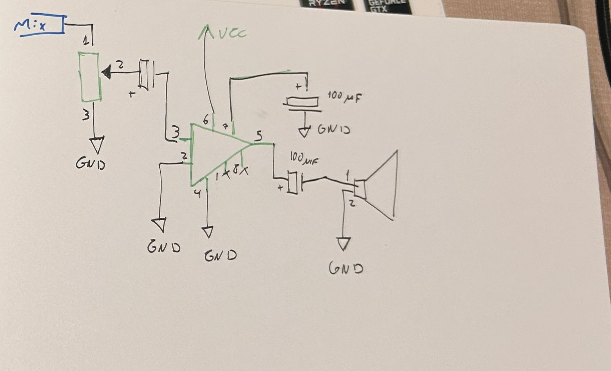

## proceso y resultados del reloj y secuenciador

Para los chips 555 y 4017 no hubo complicaciones notorias o graves, al ser circuitos más estudiados por nosotras y que entre los chips se pueden comprobar fácilmente las fallas. Al menos esto era así antes de las modificaciones que se hicieron, porque era notorio cuando no funcionaban, por la implementación de los LEDS, ya que no siempre prendían u oscilaban correctamente.

Incluso en la versión final se retiraron los 4 LEDS del 4017 por la inestabilidad que estos generaban en el circuito.

Para el final de la semana, se terminaron reemplazando más de 3 chips 555 y 4017 por fallas.

“Tenemos la hipótesis de que en uno de los intentos al ser utilizado un condensador de 1μF para oscilaciones rápidas, puede que algo del circuito no vaya a la par de la velocidad del 555 y que por eso falle”

Antes de saber que fue por 3 chips quemados/no funcionales consecutivos y malas conexiones de los cables a la protoboard, hicimos un pequeño listado de cambios para descartar los errores:

-Se cambió el chip 555: esto resultó en que el LED prendía, pero no oscilaba correctamente.

-Cambiamos el condensador de 100 μF por uno de 1 μF.

-Se vuelve a cambiar el chip 555.

-Se reemplaza el potenciómetro por sospechas de que los que están soldados, estan malos.

-El LED se renueva con otro para descartar la idea.

-Desprendemos el condensador ceramico y volvemos por incluirlo.

-Reemplazamos el potenciómetro con una resistencia para comprobar que el LED oscile constantemente.

Y todo para reemplazar el chip por cuarta vez y conectar correctamente los cables a la proto para que funcione finalmente el 555 por cuenta propia.

Para el chip 4017 fue un poco menos caótico ya que descubrimos que no estaba bien conectado a CLOCK.

Pero lo importante es que con ayuda y descartando posibilidades pudimos hacer que ambos circuitos funcionaran para el final.

*Entre todo este proceso quisimos mantener los LEDS de la versión 2 del esquemático, pero después de intentarlo un tiempo prudente, decidimos descartarlo por el plazo de tiempo que teníamos*

## proceso y resultados de osciladores y amplificador

Tanto con el chip 4093 y el 386 tuvimos más complicaciones a la hora de implementarlos, ya que eran necesarios los chips anteriores para comprobar la eficacia de estos nuevos,  sobretodo hablando con el cableado, el cual contenía 4 entradas NAND, lo que suponía una gran cantidad de cables que fácilmente podrían ser confundidos entre ellos por los STEPS, en donde los LEDS del 4017 y la salida de sonido del 386 son los que comprobaban que el 4093 funcionara correctamente y ahora al depender de 3 circuitos todo podía ser más inestable, tanto por los cableados como por los chips

Mientras pensábamos que los potenciómetros estaban mal soldados, fuimos probandolos en el 555 mientras se veía el 4093
En este caso se fue probando cada compuerta una por una y se comprobó que hubo una mal interconexión entre este chip y el 386 porque GROUND iba conectado a nada y VCC estaba conectado al negativo de la protoboard.
y para el 386 hubo un problema con el potenciómetro que nivelaba el sonido ya que la pata 3 de este, no estaba bien soldada.

Una vez visto que el sintetizador empezó a producir frecuencias audibles  nuevamente, se decidió por modificar ciertos componentes para obtener distintas tonalidades, para esto se hizo un cambio en los capacitores de 10μF que se conectaban a los **Steps**:

**Step 1**: Se colocaron 3 capacitores de 47 μF en serie.

**Step 2**: Se colocaron 3 capacitores de 22 μF en serie

**Steps 3**: Se colocaron 3 capacitores de 0.47 μF en serie

**Step 4**:  Se colocaron 2 capacitadores de 0.47 μF en serie

Se hizo con la intención de obtener 4 sonidos totalmente distintos, desde el STEP 1, que es donde la frecuencia es menor, específicamente 0.46 Hz y STEP 4 donde la frecuencia es más alta: 45.95 Hz.

Las páginas que utilizamos para calcular la frecuencia fueron, una recomendada por Aaron:
<https://stompboxelectronics.com/resources/schmitt-trigger-oscillator-calculator/> y otra que encontramos en internet para sumar capacitores en serie: <https://www.digikey.com/es/resources/conversion-calculators/conversion-calculator-series-and-parallel-capacitor>

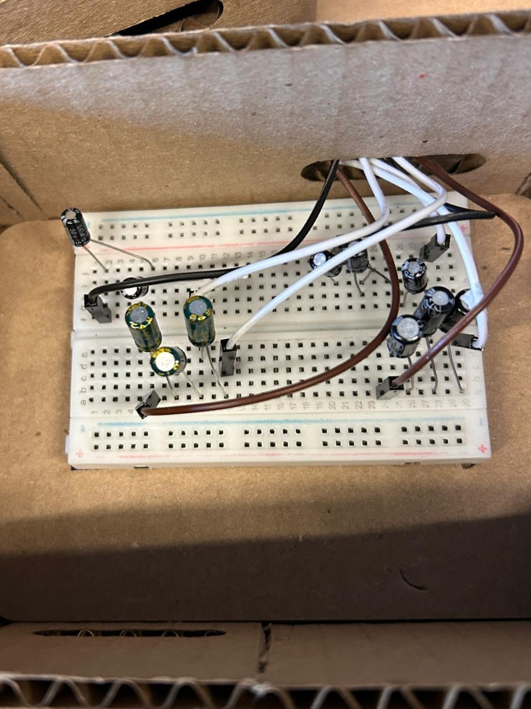

## modificaciones realizadas a los circuitos originales

1. En el chip 4093 se cambiaron los condensadores de 1μF y se integraron una mayor cantidad de capacitores en serie de distintos valores.

2.Se soldaron los potenciómetros del CD 4093 a los cables para una mayor extensión y libertad para moverlos.

3.Se modificó el led del 555 y se le agregó cables dupont macho y hembra para una mayor flexibilidad.

4.Al CD4017 se les sacó los leds, recomendado por Aaron y Matias, ya que desestabilizan el circuito.

5.Utilizacion de potenciometro logaritmico para controlar el volumen.

## carcasas de cartón

La primera decisión que se tomó fue que la protoboard debe encajarse en la base, evitando usar algún adhesivo, todo esto con el fin de obtener acceso directo a las conexiones, para lograr mantenimientos inesperados. Luego adoptamos una forma curva, alejarnos de algo tan recto, como los sintes tradiciones en cajas tan ortogonales. Además se considero que cada chip tuviera su propia protoboard y por ende su propia caja, por lo que para lograrlo (y por tiempo) se decidió realizarlo mediante corte láser cada una de ellas, sumado a esto se implementaron terminales impresas en 3D para lograr mayor orden de los componentes.

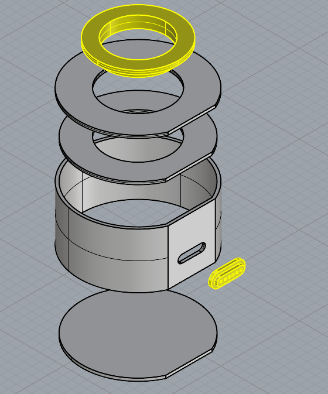

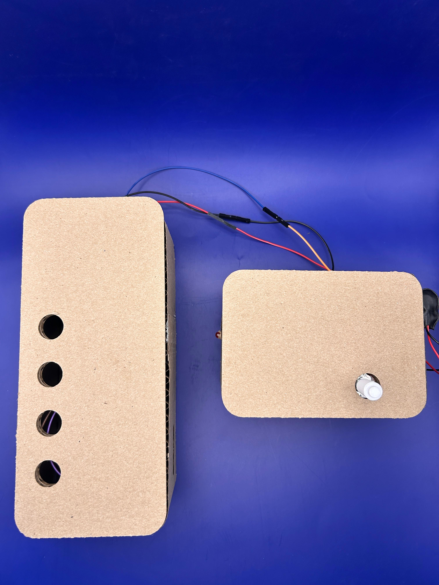

Dentro de la experimentación concluimos que en el uso de potenciómetros es ideal tenerlos conectados mediante cables a la protoboard, esto es debido a la mayor manipulación que nos permite. Sumado a esto, tenemos el hecho de tener que solucionar el soporte del parlante, por lo que se optó por seguir la misma línea de tener una caja de cartón que cumpla la misma lógica constructiva.

Dentro de la experimentación de los circuitos y sus respectivas cajas, se puede resaltar la gran ayuda que fue utilizar protoboards, el poder conectar de manera directa sin soldar fue una gran ayuda, además de poder revisar donde estaba el fallo cada vez que ocurría algo.

## interconexión entre módulos

Se inició el trabajo de la fabricación de los módulos individuales para cada chip, donde debido a fallos de cálculo tuvimos que repetir el proceso de corte láser. Dentro del armado se consideró la utilización de un puerto donde se pudieran realizar la conexión entre cada módulo, un ejemplo de esto es la unión de CLOCK y SINTETIZADOR. Para mantener mayor control de estas conexiones se decidió hacer lo posible por estandarizar los colores, es decir que ciertas uniones modulares utilizarían colores predeterminados para evitar el error humano

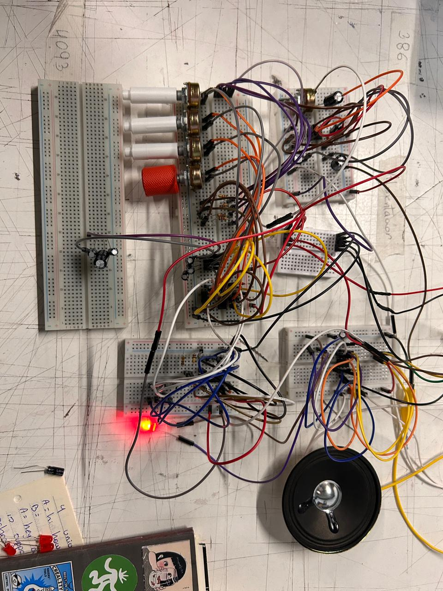

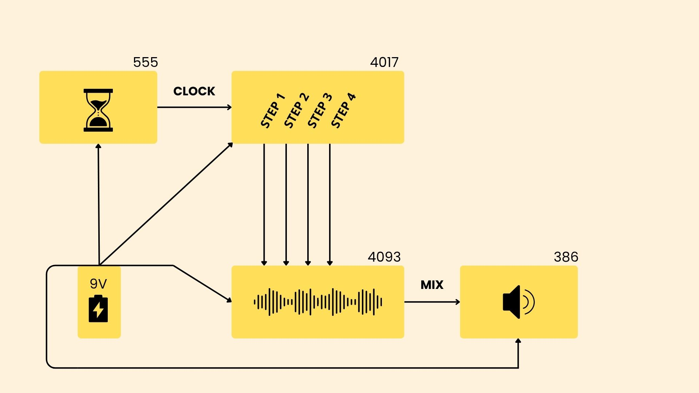

## resultados finales

Como resultado de este arduo trabajo obtenemos un sintetizador con diferentes cambios pensados para obtener la mejor experiencia del usuario

todo lo que es carcasa está pensado para que el circuito completo pueda conectarse desde cada cara, con ello también conseguimos que la manipulación de los potenciómetros sea más cómoda, al agregarles un soporte a las perillas para girarlas y mantener estas últimas en lugares óptimos para su uso con el público, para hacer un mayor control tanto en volumen, velocidad y las frecuencias

Y a la par, tener un circuito funcional que logre transmitir y configurar todo esto de la forma más óptima posible siempre pensando en el usuario

Como punto importante tenemos un conjunto de chips, que por separado cumplen funciones específicas y al unirlos se articulan en un sistema rítmico que se puede controlar según las preferencias, todo esto considera:

Pulso / 555  ➢Potenciómetro y Capacitor
Frecuencia / 4093 ➢ Capacitores y Potenciómetros
Volumen / 386 ➢ Potenciometro Logaritmico

[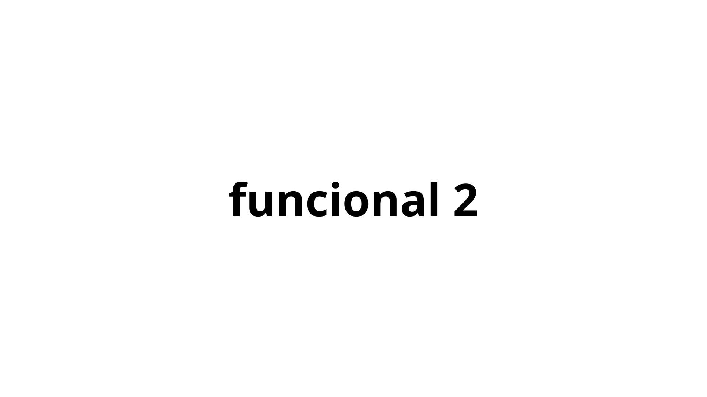](https://youtube.com/shorts/OnDnuAD8rnA?feature=share)

[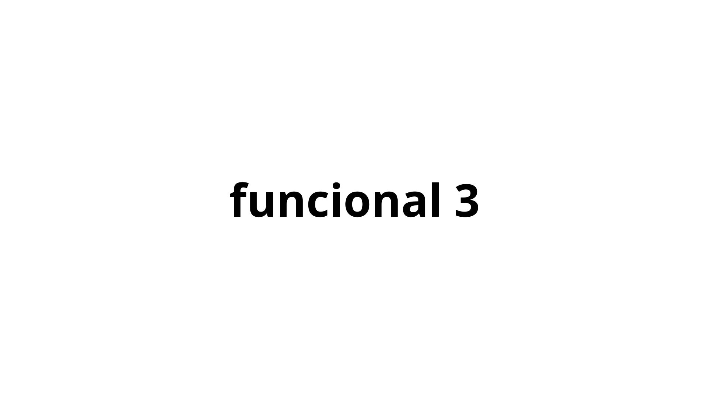](https://youtu.be/-Gm3Elvl8b4)

[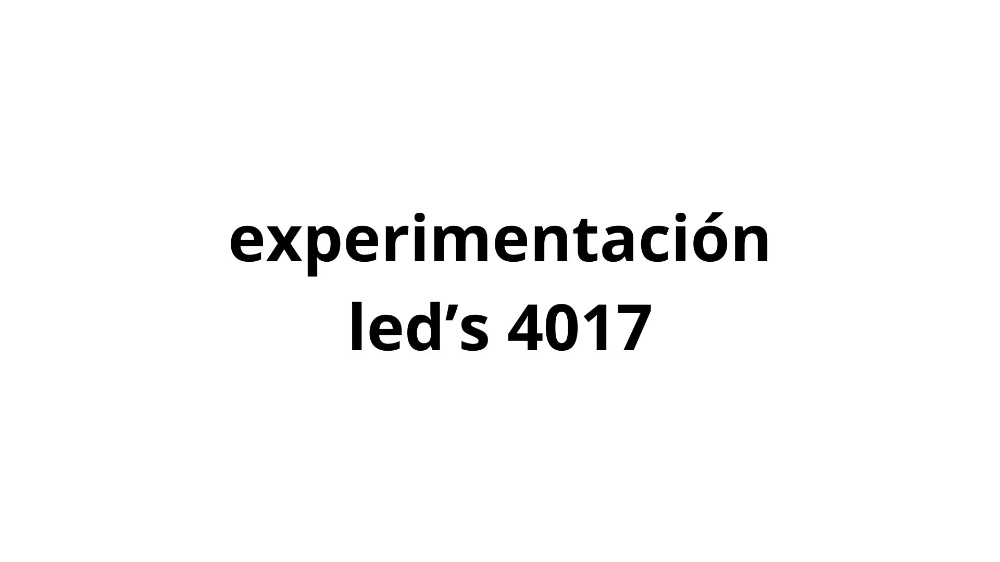](https://youtube.com/shorts/-WAXl1yggwI?feature=share)

[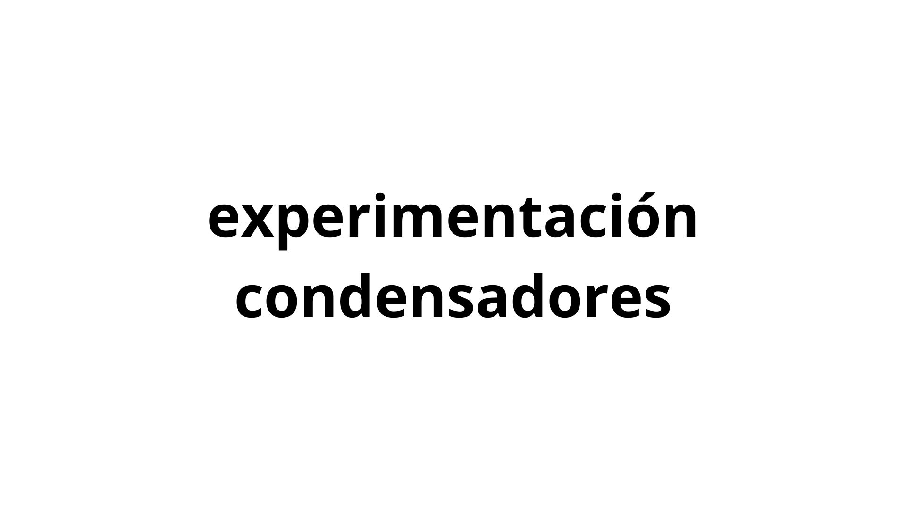](https://youtube.com/shorts/MRkO61sCz0I?feature=share)

)

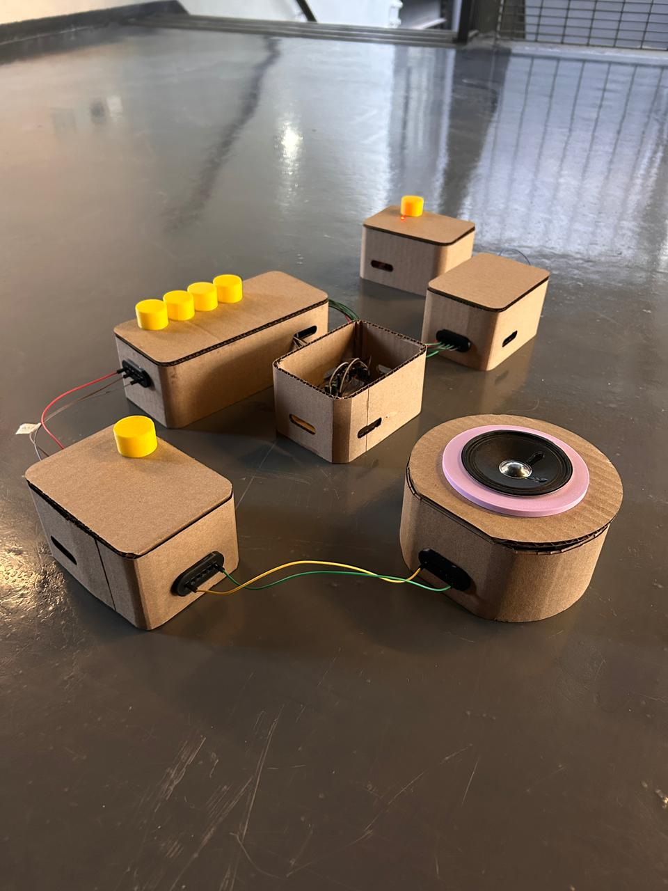

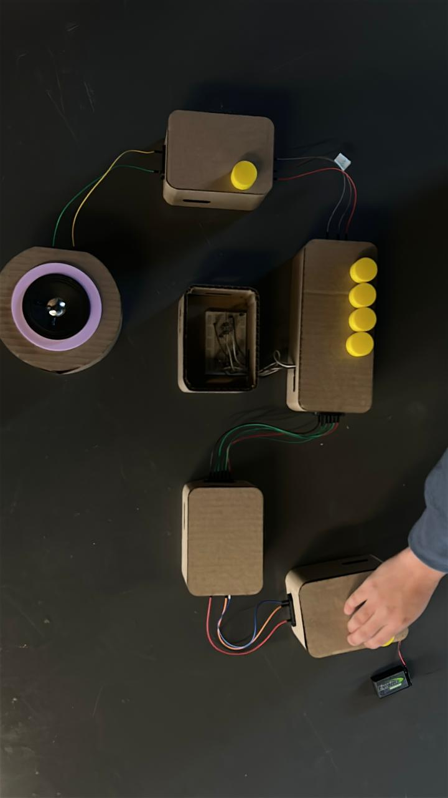

## aprendizajes y errores

Errores y aprendizajes del grupo:

Aun teniendo gente apasionada en nuestro grupo, nadie queda libre de tener errores en cosas “básicas” como el traspaso de las conexiones dadas en el esquemático, entre los cables, o si están siendo alimentadas de manera correcta tanto a GROUND como a 9V.

“Algunas aun sabiendo se equivocaban y otras que intentaban ir a la par, también se equivocaban”

Entre estos errores, pasábamos horas comprobando cada componente, conexión y chip. Esto era fundamental, ya que una simple mala conexión entre cables podían quemar los distintos chips y provocar que todo el circuito dejará de funcionar aunque todo estuviera correctamente conectado.

A partir de estas experiencias, surgieron varios aprendizajes. Siendo lo más importante  es que todes cometemos errores y eso está bien, porque somos estudiantes que no lo saben todo sobre máquinas electrónicas. y asumirlo nos permitió manejar mejor la frustración a lo largo del proyecto.

De hecho tuvimos muchísimos errores en el transcurso de las clases y antes de la entrega, algo que instintivamente nos hizo más precavidas, sacando más conclusiones o hipótesis de que podría haber salido mal o proponer soluciones en cada vez menos tiempo, que nos llevaba a un mejor entendimiento de lo que estábamos armando.

Por ejemplo: si el LED del 555 no funcionaba, podía ser por variados factores: entre los condensadores cerámicos, el potenciómetro, las resistencias o los μF de los condensadores y así con todo el sintetizador.

por lo que curiosamente, del error terminamos aprendiendo más, de que si todo hubiera salido bien desde un principio.

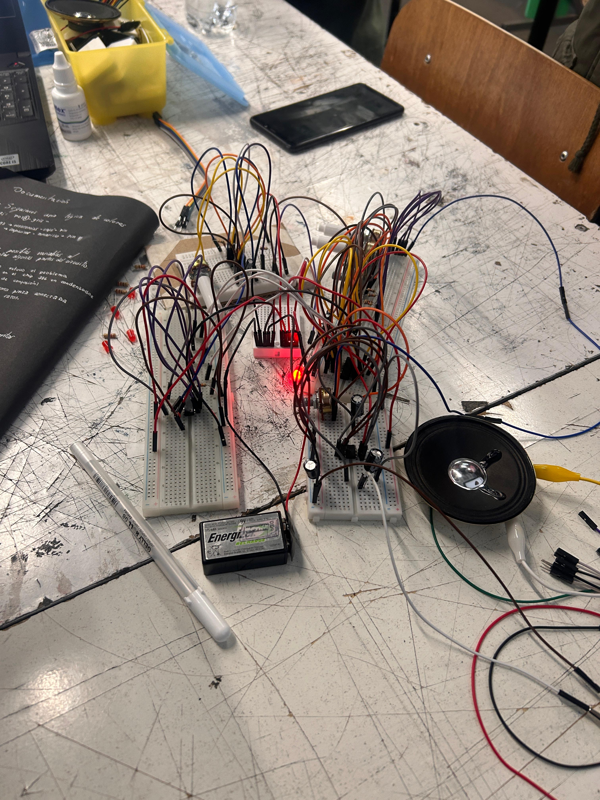

## conclusiones

Este trabajo nos hizo darnos cuenta que una organización bien planeada puede llegar a tener fallas de último minuto y que eso es normal.
Nos quedamos más horas de las necesarias para averiguar y solucionar cada problema presentado en el sintetizador que al largo plazo nos da un aprendizaje muy valioso sobre la frustración, el compañerismo entre todes y los componentes

Por el lado de la modularidad, pudimos experimentar y también fallar con los chips estudiados, algo que se notó en el desarrollo de este informe. Pero hubo uno en particular que terminó siendo clave: el 555. Aunque fue el primero que nos enseñaron en el curso, considerado como el componente “sencillo”, también resultó ser bastante frágil, y si este presentaba fallas, nada del sintetizador iba a funcionar nunca. De hecho, tuvimos que cambiarlo más de cuatro veces por lo inestable que podía llegar a ser. (mayormente por nuestra culpa) por lo que el cuidado a la hora de construir estos circuitos es crucial en este y los futuros trabajos

Y aun con todos los problemas de última hora, este proyecto nos da una rica experiencia sobre la manipulación de los chips, su funcionamiento y la manera de leerlos que serán de mucha ayuda para los siguientes trabajos que esperamos con ansias.

Como último punto:

También podemos mencionar que hubieron ideas descartadas en nuestro desarrollo

-Implementar 1 protoboard separada para la alimentación de todos los chips

-Otra protoboard para que el usuario pudiera manipular y experimentar con los tonos del sintetizador y los condensadores

-Mantener los LEDS del 4017 para el sintetizador final

Y usar otra manera de dar energía al circuito.
En un momento decidimos investigar sobre maneras creativas de hacer esto y logramos que esto funcionara, e investigando vimos que hay muchos objetos e incluso personas que pueden ser parte de estos circuitos para proporcionar energía a otros.

estos son parte de la investigación de la energía:
<https://www.instructables.com/Repurposing-Beverage-Cans-for-Low-Voltage-Electric/>
<https://microbit.org/es-es/projects/make-it-code-it/human-circuit-experiment/>
<https://www.sciencebuddies.org/science-fair-projects/project-ideas/Energy_p015/energy-power/make-a-battery-from-coins>

Cómo funcionan los chips:

<https://www.build-electronic-circuits.com/4000-series-integrated-circuits/ic-4093/>

<https://www.build-electronic-circuits.com/4000-series-integrated-circuits/ic-4017/>

<https://www.homemade-circuits.com/ic-lm-386-datasheet-explained-in-simple/>

<https://www.incb.com.mx/index.php/articulos/53-como-funcionan/768-como-funciona-el-circuito-integrado-555-art123s>
