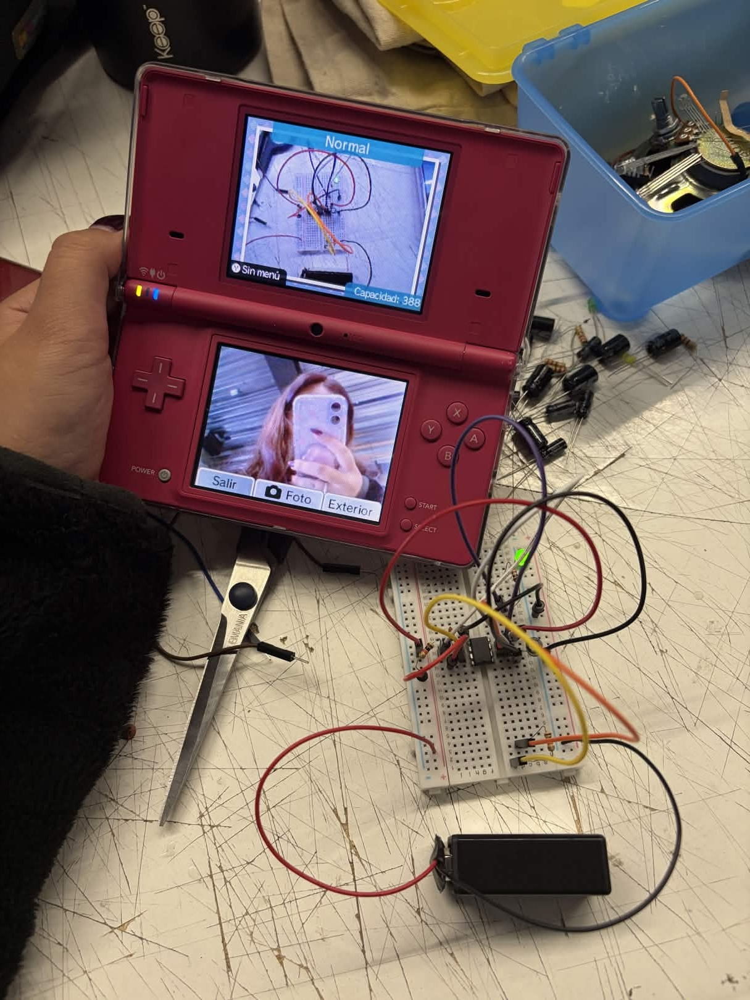
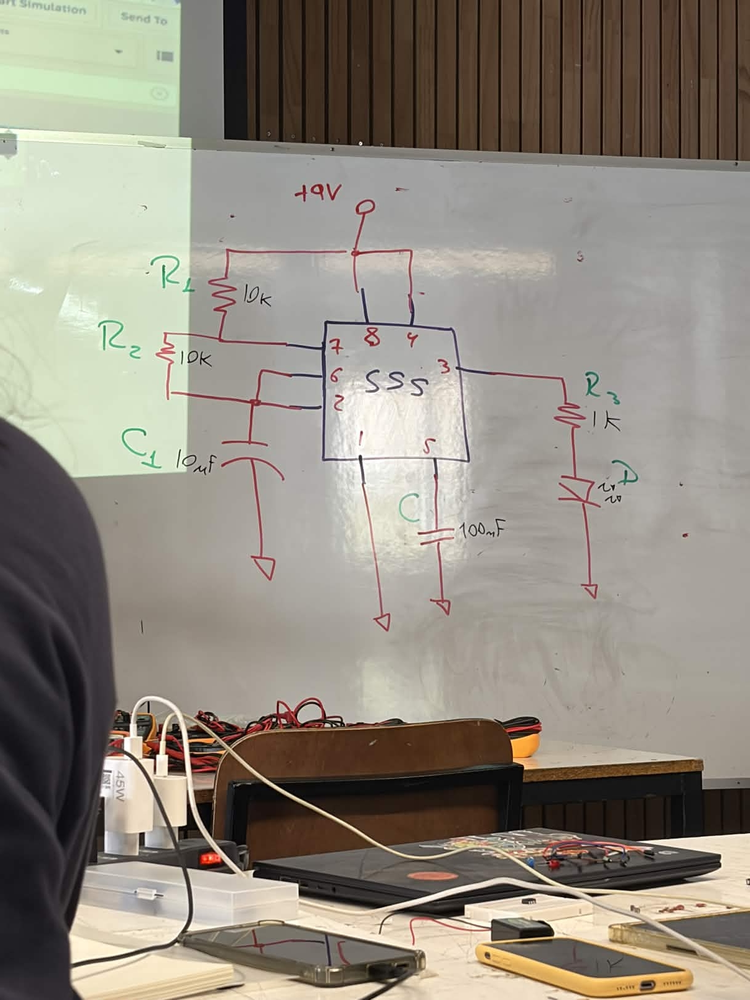
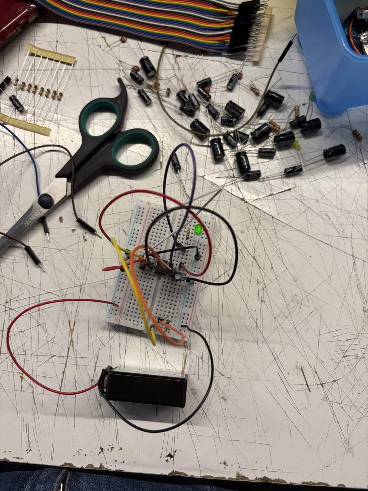

# sesion-02b

viernes 20 de marzo 

## Apuntes clase

- Fotoresistor (LDR): resistencia que varía según la cantidad de luz que recibe.
  - Más luz → menor resistencia
  - Menos luz → mayor resistencia
- Chip 555: uno de los circuitos integrados más utilizados en electrónica, especialmente para generar pulsos, temporizadores y oscilaciones.

### Fotos de lo hecho en clase

## Repaso materia

### Resistencias

- Limita el paso de la corriente
- Controla el voltaje dentro del circuito

Las resistencias usan un código de colores para indicar su valor en OHM (Ω)

### Código de colores

| Color    | Valor |
|----------|------|
| Negro    | 0    |
| Café     | 1    |
| Rojo     | 2    |
| Naranjo  | 3    |
| Amarillo | 4    |
| Verde    | 5    |
| Azul     | 6    |
| Violeta  | 7    |
| Gris     | 8    |
| Blanco   | 9    |

(pendiente subir esquema de ejemplo de cómo leer la resistencia ya teniendo el código de colores) 

### Condensadores/Capacitores

- Almacena energía eléctrica temporalmente
- Se carga y descarga
- Filtra señales o estabiliza voltaje

### Tipos de condensadores

Electrolítico:

- Es polarizado (+ y -)
- Tiene mayor capacidad (µF)

En el esquemático se representa así: |)

Cerámico:

- No polarizado
- Tiene menor capacidad (pF, nF)

En el esquemático se representa así: ||

## Preguntas

- ¿Se pueden usar leds RGB en este tipo de circuitos?
- ¿Los esquemáticos se pueden armar en físico de distintas maneras? 
- ¿Las resistencias se echan a perder?
- ¿De qué sirve conectar resistencias en serie?
- ¿Cómo sé qué tipo de condensador debo usar? 
- ¿Cómo puedo saber si mi batería ya se está descargando?
- ¿Qué otras fuentes de energía pueden usarse?
- ¿Cómo puedo saber si un led está quemado?
- ¿Se puede conectar más de una fuente de energía? 
- ¿Se pueden hacer circuitos sin usar protoboard?

