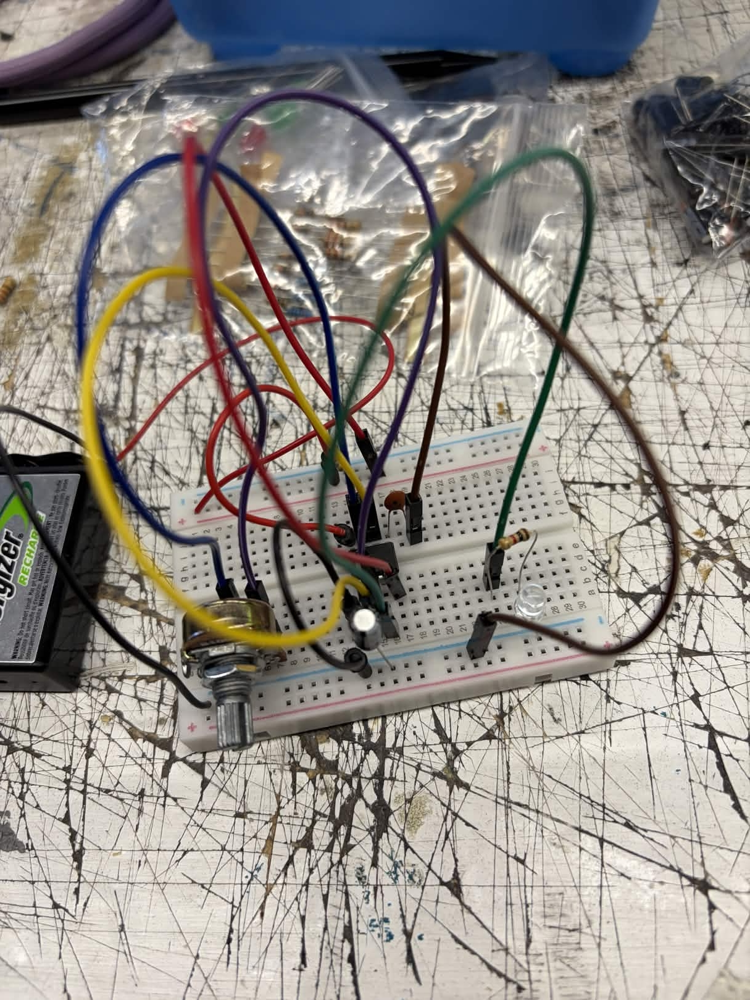
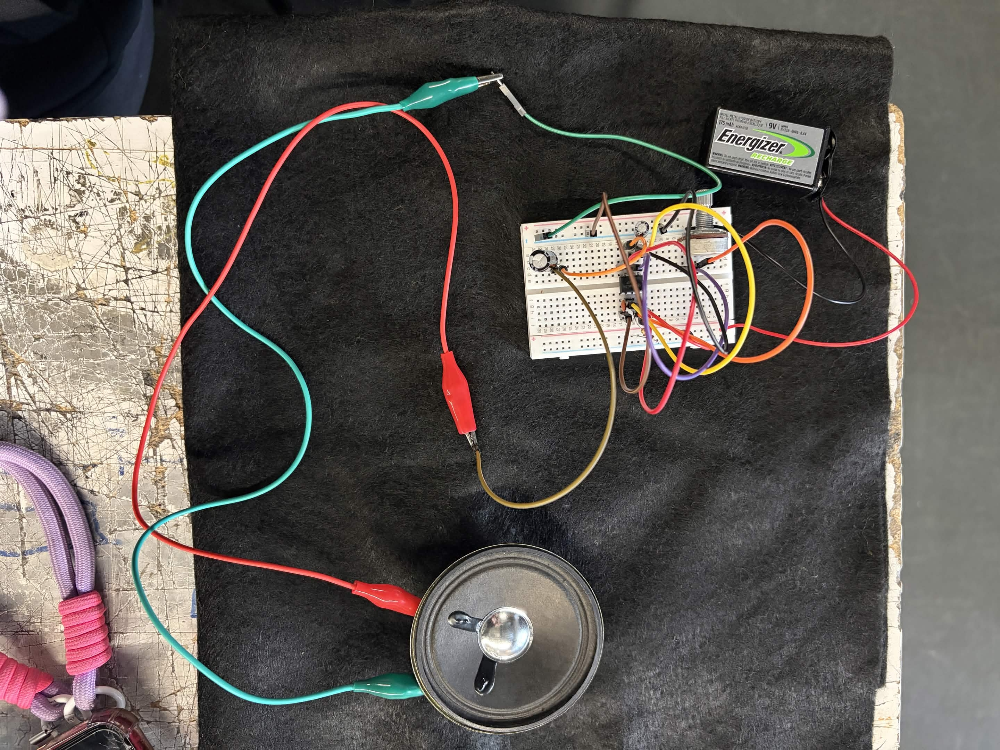

# sesion-03a

martes 24 de marzo

## Clase

Astable mode con chip 555
(así se llama el circuito que habiamos hecho)

- Oscilador: Circuito que produce una señal repetitiva (ON/OFF constante).
- Frecuencia (f):Número de ciclos por segundo (Hz).
  - Determina el tono del sonido.
- Periodo (T): Tiempo que dura un ciclo completo.
  - T = 1 / f
- Carga y descarga de capacitor:
  -  El capacitor se carga → sube voltaje
  - Se descarga → baja voltaje
- Control de frecuencia:
Se modifica cambiando resistencias o potenciómetro.

Potenciómetro en el circuito:
Permite variar la velocidad de oscilación → cambia el sonido (pitch).

Output del 555 (pin 3): Entrega señal cuadrada (alto/bajo).

Parlante: Convierte señal eléctrica en sonido.

Relación electrónica y sonido:

Mayor frecuencia → sonido más agudo

Menor frecuencia → sonido más grave

- Resistencias → controlan tiempos
- Capacitor → define duración del ciclo
- Potenciómetro → control manual
- 555 → genera señal

### Encargo

ver documental https://www.youtube.com/watch?v=sJ9EZWBZee8, incluir apuntes e investigación asociada a la bitácora.
