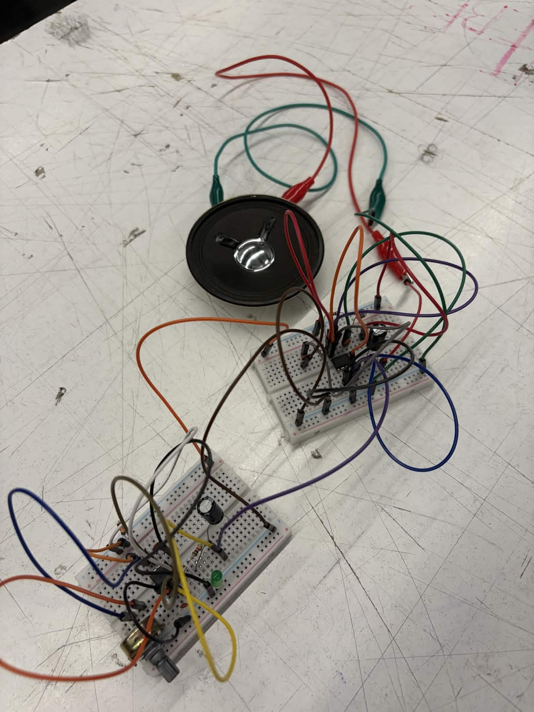

# sesion-03b

viernes 27 de marzo

## Apuntes

Resistencia equivalente, en ciclo y paralelo.

### En serie

Las resistencias están una después de la otra (en línea).

Req = R1 + R2 + R3 + etc..
  - La corriente es la misma en todo el circuito
  - El voltaje se divide entre resistencias
  - La resistencia total aumenta

### En paralelo 

Las resistencias están conectadas en ramas separadas.

1 / Req = (1 / R1) + (1 / R2) + (1 / R3) + etc..

 - El voltaje es el mismo en cada rama
 - La corriente se divide
 - La resistencia total disminuye

- Serie → suma directa por lo tanto mayor resistencia
- Paralelo → inversa por lo tanto menor resistencia

www.555-timer-circuits.com

### Segundo modo de operación

Monostable mode:

- Genera un solo pulso
- Se activa con un trigger (puede ser un botón)
- Luego vuelve a estado inicial

### Atari Punk Console

Circuito generador de sonido basado en 2 chips 555.

