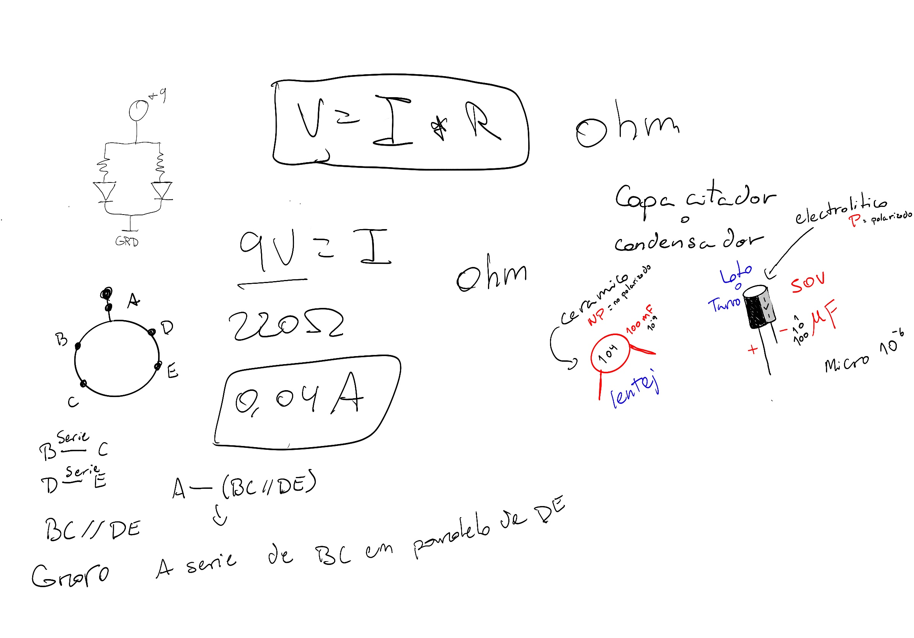
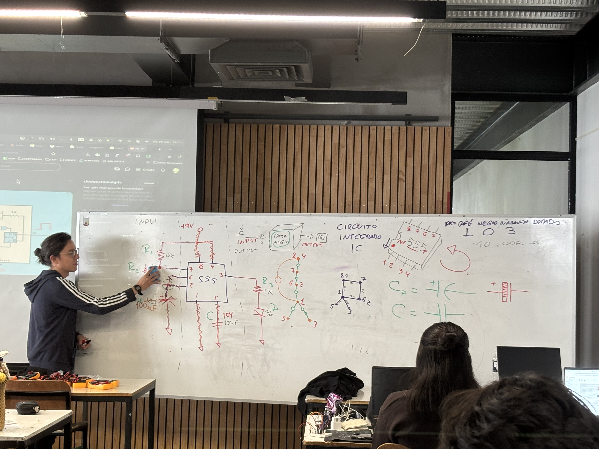
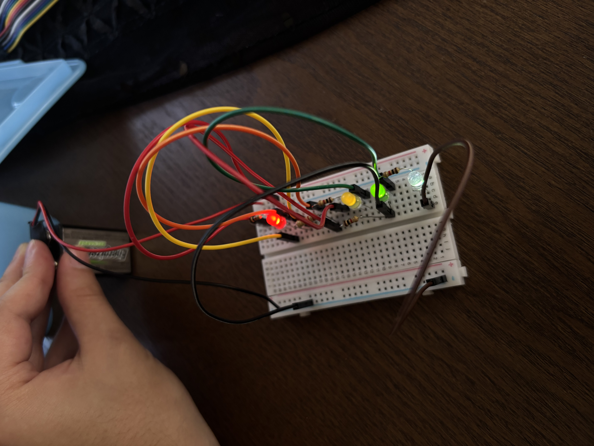
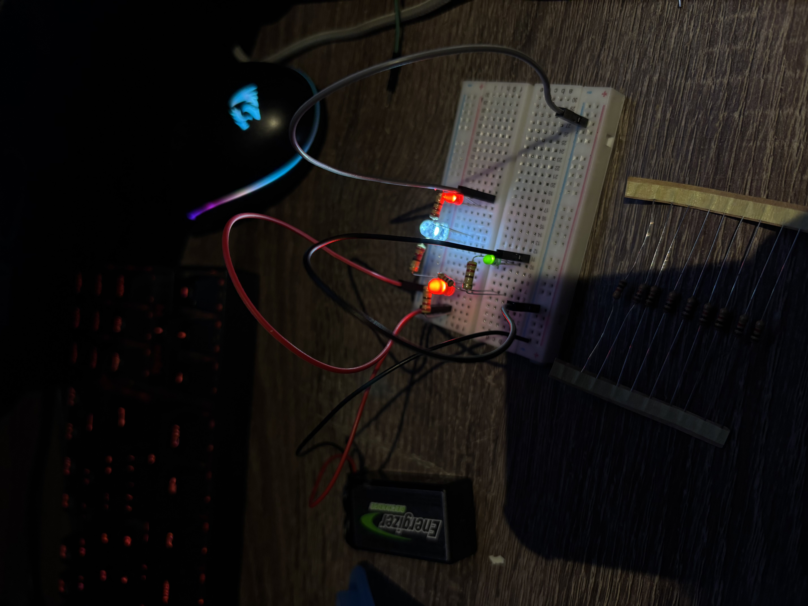

# sesion-02b

## apuntes de la clase

### resultados ejercicios hechos en clase

https://github.com/user-attachments/assets/44ed3053-4116-4db3-82da-acf111583071

https://github.com/user-attachments/assets/f260ef69-fc8f-49d5-a90a-98a42457e8b4

https://github.com/user-attachments/assets/47855cbd-dc70-407e-a975-0aa242506848

estuve buscando como subir videos a github y esta fue una de las formas que me salieron

video de como subir videos

https://www.youtube.com/watch?v=ssMNCIUPOLI

## encargo 02b

### practica materia

soy nuevo en esto de los circutos y conexiones, entonces se me hace complicado el entender los esquemas de los circuitos para despues pasarlos a la protoboard, por ejemplo, en el ejercio del encargo lqxtlc llen de cables porque no entendia las conexiones

entonces me preguntaba como podia evitar tanto ruido visual de cables, asi que lo volvi a practicar para simplificar la conexion del circuito teniendo como resultado algo mucho mas liviano visualmente y mas bonito

### preguntas

1. ¿puedo concectar mas de dos baterias a la protoboard?

2. ¿se puede incendiar la protoboard si se quema algo?

3. ¿que pasa si conceto o intento conectar algun cable o una resistencia en el mismo hoyito de la protoboard?

4. ¿se pueden conectar dos potenciometros en el mismo circuito?

5. ¿existenten otro tipo de sensores como el de luz?

6. ¿que otro tipo de luces se pueden concetar a las protoboards

7. ¿cuantos condensadores puedo conectar en el mismo circuito?

8. ¿si tengo mas de un sensor de luz conectado en el mismo circuito, afecta de manera distina la luz al led o es igual?

9. ¿cuanto es el voltaje maximo que puede tener una bateria?

10. ¿la protoboard tiene algun maximo de voltaje que pueda resistir?
