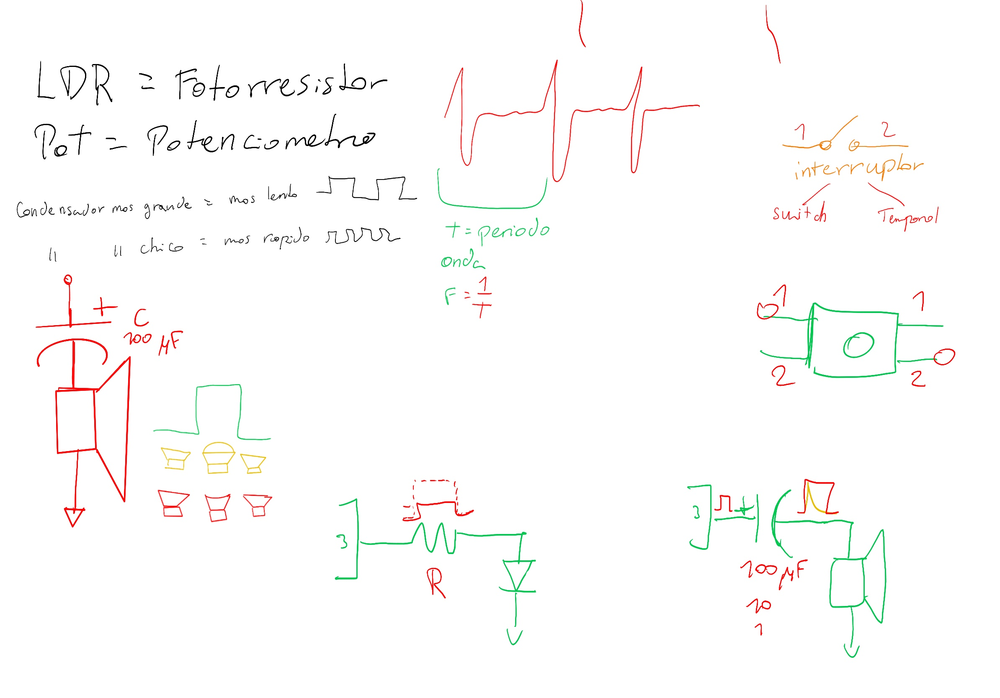

# sesion-03a

## apuntes clase

Tutupá máquina percusión 

Sokio 

ldr = fotorresistor

pot = potenciometro

Semana pasada hicimos un circuito a-estable

Frecuencia: repetición de un suceso en el tiempo

La frecuencia sube o baja gracias a el condensador dependiendo su tamaño y de resistencia dependiendo de su kilo

Siempre al hacer algún cambio en el circuito, sacar batería

Lo escrito en el parlante indica el ohm

Oscilador victoriano / macumbista el rebote del propio parlante se aprovecha para que las pinzas chocan y emiten electricidad y se repita el ciclo de 

John cage y su fascinacion por la musica y los hongos, 4'33

Cuando conecto un condensador en serie sirve como un suavizante, depende de él uf que tenga el condensador cuanto suaviza

Moog filter ladder

Hay interruptores de switch y temporales/push/momentaneo (switch es el de ampolleta y los temporales son el del timbre)

### videos de uso del parlante en el circuito

esquema

aca dejare algunos videos de como funciona el parlante en el circuito 

aca otro video pero en vez de tener potenciometro, tiene fotorresistor

## encargo 03a

aca va el encargo

### documental
