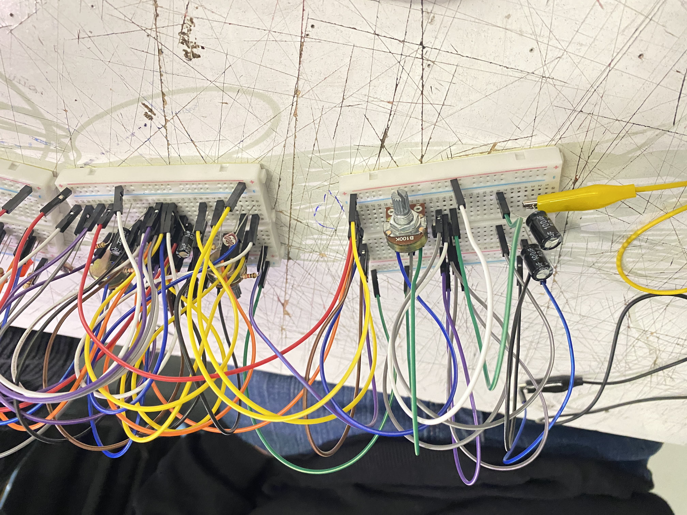
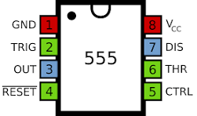
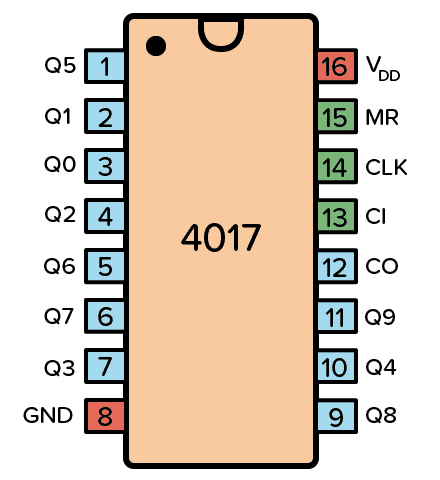
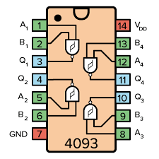
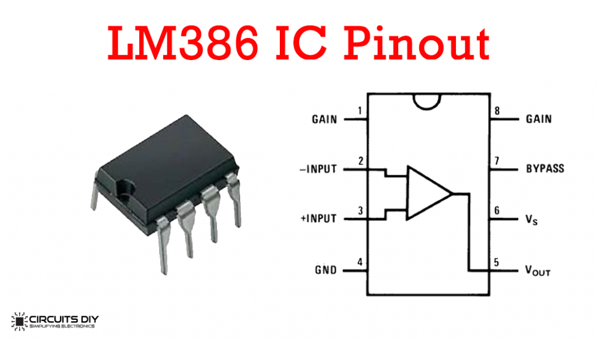

# sesion-06a

## Schmitt Trigger

Investigando en internet Schmitt Trigger es un circuito que toma una señal inestable o con ruido y la convierte en una señal clara de encendido y apagado. Lo hace usando dos niveles distintos de activación, uno para cuando la señal sube y otro para cuando baja, así evita que pequeños cambios o interferencias provoquen errores.

aca un video en youtube sobre el schmitt

<https://www.youtube.com/watch?v=2Ra9tpJ3xvA>
 
## Trabajo en clase

En esta clase todo funciono perfecto, desde el 555 hasta el lm386. Hay algunos cambios ya que no teníamos suficientes potenciometros así que conectamos un fotorresistor.

### Videos

## extra

info extra para no olvidar

#### chip 555 pinout

Es un chip muy usado para generar pulsos y temporizaciones 

- Pin 1 (GND): tierra
- Pin 2 (TRIGGER): activa el ciclo cuando baja el voltaje
- Pin 3 (OUTPUT): salida (la señal que genera)
- Pin 4 (RESET): reinicia el chip (normalmente va a VCC)
- Pin 5 (CONTROL): ajusta el comportamiento interno (casi siempre con capacitor a tierra)
- Pin 6 (THRESHOLD): detecta cuando se alcanza cierto voltaje
- Pin 7 (DISCHARGE): descarga el capacitor
- Pin 8 (VCC): alimentación (+)

#### chip 4017 pinout

Es un contador que activa salidas una por una (Q0 → Q9).

- Pin 16 (VCC): alimentación
- Pin 8 (GND): tierra
- Pin 14 (CLOCK): recibe pulsos (por ejemplo del 555)
- Pin 13 (ENABLE): pausa el conteo (activo en LOW)
- Pin 15 (RESET): vuelve a Q0
- Pines 3,2,4,7,10,1,5,6,9,11: salidas Q0 a Q9

#### chip 4093 pinout

Tiene 4 compuertas NAND con Schmitt Trigger (limpia señales).

- Pin 1 → Entrada (NAND 1)
- Pin 2 → Entrada (NAND 1)
- Pin 3 → Salida (NAND 1)
- Pin 4 → Salida (NAND 2)
- Pin 5 → Entrada (NAND 2)
- Pin 6 → Entrada (NAND 2)
- Pin 7 → GND
- Pin 8 → Entrada (NAND 3)
- Pin 9 → Entrada (NAND 3)
- Pin 10 → Salida (NAND 3)
- Pin 11 → Salida (NAND 4)
- Pin 12 → Entrada (NAND 4)
- Pin 13 → Entrada (NAND 4)
- Pin 14 → VCC (+)

#### chip lm386

- Pin 1 y 8: control de ganancia
- Pin 2: entrada (-)
- Pin 3: entrada (+)
- Pin 4: GND
- Pin 5: salida al parlante
- Pin 6: VCC (+)
- Pin 7: bypass (mejora estabilidad)
