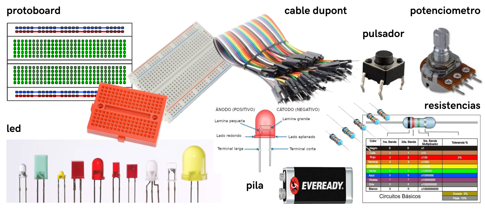
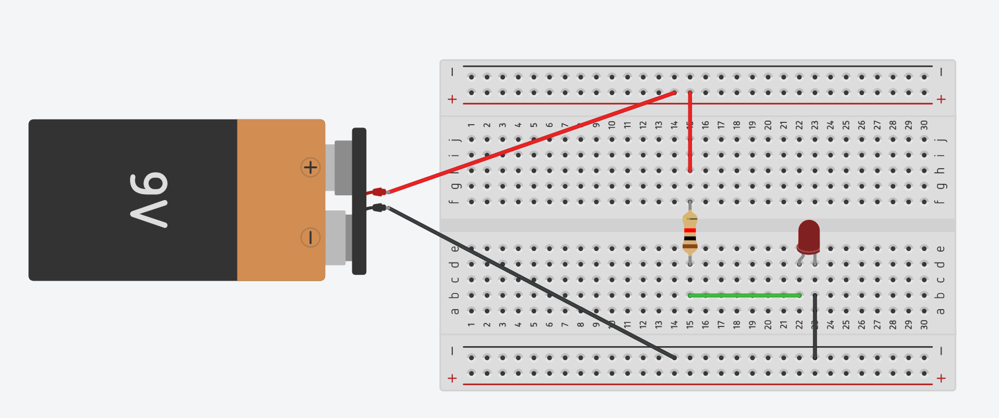
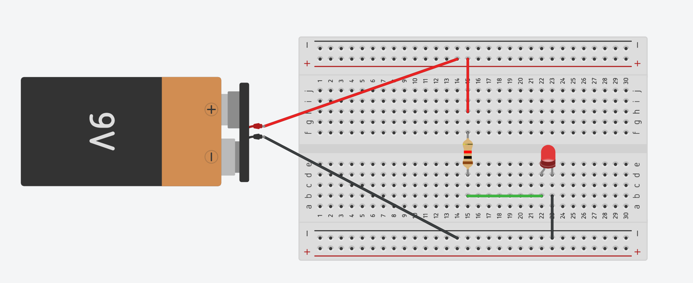
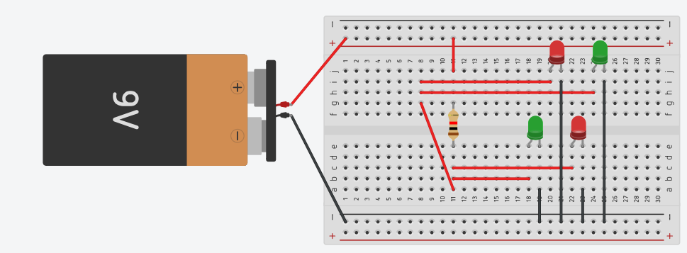
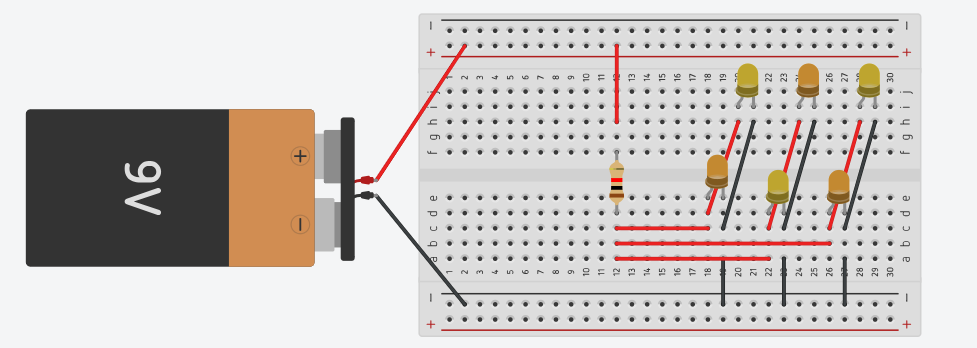
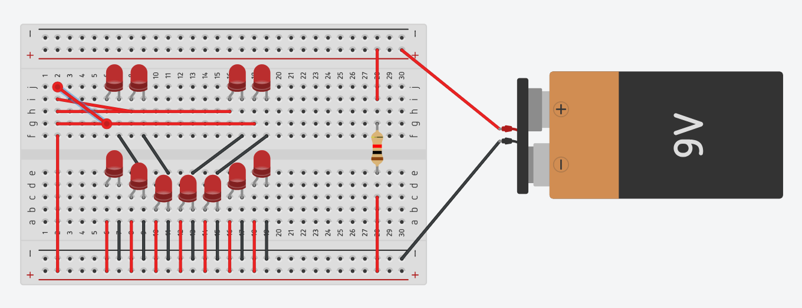
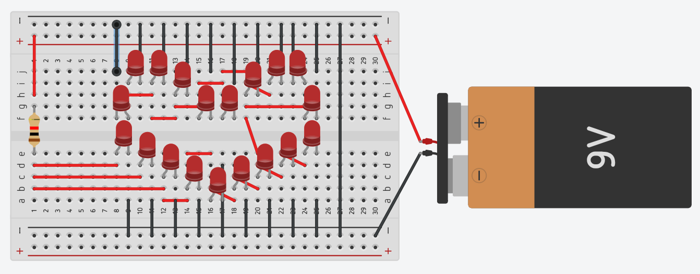
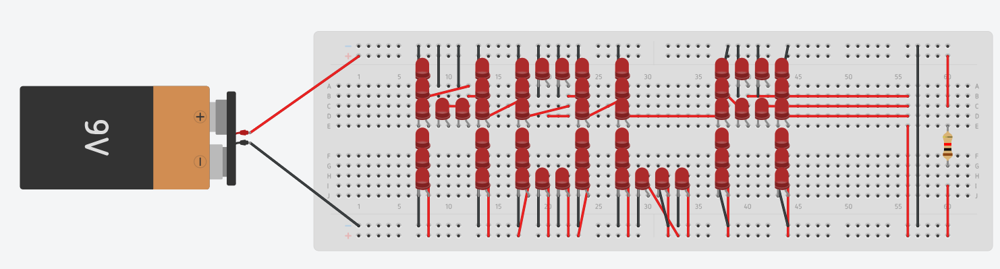
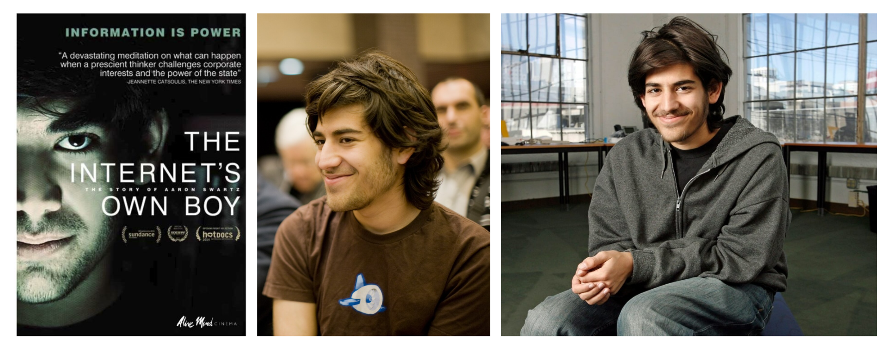

# sesion-01b

Viernes 13 de Marzo, 2026.

Nota del día: ame tinkercad.

## Referentes (y otras cosas)

(La mayoría de las mujeres en esta lista son del documental "Sisters with transistors", que la verdad no sé por qué no incluí en los referentes de la clase pasada, pero considerando que de todas formas hablamos de ellas en esta clase, me parece que pueden quedarse acá!!)

- **Clara Rockmore** fue una virtuosa lituana de la música que destacó como intérprete de theremín. Desarrolló una técnica para tocar este instrumento, que incluía un sistema de posicionamento de los dedos.
- **Daphne Oram** fue una compositora de música electrónica de nacionalidad británica. Fue una de las primeras compositoras británicas en producir un sonido electrónico, además de pionera de la música concreta.​
- **Delia Derbyshire** fue una compositora de música concreta, pionera en el ámbito de la música electrónica. Escultora sonora, experimentó con diversos sonidos para el medio radiofónico, televisivo, teatro y cine.
- **Bebe Barron** fue una compositora estadounidense de música electrónica. Su obra (junto con su esposo Louis) define uno de los movimientos de música electrónica más singulares de la historia. - (<https://sisterswithtransistors.com/the-pioneers>)
- **Pauline Oliveros** fue una compositora y acordeonista estadounidense y figura central en el desarrollo de la experimentación y de la música electrónica de posguerra. Fue miembro fundador del San Francisco Tape Music Center en la década de 1960, y se desempeñó como su directora.
- **Maryanne Amacher** fue una artista de instalación y compositora estadounidense.​​Es conocida por trabajar ampliamente con una familia de fenómenos psicoacústicos llamados productos de distorsión auditiva, en los que las orejas mismas producen sonido audible.
- **Éliane Radigue** fue una compositora francesa de música acusmática, cuyo trabajo, desde principios de la década de 1970, se realizó con un solo sintetizador, el sistema modular ARP 2500. (wikipedia)
- **Suzanne Ciani** _"is a five-time Grammy award-nominated composer, electronic music pioneer, and neo-classical recording artist who has released over 20 solo albums including "Seven Waves," and "The Velocity of Love," along with a landmark quad LP “LIVE Quadraphonic,” which restarted her Buchla modular performances. Her work has been featured in films, games, and countless commercials as well. She was inducted into the first class of Keyboard Magazine's Hall of Fame alongside other synth luminaries, including Bob Moog, Don Buchla and Dave Smith and received the Moog Innovation Award. Most recently, she is the recipient of the Independent Icon Award from A2IM. Suzanne has provided the voice and sounds for Bally's groundbreaking "Xenon" pinball machine, created Coca-Cola’s pop-and-pour sound, designed logos for Fortune 500 companies, establishing herself as one of the most creatively successful female composers. A Life in Waves, a documentary about Ciani’s life and work, debuted at SXSW in 2017"_. - <https://www.youtube.com/user/SuzanneCiani>
- **Laurie Spiegel** es una compositora estadounidense, ​ conocida principalmente por sus composiciones de música electrónica y su software de composición algorítmica Music Mouse. También toca la guitarra y el laúd.​Algunos vieron a Spiegel como una pionera de la escena de la nueva música de Nueva York.
- **TINKERCAD** (página) Según Gemini Tinkercad es una plataforma web gratuita y fácil de usar, desarrollada por Autodesk, diseñada para el modelado 3D, simulación de circuitos electrónicos y programación de bloques. Ideal para principiantes y el ámbito educativo, permite crear diseños complejos uniendo formas geométricas básicas, preparándolos para la impresión 3D. - <https://www.tinkercad.com/>
- **Mitchel Resnick** (salió el semestre pasado igual) es un "profesor titular de investigación sobre el aprendizaje en el MIT Media Lab, desarrolla nuevas tecnologías y actividades para involucrar a las personas (en particular a los niños) en experiencias de aprendizaje creativas. Su grupo de investigación Lifelong Kindergarten desarrolló el software de programación Scratch y la comunidad en línea, utilizados por millones de jóvenes en todo el mundo". - (<https://www.media.mit.edu/people/mres/overview/>)
- **Bach**, Johann Sebastian Bach fue un compositor, músico, director de orquesta, maestro de capilla, cantor y profesor alemán del período barroco. Según Gemini Su música se caracteriza por la estructura armónica, el uso de melodías entrelazadas y una producción inmensa, tanto sacra como instrumental.
- **Music mouse** (obra) software algorítmico de composición musical desarrollado por Laurie Spiegel.  
- **Kaitlyn Aurelia smith** es una compositora, intérprete y productora estadounidense, originaria del noroeste del Pacífico y actualmente radicada en Los Ángeles. Su trabajo emplea de manera destacada sintetizadores modulares Buchla. Recibió elogios por sus álbumes Ears y The Kid. (en su ig dice "Composer, synthesist, producer, sound designer, visual artist"). - <https://www.instagram.com/kaitlynaurelia/> / <https://kaitlynaureliasmith.com/>
- **Sunergy** (disco).

## Qué aprendí hoy

### Conceptos

- **Voltaje (V)** también conocido como tensión eléctrica o diferencia de potencial ("que tanto hay mas eletrones en un lado que en el otro"), es la magnitud física que impulsa a los electrones a moverse a través de un conductor en un circuito cerrado. Se mide en voltios (V) y representa la energía potencial por unidad de carga. Es la "presión" que permite el flujo de electricidad.
- **Resitencia (R)** = CONTROLAR EL FLUJO - es la oposición que presenta un material al paso de la corriente eléctrica, medida en ohmios. Definida por la ley de Ohm como **R = V/I** (voltaje entre intensidad), es una magnitud fundamental utilizada para limitar el flujo de electrones en circuitos, protegiendo componentes.
- **Intensidad de corriente (I)** es la cantidad de carga eléctrica que atraviesa la sección transversal de un conductor por unidad de tiempo, medida en Amperios (A). Representa el flujo de electrones en un circuito, siendo el equivalente al caudal de agua en una tubería.
  - Según la ley de Ohm **I=V/R**
  - CORRIENTE (ampere) (A) = VOLTAJE (voltio) (V) / RESISTENCIA (R)
- **GND** (Ground - "tierra" - negativo) representa la tierra, masa o referencia de 0 voltios en un circuito electrónico. Actúa como el punto de retorno de corriente común y referencia de voltaje estable, esencial para el funcionamiento seguro, la protección contra descargas y la reducción de interferencias (EMI) en dispositivos electrónicos y placas de circuito.
- **Corriente** (eléctrica) es el flujo ordenado de cargas eléctricas (generalmente electrones) a través de un material conductor, impulsado por una diferencia de potencial. Se mide en Amperios (A - cantidad de carga por segundo) y es fundamental para generar luz, calor y movimiento en circuitos eléctricos.
- **Energía** es la capacidad de los cuerpos o sistemas para realizar un trabajo, producir cambios en ellos mismos o en otros cuerpos, manifestándose en movimiento, luz, calor o electricidad. Es un concepto fundamental que no se crea ni se destruye, solo se transforma o transfiere.
- **Materia** (carbo, silicio, cobre)
- **Electrón** son partículas subatómicas fundamentales con carga eléctrica negativa y masa extremadamente ligera, situadas en la corteza exterior del átomo. Son responsables de los enlaces químicos, la corriente eléctrica y las propiedades químicas de los elementos. (Los eletrones tienen cargas negativas - mismos se repelen, no poner negativos juntos)
- **Voltio (V)** es la unidad del Sistema Internacional para medir la tensión eléctrica, diferencia de potencial o fuerza electromotriz. Representa la presión o fuerza que impulsa a los electrones a través de un conductor. Un voltio se define como la diferencia de potencial cuando se disipa 1 vatio de potencia por 1 amperio de corriente.
- **Circuito** es una red interconectada de componentes (generador, conductor, receptor, interruptor) que permite el flujo de corriente eléctrica para transformarla en energía útil (luz, calor, movimiento). Para funcionar, debe ser un camino cerrado, permitiendo que la energía circule desde la fuente y regrese a ella.
- **"Conducir"** (conducción eléctrica)es el movimiento de partículas cargadas, principalmente electrones, a través de un material, facilitado por una diferencia de potencial. Los metales (cobre, plata, aluminio) son excelentes conductores debido a sus electrones libres, mientras que aislantes como el plástico bloquean este flujo.
- **HIGH** (alto) representa un "1" lógico, indicando el estado activo o encendido (ON) de un componente. Generalmente corresponde al voltaje máximo del sistema, como 5V o 3V, mientras que "LOW" (bajo) es 0V - es el estado superior, a menudo interpretado como verdadero (true) o activo. (es decir que controla cuando sale)
- **Flujo**
- **Diferencia**
- **Poder**  

CAUDAL = ALTURA / OPOSICIÓN

### Componentes

- **Cable dupont** es un cable con un conector en cada punta, que se usa normalmente para interconectar entre sí los componentes en una placa de pruebas. Se utilizan de forma general para transferir señales eléctricas de cualquier parte de la placa de prototipos. (tienen salida macho/hembra)
- **Protoboard** o placa de pruebas es una herramienta fundamental en electrónica para ensamblar y probar circuitos rápidamente sin soldar. Hechas de plástico con láminas metálicas internas, permiten interconectar componentes y cables. Tiene filas verticales de 5 orificios que están conectadas entre sí eléctricamente que se usa como zona de conexión y tiene líneas horizontales largas para distribuir energía (positivo/negativo), marcadas usualmente en rojo y azul que se utiliza como buses de alimentación.
- **Pila**, es una fuente de energía eléctrica obtenida por transformación directa de energía química y constituida por uno o varios elementos primarios.
- **Resistencias**, son componentes electrónicos pasivos que limitan el flujo de corriente eléctrica y dividen voltajes dentro de un circuito, funcionando como válvulas de seguridad al disipar energía en forma de calor. Se miden en ohmios y su valor se determina generalmente por un código de bandas de colores. Controlan la intensidad de corriente para evitar cortocircuitos y proteger componentes sensibles, como los LEDs. (no tiene polaridad por lo que da lo mismo hacia que lado se ponga)
- **Led** (Diodo Emisor de Luz) es un componente semiconductor que emite luz al circular corriente por él en una sola dirección. Cuenta con dos terminales: ánodo (positivo) y cátodo (negativo). Si se conecta al revés, no enciende. Algunas formas de diferenciar la parte negativa y la positiva: pata corta negativo - pata larga positivo; triangulo grande es negativo y triangulo pequeño es positivo, entre otros. catado - anado). Opera con corriente continua (CC) y requiere voltajes bajos y específicos según el color, por lo que casi siempre necesita una resistencia limitadora para no dañarse.
- **Pulsador**, es un dispositivo de conmutación eléctrica que permite abrir o cerrar un circuito solo mientras se mantiene presionado, regresando a su estado original al soltarlo.
- **Condensador**, es un componente eléctrico pasivo que almacena energía rápidamente en forma de campo eléctrico entre dos placas conductoras separadas por un material dieléctrico. Se utiliza para filtrar señales, nivelar voltajes en fuentes de alimentación y en el arranque de motores.
- **Potenciometro**, es una resistencia variable mecánica de tres terminales que ajusta manualmente la intensidad de corriente o voltaje en un circuito, actuando como divisor de tensión. Mediante un cursor deslizante sobre una pista resistiva, altera la resistencia entre 0 y su valor máximo nominal, siendo comunes los tipos rotatorios y deslizantes en aplicaciones como volumen o iluminación. (casi toda la información fue sacada de Gemini).

A considerar:

- cable rojo = energia (VCC)
- cable negro = "tierra" (GND, bajo voltaje)

> Extra: Las pilas se llaman AA y AAA (y A, C, D) por un sistema de estandarización de tamaños definido a principios del siglo XX, donde las letras indican dimensiones físicas y capacidad energética, no voltaje. A medida que los aparatos se hicieron más pequeños, se necesitaban celdas menores, llevando a la creación de "doble A" y "triple A" para indicar tamaños inferiores a la "A" original. - El sistema usa más letras para denotar menor tamaño, convirtiendo a las AAA en la versión "triple" de pequeña respecto al estándar AA.  

### Github (yeih)

GitHub es una plataforma en la nube que funciona como el mayor centro de alojamiento de repositorios Git del mundo, permitiendo a desarrolladores almacenar, gestionar y compartir código, además de colaborar en proyectos de software. Es conocida como la "red social de los programadores", facilitando el trabajo en equipo, control de versiones y el código abierto.

En el curso lo utilizamos como bitácora de registro para cada clase y proyecto a realizar (se evalua cada clase!!).

cómo se usa, algunos tips y consideraciones: (información sacada del repositorio del semestre pasado)

- Siempre modificar los archivos desde el repositorio del orginal (personal - "forked from").
- "BRANCH" siempre debe mantenerse en 1.
- Si la información esta "BEHIND" es necesario sincronizar (actualizar) para estar al día con las ediciones que se hicieron por otros usuarios ("sync fork" - update bronch, se va ver en color verde o celeste sí es que todo estuviera bien para ser actualizado).
- Cada persona del curso tiene su propia carpeta, siempre trabajar desde ahí.
- Las subcarpetas de las carpetas personales están nombradas como "sesión" + un numero y una letra, esto representa una clase y una fecha específica.
- Las palabras se ponen entre ciertos símbolos para poder generar jerarquias visualez y cada línea de texto debe estar separada de un espacio para que en el resultado final salga separado, sino saldrá todo el texto junto.
- Al poner imagenes, para modificar el tamaño cambiar el width y el height.
- Markdown: ejemplos rápidos de como poner el texto los encuentras desde este link (funciones): <https://markdownguide.offshoot.io/cheat-sheet/>

Reglas (nuevo): guardar README solo en mayúsculas, nada de espacios al momento de guardar carpetas o archivos (utilizar guión o guión bajo).

### Tinkercad

simulación de circuitos electrónicos: las primeras imágenes son en relación a lo aprendido en conjunto durante la clase, las demás fotos son experimentación que hice en grupo (4 y 6) y sola (corazón, carita y hola).

para ver: <https://www.tinkercad.com/things/643XxFrK9hd-smashing-wolt-lahdi/editel>

## encargo-01b

Ver el documental the internet's own boy, sobre la vida de Aaron Swartz, y escribir un reporte con fuentes y referencias sobre lo aprendido.

### The Internet’s Own Boy: The Story of Aaron Swartz (2014)

Es un documental dirigido por Brian Knappenberger que narra la vida, pensamiento y muerte del programador y activista de internet Aaron Swartz. La película no solo cuenta su historia personal, sino que también explora temas más amplios como el acceso al conocimiento, el poder de las corporaciones y gobiernos sobre la información, y el impacto que puede tener un individuo en el mundo digital.

El documental introduce a Aaron Swartz como un niño con una curiosidad y sensibilidad fuera de lo común. Según el relato de sus padres, no solo destacaba por su capacidad intelectual, sino por pasar horas reflexionando sobre la justicia y el funcionamiento de la sociedad. Creció en los inicios de una internet libre y experimental, lo que le permitió colaborar con expertos desde muy joven. Un hito clave es que a los 13 años ya participaba en el desarrollo del sistema RSS, demostrando que para él la red no era solo tecnología, sino una herramienta para democratizar el conocimiento.

Al llegar a la juventud, Swartz consolida una postura clara: **la información debe ser para todos**. Inspirado por figuras como Tim Berners-Lee, se opone a que el conocimiento científico y cultural esté restringido por intereses corporativos. Esto lo lleva a convertirse en un **activista del Open Access**, combinando la escritura de ensayos con la creación de herramientas prácticas.

A pesar de su éxito en el mundo de las startups (como reddit), el documental subraya su incomodidad con la monetización de la red. Aaron decide abandonar el entorno empresarial para volcarse al activismo político, destacando su rol en la movilización masiva contra la ley SOPA (Stop Online Piracy Act), donde demostró el poder de la organización digital frente a decisiones gubernamentales.

El punto de quiebre ocurre en 2010, cuando Aaron aplica su filosofía de forma radical al descargar millones de artículos académicos de JSTOR ("digital library of academic journals, books, and primary sources") a través de la red del MIT. Su intención era liberar investigaciones financiadas con fondos públicos que estaban bloqueadas tras muros de pago.

Aunque la plataforma JSTOR no presentó cargos, el gobierno de Estados Unidos tomó el caso como una oportunidad para "dar una lección". El fiscal federal le imputó 13 cargos criminales, amenazándolo con hasta 35 años de prisión y multas millonarias, una medida que muchos entrevistados califican como desproporcionada (y definitivamente lo es, considerando que muchas veces por crímenes realmente graves no hacen nada!!).

Tras dos años de una presión legal extenuante y la negativa de los fiscales a negociar, Aaron Swartz se suicidó en enero de 2013, a los 26 años. El documental concluye que su muerte fue el resultado de un choque violento entre la cultura abierta de internet y las estructuras de poder tradicionales. Como bien rescata el título de la obra a través de las palabras de su pareja: “Era el chico de internet… y el viejo mundo lo mató”.

### Pienso pensamientos

¿Qué se aprende del documental?

El documental parte con una cita de Henry David Thoreau que deja en claro el tono desde el inicio: _"Unjust laws exist; shall we be content to obey them, or shall we endeavor to amend them, and obey them until we have succeeded, or shall we transgress them at once?"_. Esta frase funciona como una especie de advertencia de lo que viene: una reflexión constante sobre la relación entre ley y justicia, y sobre si realmente siempre coinciden. Desde ahí se instala una pregunta incómoda pero necesaria: ¿qué pasa cuando las leyes no logran adaptarse a los cambios tecnológicos y terminan siendo injustas?

Uno de los temas más importantes que atraviesa el documental es la idea de que **el conocimiento es poder** pero inmediatamente aparece la otra cara: **¿quién controla ese poder?**. A lo largo de la historia se muestra cómo universidades, editoriales y grandes corporaciones limitan el acceso a investigaciones que muchas veces fueron financiadas con dinero público. Como plantea el propio relato, no se trataba simplemente de descargar archivos, sino de una discusión mucho más profunda: si el conocimiento debería ser un bien común o un recurso privado (Knappenberger, 2014). Desde una experiencia personal como estudiante, esto no se siente lejano en absoluto; es bastante común encontrarse con artículos bloqueados detrás de pagos o suscripciones, lo que hace evidente que el acceso a la información sigue siendo un privilegio más que un derecho.

En este punto, las ideas de Aaron Swartz se conectan directamente con su “Manifiesto de la guerrilla por el acceso abierto”, donde plantea que el conocimiento científico y cultural debería ser compartido libremente. Ahí propone que quienes tienen acceso a bases de datos académicas tienen también una responsabilidad ética: liberar esa información para el resto del mundo. Más que un acto ilegal en sí, lo presenta como una forma de desobediencia civil frente a un sistema que privatiza el saber (Swartz, 2008). Esto ayuda a entender mejor sus motivaciones y también por qué su caso generó tanto debate.

Por otro lado, el documental rompe con la idea de que internet es un espacio naturalmente libre. Muestra que esa libertad depende completamente de decisiones políticas, económicas y legales. Gobiernos y empresas tienen el poder de moldear la red: pueden decidir qué se ve, qué se oculta y qué circula más. En ese sentido, internet deja de ser solo una herramienta tecnológica y pasa a ser un campo de disputa. Incluso hoy se puede ver cómo ciertas informaciones se invisibilizan o se desplazan del foco público (como el caso epstein que si bien no tiene relación con lo academico si es notable la manipulación que hay respecto a la información), lo que demuestra que el control de la información no es algo abstracto, sino muy concreto. "La red puede ser una herramienta de democratización, pero solo si existen condiciones reales que lo permitan".

Otro aspecto importante es la crítica al sistema judicial estadounidense, Se evidencia cómo leyes pensadas para otros contextos tecnológicos pueden aplicarse de forma desproporcionada en el mundo digital. Más que buscar justicia, da la impresión de que el sistema intentó dar un “castigo ejemplar”, con penas extremadamente altas, para disuadir a otros. Esto deja abierta una reflexión importante sobre la diferencia entre legalidad y justicia, y sobre cómo las instituciones responden cuando alguien desafía sus reglas desde una posición ética.

A nivel personal, es imposible no conmoverse por el costo humano de estas convicciones. Swartz es retratado como un individuo de un idealismo inquebrantable, alguien que realmente creía que internet podía mejorar el mundo. No obstante, esa misma brillantez lo volvía vulnerable. Defender ideales en un sistema que prioriza la propiedad sobre la libertad académica conlleva una presión emocional que, en este caso, terminó en tragedia. Su historia termina dejando una sensación agridulce: por un lado, demuestra que una persona puede generar cambios reales; por otro, evidencia que el sistema puede ser extremadamente duro con quienes intentan cuestionarlo desde la raíz.

### Bibliografía

- Cooper, D. (2013). Bullying Aaron Swartz. Huffington Post. <https://www.huffpost.com/entry/bullying-aaron-swartz_b_2473013>
- Knappenberger, B. (Director). (2014). The Internet's Own Boy: The Story of Aaron Swartz (Documental). <https://youtu.be/9vz06QO3UkQ>
- Lessig, L. (2013). Prosecutor as Bully. Huffington Post. <https://www.huffpost.com/entry/aaron-swartz-suicide_b_2467079>
- Swartz, A. (2008). Guerilla Open Access Manifesto. (es un libro, pero acá esta el manifiesto: <https://es.anarchistlibraries.net/library/aaron-swartz-guerilla-open-access-manifesto>)
- Thoreau, H. D. (1849). Civil disobedience. (cita del principio)
