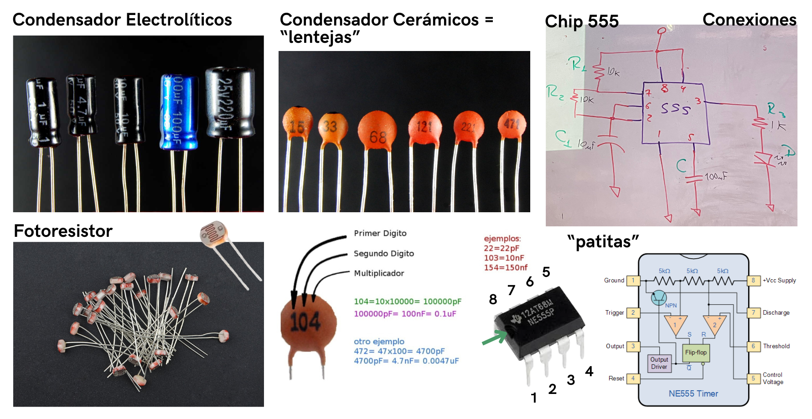
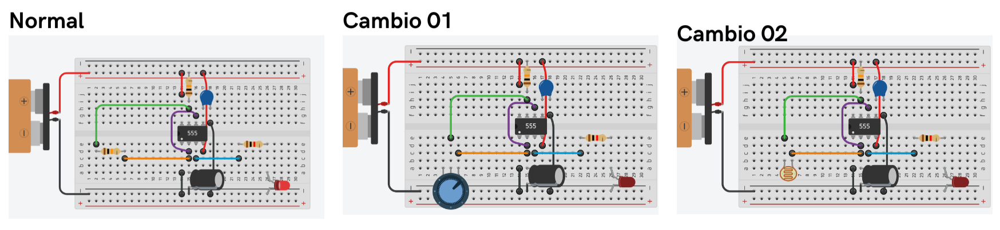

# sesion-02b

Viernes 20 de Marzo, 2026.

Nota del día: sinceramente no sé qué tiene esta clase contra mí, pero editando el GitHub se me borró todo más de tres veces (╥_╥). Ni siquiera alcanzaba a guardar y pasaban cosas que hacían que perdiera todo lo que llevaba. Después de tantas veces que se borró, quiero aclarar que esta clase ya no tiene tanta información como la que tenía anotada la primera vez. :(

## Referentes (y otras cosas)

- **Hainbach** Stefan Paul Goetsch, más conocido por el alias Hainbach, es un youtuber y compositor alemán de música electrónica experimental, residente en Berlín. Es conocido principalmente por su canal homónimo de YouTube, creado en 2011.​ <https://www.youtube.com/channel/UCeovElJP0n0i8ADaPsRSd8g> / <https://www.hainbachmusik.com/>
- **Cocoquantus** (instrumento musical) es un sintetizador y procesador de efectos artesanal diseñado por Peter Blasser para la marca Ciat-Lonbarde. Es conocido por su estética de madera, su flujo de trabajo esotérico y su sonido lofi y experimental. 
- **Ángel Abusleme** es ingeniero civil electricista y magíster en ciencias de la ingeniería por la Pontificia Universidad Católica de Chile. Además, es MSc y PhD en ingeniería eléctrica por la Universidad de Stanford, donde se especializó en diseño de circuitos integrados de señales mixtas. Actualmente, se desempeña como director y académico del Departamento de Ingeniería Eléctrica de la Pontificia Universidad Católica de Chile. Sus líneas de investigación son el desarrollo de instrumentos para experimentos de física de partículas y el diseño de circuitos integrados analógicos y de señales mixtas. - Profesor Asociado especializado en Diseño electrónico, microelectrónica, microcontroladores, sistemas embebidos.
- **Bob widlar** fue un ingeniero electrónico estadounidense pionero en el diseño de circuitos integrados (CI) lineales. Es ampliamente reconocido como el "padre" de los amplificadores operacionales modernos y una de las figuras más brillantes y excéntricas de la historia de Silicon Valley. 

## Qué aprendí hoy

### Ley de Ohm

(para más información revisar clase/sesión anterior)

- V (voltaje): se mide en volts (V).
- I (corriente): se mide en amperes (A).
- R (resistencia): se mide en ohmios (Ω).

Voltaje (V): La fuerza que impulsa a los electrones.

- V = I x R 

Un ejemplo seria: 9 V = I x 220 Ω

- Para aislar I, dividimos 9/220
- El resultado sería I = 0.04090909

Para expresar este valor en miliamperios, se multiplica el resultado por 1000

- 0.0409090 x 1000 = 40.91 mA
- O simplificado sería 0.04 A x 1000 mA = 40 mA.

### Circuitos

- circuito en **Serie**: los componentes se conectan uno tras otro (ejemplo: B–C en serie).  
- circuito en **Paralelo**: los componentes comparten los mismos nodos de conexión (ejemplo: BC // DE).  
- **Caja negra**: se analizan entradas y salidas sin importar el funcionamiento interno.
- **Grafos**: representación visual de conexiones entre puntos. _Grafos topológicos:_ representación visual de un sistema que utiliza nodos y aristas para mostrar relaciones y componentes.

Según gemini, Los grafos en circuitos eléctricos son representaciones topológicas que simplifican redes complejas mediante nodos (vértices) y ramas (aristas), ignorando la naturaleza de los componentes para enfocarse en su conexión. Esta herramienta facilita la aplicación de las leyes de Kirchhoff para analizar corrientes y voltajes.

- En el caso de las clases se usa un esquema con conexiones cuadradas que terminan en tierra y empiezan por la alimentacion.
- Se podrían también hacer conexiones circulares y seguiría cumpliendo su propósito de simplificación y haciendo más fácil el entendimiento del camino de los circuitos.

### Componentes (parte 02)

- Cable dupont.
- Protoboard.
- Pila.
- Resistencias.
- Led (Diodo Emisor de Luz)
- Pulsador.
- Potenciometro. (hasta este punto revisar [sesion-01b](https://github.com/terroiblea/dis8644-2026-1/tree/main/06-terroiblea/sesion-01b) para más información)
- **Capacitor/condensador** es un componente electrónico pasivo que almacena energía eléctrica en un campo electrostático. Consiste en dos placas conductoras separadas por un material aislante (dieléctrico). A diferencia de las baterías, cargan y descargan energía rápidamente, siendo esenciales para filtrar, bloquear corriente continua y acoplar señales en circuitos.
  - **Electrolíticos:** polarizados (patita corta - negativo - GND), medidos en µF, con límite de voltaje. Es un dispositivo pasivo (no genera energía por sí mismo) que almacena energía en un campo eléctrico. Consiste en dos placas conductoras separadas por un material dieléctrico. Este diseño permite acumular carga eléctrica en las placas, creando así una diferencia de potencial. Hay de 1, 10, 100 μF
  - **Cerámicos:** no polarizados (no importa hacía que lado se pone), pequeños y versátiles. Son de valor fijo hechos de material cerámico como dieléctrico. Está formado por dos o más capas de cerámica y una capa de metal que actúan como electrodos. El comportamiento eléctrico y, por lo tanto, las aplicaciones de los materiales cerámicos están determinados por la composición del material cerámico. Los cerámicos son compuestos inorgánicos, no metálicos, de óxido cristalino, nitruro o carburo, como el carbono y el silicio. Tenemos de 104, osea 100.000 pF 
- **Chip / Circuito integrado 555**: 8 patas, numeradas en sentido antihorario desde la muesca. Es un temporizador versátil utilizado para generar pulsos, oscilaciones y retardos de tiempo. Sus modos principales son astable (oscilador libre) y monoestable (temporizador de un solo pulso).   
- **Fotoresistor**, también conocido como LDR (Light Dependent Resistor), es un componente electrónico pasivo cuya resistencia óhmica varía inversamente a la cantidad de luz recibida. Su resistencia disminuye cuando aumenta la intensidad de la luz (baja a cientos de ohmios) y aumenta en la oscuridad (sube a megaohmios). En otras palabras: su resistencia depende de la luz; más luz es igual a menor resistencia lo que genera que parpadeé más rápido.

## Qué hice hoy

Vimos el uso del chip 555.

En primera instancia, se conecta siguiendo el esquema "normal" (sale en la foto anterior). La salida la conectamos a un LED; el chip ocasiona que este "parpadee". Este parpadeo depende de las resistencias y capacitadores que tiene el circuito. Para ver distintas variaciones, comenzamos a realizar cambios para ver qué resultaba.

1. Probar distintos capacitores:

- 1 µF = parpadeo muy rápido. (Va tan rápido que da la sensación de que la luz vibra; solo grabando desde el celular se logra realmente apreciar cuando la luz se apaga y se vuelve a prender).
- 10 µF = parpadeo rápido, pero visible.
- 100 µF = parpadeo lento.
  
2. Sustituir una resistencia por un potenciómetro para variar/controlar la velocidad del parpadeo.

En uno de los extremos (hacia la izquierda), la luz se queda apagada; a medida que se va moviendo hacia la derecha, comienza a aumentar el nivel de parpadeo de la luz hasta llegar al otro extremo, que ocasiona que la luz se mantenga encendida en todo momento.

3. Usar un fotoresistor para que la luz controle la frecuencia del parpadeo.

El sensor funciona con luz, así que, en primera instancia, con la luz ambiental parpadeaba ligeramente rápido. Después, con mi grupo utilizamos la linterna del celular y las distintas potencias que esta tiene; en la más baja, el parpadeo era más lento y, con la potencia más grande, el parpadeo era muy rápido. 

(queda pendiente subir los gifts de los cambios realizados) 

## Encargo-02b

Practicar cualquiera de las materias se hayan visto en clase, dejar ese registro en la bitácora. Ademas, escribir en la bitácora al menos 10 preguntas para la próxima sesión, sobre cualquier tema que hayamos revisado o mencionado. pueden ser preguntas técnicas, conceptuales, de diseño, etc.

### Practica 

Me enfoque en los tipos de circuitos pasados en clase (básico, en serie y en paralelo) porque no creo haberlo entendido tan bien, con el objetivo de entender cómo funcionan, en qué se diferencian y qué efectos generan en el comportamiento de la corriente.

En primera instancia, revisé el **circuito básico**, que es la forma más simple de un circuito. Este está compuesto por una fuente (pila), conductores (cables), la resistencia y un receptor (LED). Para que funcione, debe ser un sistema cerrado; es decir, la corriente debe poder salir de la fuente y volver a ella. Si el circuito se abre en cualquier punto, deja de funcionar completamente.

En el **circuito en serie**: En este tipo de circuito, los componentes están conectados uno tras otro en una sola línea, por lo que la corriente tiene un único camino para circular. Según lo que busque la corriente que pasa por cada componente es la misma, pero el voltaje se reparte entre ellos lo que ocasiona que, si se agregan más componentes (por ejemplo, más LEDs), cada uno reciba menos energía, por lo que su intensidad disminuye. Además, si uno de los componentes falla o se desconecta, todo el circuito deja de funcionar.

En el **circuito en paralelo:** Los componentes se conectan en distintas ramas, compartiendo los mismos puntos de entrada y salida. Según lo que busque la corriente se divide entre las ramas, pero cada componente recibe el voltaje completo de la fuente. Esto ocasiona que los dispositivos funcionen de manera independiente: si uno falla, los demás siguen funcionando. A diferencia del circuito en serie, aquí la intensidad de cada componente se mantiene más constante.

Entonces: 

- La principal diferencia está en cómo se distribuyen la corriente y el voltaje.
- El circuito en serie es más simple, pero menos eficiente y más vulnerable a fallas.
- El circuito en paralelo es más estable y confiable, por eso se utiliza en instalaciones reales (como en casas).
- El comportamiento del circuito (intensidad de luz, funcionamiento, fallas) depende directamente de cómo están conectados sus componentes.

### Preguntas

- ¿Cómo elegir correctamente el valor de una resistencia para un LED según el voltaje de la fuente?
- ¿Qué diferencias prácticas se notan entre un circuito en serie y uno en paralelo en aplicaciones reales?
- ¿Por qué algunos componentes funcionan con corriente continua (CC) y otros con corriente alterna (CA)?
- ¿Qué errores comunes pueden dañar una PCB al momento de diseñarla o fabricarla?
- ¿Cuál es la principal diferencia en rendimiento entre THT y SMT más allá del tamaño?
- ¿Cómo afecta el ruido eléctrico (EMI) en circuitos pequeños como los que usamos en clase?
- ¿Por qué el cobre es el material más utilizado en circuitos y no otros metales como el oro o la plata (a parte del valor claramente)?
- ¿Cómo funciona internamente un LED para emitir luz y por qué hace poco comenzaron a hacer de color azul, por qué estos ocupan más voltajes?
- ¿Qué tan preciso es el código de colores de las resistencias comparado con medirlas con un multímetro?
- ¿Cómo influye el diseño de una PCB en el funcionamiento general del circuito? (ej: disposición de pistas)
- ¿Cómo se calcula el tiempo exacto de parpadeo con el chip 555?
- ¿Cómo hacer que el circuito tenga distintos ritmos y no solo uno?
- algo más general que no tiene que ver directamente con el contenido de la clase de fora bruta: ¿qué se considera "música"?¿qué hace que algo sea llamado música y no solo sonidos aleatorios o sonidos en general? 
