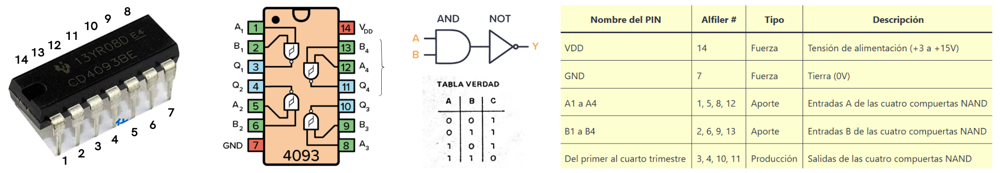
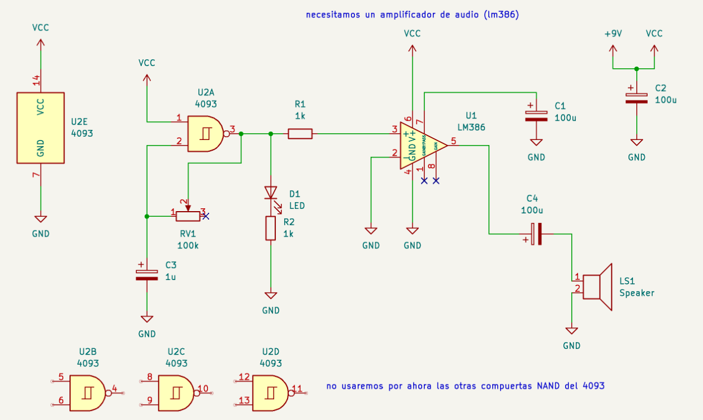
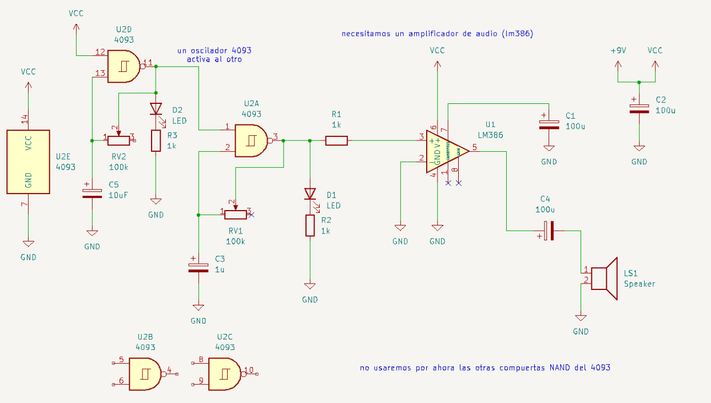
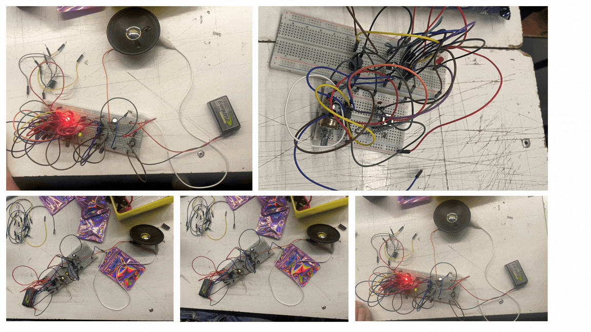

# sesion-05a

Martes 07 de Abril, 2026.

Nota del día: sonidos. solo eso. 

## Referentes (y otras cosas)

- **Angine de poitrine** es un dúo de rock experimental originario de Saguenay, Quebec, que se ha vuelto viral en 2026. Se caracterizan por su anonimato y su sonido "microtonal dada-pythago-cubiste". Los músicos utilizan los seudónimos Khn y Klek de Poitrine. Afirman ser exploradores del tiempo de otro planeta y se caracterizan utilizando máscaras blancas y negras con puntas para mantener oculta su identidad. - <https://www.youtube.com/channel/UCX6REY5w2ZRmSOSbibakqnQ> / <https://www.instagram.com/anginedepoitrine/>
- **Kurt Godel** según gemini fue uno de los lógicos y matemáticos más influyentes de la historia, a menudo comparado con Aristóteles por la magnitud de sus descubrimientos en los fundamentos de la razón humana. Revolucionó las matemáticas con sus teoremas de incompletitud, los cuales demostraron que en todo sistema lógico existen verdades que no pueden ser probadas. Fue el amigo más cercano de Albert Einstein en Princeton, donde también teorizó sobre la posibilidad de los viajes en el tiempo bajo las leyes de la relatividad. A pesar de su genio, vivió una vida marcada por la paranoia y el miedo a ser envenenado, lo que finalmente lo llevó a morir por inanición al negarse a comer.
- **George Boole** fue un matemático y lógico británico autodidacta cuya obra es el cimiento de la era digital, pues inventó el álgebra que permite a las computadoras procesar información mediante estados binarios (verdadero/falso) - Su lógica binaria (0 y 1) es la base del diseño de los circuitos electrónicos y la programación moderna.

## Sobre proyecto 01

Entrega: **24 de abril** (sesión 07b)

- Después de eso vamos a aprender a utilizar los softwares para hacer las placas.

Qué necesitamos para hacer un sintetizador: 

- un gesto - control - dale - "comoloensayamos" 
- Después hay algo que convierte el voltaje y llega a un oscilador.

Para el proyecto en sí: 

- Hay queponer al medio un filtro rc, un VCA (permitir que el sonido siempre este apagado a menos que se quiera que funcione). 
- Orden (explicación profes): gesto/control/dale/"comoloensayamos" -> voltaje -> oscilador + filtro RC y/o VCA -> parlante/sonido.
- Cambiar sonido; van haber dos modos para hacer el proyecto, se pueden hacer los dos o solo 1.
- "vamos a hacer una red de cablecitos". 

## Qué aprendí hoy

### VCV rack

<https://vcvrack.com/>

- Sintetizador Modular Virtual.
- Es una plataforma de código abierto donde conectas "módulos" mediante cables virtuales para crear sonidos desde cero (Se puede descargar/utilizar de forma gratuita). 
- Se puede añadir miles de módulos gratuitos de marcas reales.
- Es la mejor forma de entender cómo viaja la electricidad (o los datos) para generar audio.
- Se puede usarlo con controladores MIDI o integrarlo con otros programas de música.

Según gemini, Para producir un sonido básico en VCV rack, necesitas una cadena mínima de módulos:

- VCO: Genera el sonido.
- VCA (Amplificador): Controla el volumen.
- LFO / Envolvente: Para que el sonido no sea infinito y tenga "ataque" y "caída".
- Audio 8: El módulo de salida para que el sonido llegue a tus altavoces.

### EUROVACK 

Formato de diseño para sintetizadores modulares creado en los años 90 (popularizado por Doepfer).

- Los módulos tienen una altura fija (3U) y su ancho se mide en HP (Horizontal Pitch).
- Se conectan mediante cables jack de 3.5mm (monofónicos).
- Todo funciona con señales eléctricas. Un cable puede llevar audio o "voltaje de control" (CV).
- La gracia es que puedes mezclar módulos de diferentes marcas (Moog, Mutable Instruments, Make Noise) en una misma caja.

### VCO (Voltage Controlled Oscillator) 

El VCO es el módulo encargado de **generar la señal de audio inicial**. 

- Convierte la electricidad (o valores numéricos en VCV) en una onda sonora cíclica.

Controles básicos:

- **V/Oct (Voltaje por Octava)**: La entrada que define la afinación o la nota musical.
- **Pitch/Tune**: Perilla para ajustar la frecuencia manualmente.
- **FM (Frecuencia Modulada)**: Entrada para alterar el tono usando otro oscilador (ideal para sonidos metálicos).
  
Formas de Onda: Un VCO estándar suele ofrecer cuatro salidas distintas:

- **Seno** (Sine): Sonido puro y suave, similar a una flauta.
- **Triángulo**: Suave pero con un poco más de textura.
- **Sierra** (Saw): Brillante y agresiva, ideal para bajos y leads.
- **Cuadrada** (Square/Pulse): Sonido "hueco" tipo videojuego retro; permite modificar su ancho de pulso (PWM).

En nuestro caso buscamos cambiar el sonido de la oscilación (cuadrada) en base a capacitores o potenciometros. 

### LFO (Low Frequency Oscillator)

A diferencia del VCO (que vibra rápido para que lo escuchemos), el LFO **vibra muy lento**, generalmente por debajo de los 20Hz (el umbral del oído humano). No se usa para "oírlo", sino para modular otros parámetros. Sirve para automatizar movimientos. "mano invisible" que mueve una perilla de un sintetizador de ida y vuelta a una velocidad constante.

Efectos clásicos del LFO:

- **Vibrato**: Conectas el LFO al Pitch del VCO. El tono sube y baja levemente.
- **Trémolo**: Conectas el LFO al Volumen (VCA). El sonido sube y baja de intensidad.
- **Wobble (Dubstep)**: Conectas el LFO al Corte de frecuencia de un Filtro (VCF).
  
Formas de onda en LFO:

- **Seno/Triángulo**: Para movimientos suaves y fluidos.
- **Cuadrada**: Para saltos bruscos entre dos valores (como una sirena o un interruptor).
- **Random (Sample & Hold)**: Para crear sonidos aleatorios o "computacionales".

### Lógica computacional

lógica filosofia -> lógica computación

- Filosofía: Se centra en la validez de los argumentos. Estudia cómo llegamos a conclusiones verdaderas a partir de premisas. Es el arte del razonamiento puro (Aristóteles, Kant).
- Computación: Se centra en la conmutación de señales. Es una lógica aplicada donde los valores de "Verdadero" o "Falso" se convierten en 1 y 0 (presencia o ausencia de voltaje). Es la base de la arquitectura de Von Neumann.

La lógica computacional es el software (el pensamiento), mientras que la lógica electrónica es el hardware (el músculo).

Lógica **en Electrónica** (La Realidad Física):

Niveles de Voltaje:

- 5V o 3.3V representan un 1 lógico (High).
- 0V (GND) representa un 0 lógico (Low).
- Transistores: Son los interruptores microscópicos que actúan como "porteros". Al combinarse, forman puertas lógicas.

#### Operadores lógicos

Es un circuito electrónico que opera con una o más señales para obtener un output. (Estos son los bloques básicos que George Boole definió)

- **AND:** inputs mutuamente dependientes - **&** - debe cumplir todo, solo pasa si todas las variables estan ya que dependen entre si. En el código se pone en mayúsculas.

Lógica: La conclusión es verdadera solo si todas las premisas son verdaderas.
Ejemplo: "Si tengo café Y tengo electricidad, puedo programar".

- **OR:** inputs independientes - **| |** - debe cumplir alguna, se llega a un resultado cuando alguna de las variables está pasando. es independiente.

Lógica: La conclusión es verdadera si al menos una de las premisas es verdadera.
Ejemplo: "Si tengo un teclado O tengo un mouse, puedo interactuar".

- **NOT:** es un inversor - **!** - si funciona "a", "b" no funciona, si funciona "b", "a" no funciona; cada variable funciona en base a que su contraparte no lo haga. Hace lo contaria que haga la otra variable, es un inversor. "a" abajo, "b" arriba. -> "a" arriba, "b" abajo.

Lógica: Cambia el valor de verdad al opuesto.
Ejemplo: "Si NO está lloviendo, salgo a caminar".

### Chip 4093 

14 patitas, se enumeran en dirección contraria al reloj (al igual que el chip 555). 

- chips que funcionan de muchas maneras a diferencia del chip 555.
- "muchas cosas pasando en paralelo".

Es un circuito integrado que contiene cuatro puertas lógicas NAND de dos entradas con una característica especial.

- **Lógica NAND:** Es una puerta "No Y". Solo da una señal de salida (0) cuando ambas entradas son positivas (1). En cualquier otro caso, da un (1).
- **Schmitt Trigger:** Esta es la "magia" del 4093. Permite limpiar señales ruidosas y, lo más importante, facilita la creación de osciladores con muy pocos componentes adicionales.

Con solo una resistencia (o potenciómetro) y un capacitor conectados a una puerta del 4093, obtienes un oscilador de onda cuadrada. Como el chip tiene 4 puertas, puedes conectar la salida de una a la entrada de otra. Esto crea una modulación cruzada (una puerta actúa como LFO de la otra), generando sonidos complejos, rítmicos y chirriantes. Funciona en un rango amplio (de 3V a 15V), lo que lo hace perfecto para circuitos alimentados por batería de 9V.

Información sacada de: <https://www.build-electronic-circuits.com/4000-series-integrated-circuits/ic-4093/>

## Qué hice hoy

- vamos a hacer cosas chiquitas que suenen muy fuertees. 

Orden semanal:
- probar nuevos chips. 
- trabajo en grupo.

Armamos un circuito usando una compuerta NAND del 4093 para generar un oscilador. Después hicimos una variación conectando otra compuerta, lo que generaba una especie de “oscilador que controla otro oscilador”

