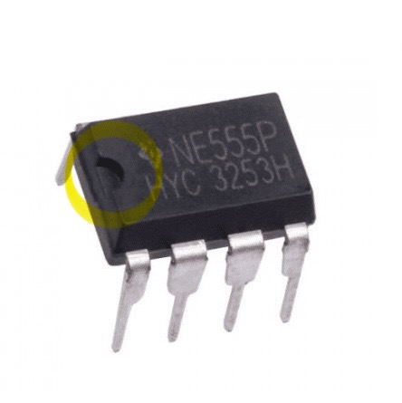
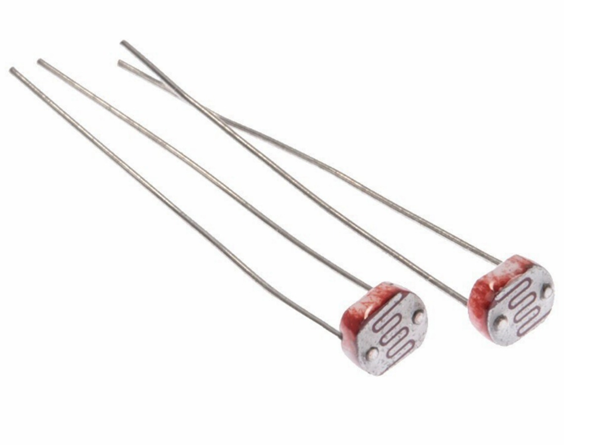
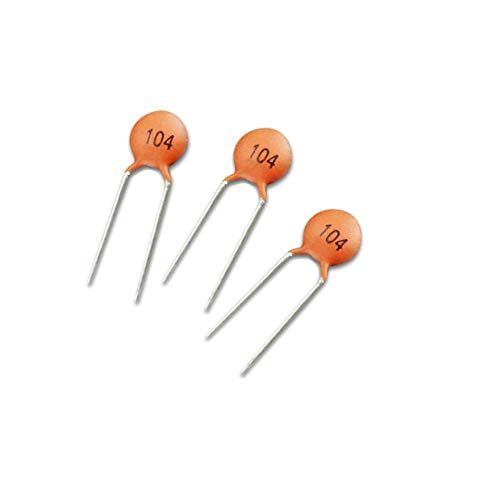
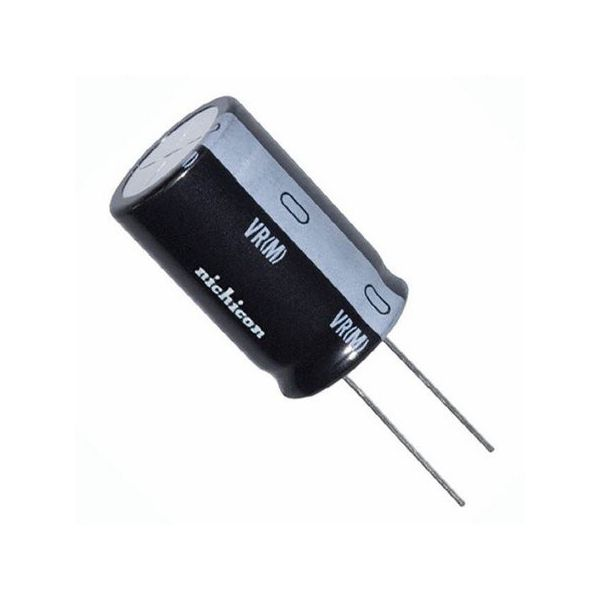
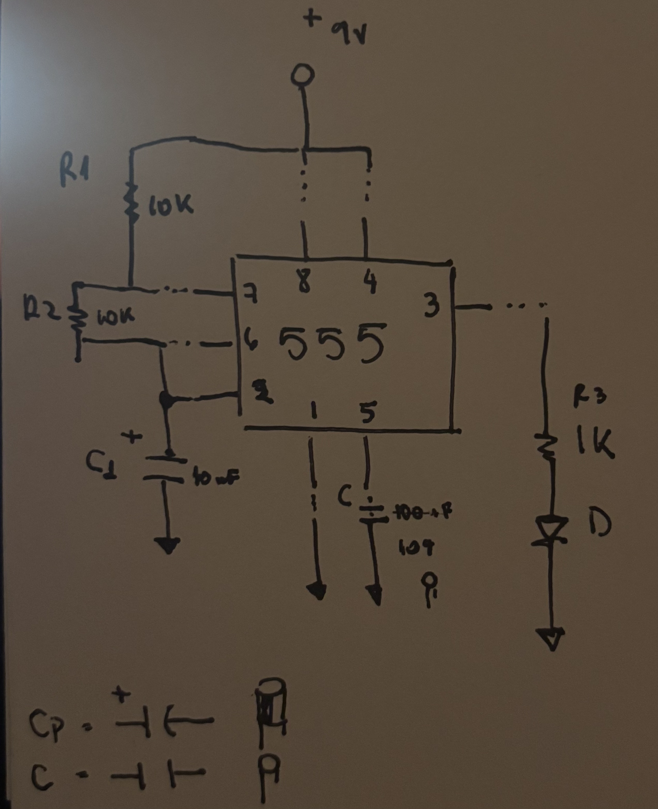
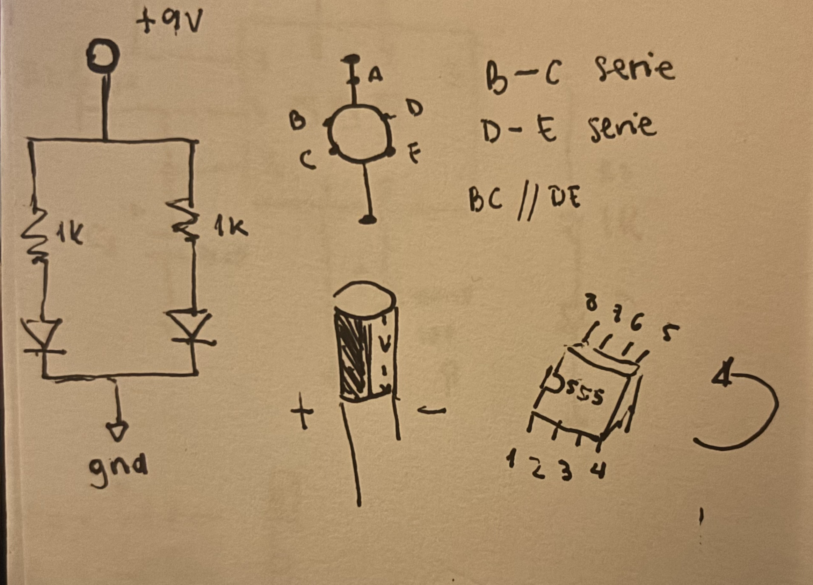

# sesion-02b

## NE555P

Nos dieron el chip NE555P, que sirve para hacer tiempos, pulsos o señales repetidas.

Tiene 8 patitas, y para saber cuál es cuál hay que fijarse en una marca del chip.

Esa marca indica la posición, y desde ahí se empiezan a contar las patitas desde la esquina inferior izquierda, siguiendo en sentido contrario del reloj.

## Nuevos materiales

### Fotoresistor:

Resistencia que cambia según la luz, con más luz baja su resistencia y con menos luz la aumenta. 

Más resistencia - menos luz

Menos resistencia - más luz

### Capacitor cerámico (no polarizado):

Componente que almacena energía eléctrica y puede conectarse en cualquier sentido, porque no tiene polaridad.

### Capacitor / Condensador:

Dispositivo que guarda y libera carga eléctrica, se usa para filtrar, estabilizar o almacenar energía en un circuito.

- Si el capacitor es pequeño: se carga y descarga rápido - el LED parpadea rápido. 
- Si el capacitor es grande: se carga más lento - el LED parpadea lento.

### Simbologías

- R (ej: R1, R2): Resistencia, el número sirve para distinguir cada una y al lado aparece su valor (ej: 1k, 10k).
- C (ej: C1, C2): Capacitor/condensador, el número identifica cada uno y al lado se indica su valor (ej: 10 mF, 100 mF).
- D: LED .
- +9: Positivo de la batería 9V

### Ejercicios en clase:

### Circuito con chip 555

https://github.com/user-attachments/assets/4cba7d98-1f0b-489e-9eda-48b3a973c85a

### Circuito con fotoresistor

https://github.com/user-attachments/assets/f9f72d1b-14af-4004-8160-a495060fdfdf

### Circuito con potenciometro 

https://github.com/user-attachments/assets/5f21d8bc-f143-4bb2-87c8-e9c75ca15923

### Encargo 

### Práctica personal

Cómo leer bien los esquemas y ordenarlos.

### Registro

Vengo de la sección de moda, así que todo esto es nuevo para mí y me ha costado seguir el ritmo, pero preguntando a mis compañeros y practicando he ido entendiendo más. En esta práctica me enfoqué en los esquemas, aprendiendome las letras como R, C, D y +9 para reconocer bien los componentes, y tratando de entender cómo se conectan las líneas siguiendo el recorrido desde el positivo para ver cómo funciona el circuito. También practiqué ordenar y simplificar los esquemas, usando menos cables y dejando todo más claro para que se entienda mejor y poder buscar errores más rápido.

### Preguntas:

- ¿Dónde puedo encontrar más ejercicios para practicar?
- ¿Cómo puedo evitar que el chip se queme?
- ¿Cómo puedo hacer que el circuito tenga distintos ritmos?
- ¿Cómo influye el voltaje en el circuito?
- ¿Cómo se que capacitor o resistencia elegir según lo que quiero hacer?
- ¿Existen otras formas de controlar el parpadeo?
- ¿Qué otros sensores se pueden usar en estos circuitos?
- ¿Hay un límite de capacitores que se pueden usar?
- ¿Dónde puedo ver videos o páginas para entender mejor la materia?
