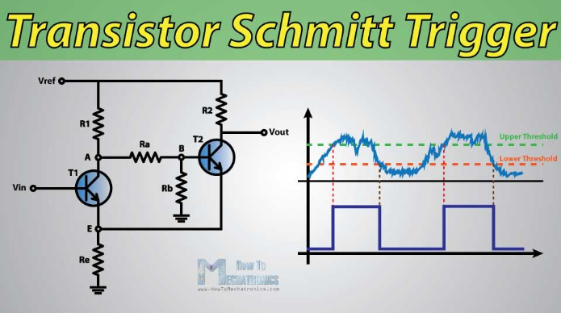
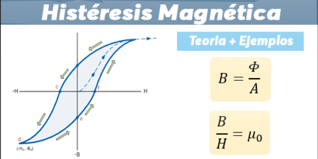
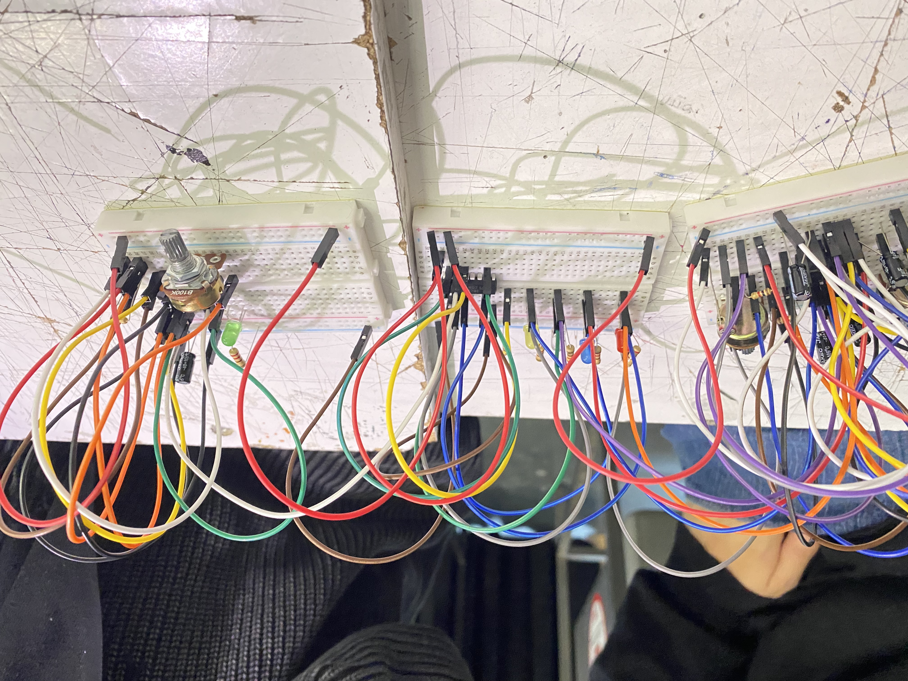
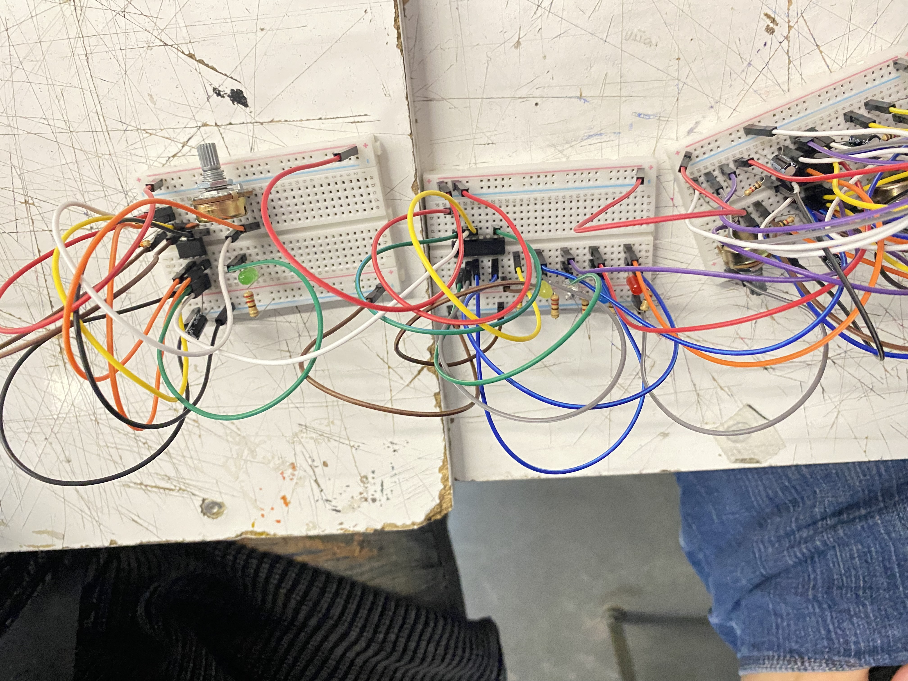

# sesion-06a

En esta sesión trabajamos uniendo distintos módulos para formar un circuito más completo.

Se conectaron el generador de pulso (555), el secuenciador (4017), el sintetizador (4093), el amplificador (LM386) y la salida (parlante).

El objetivo fue entender cómo cada parte cumple un rol específico dentro del flujo general de la señal.

Dentro de esta estructura:

- El 555 marca el ritmo.
- El 4017 va activando cada paso uno por uno.
- El CD4093 usa 4 compuertas NAND que ocupamos para generar y moldear la señal de audio.
- El LM386 amplifica el sonido para que se escuche más fuerte.
- El parlante es donde finalmente se escucha el sonido.

### Schmitt Trigger

Uno de los temas que se reforzó fue el funcionamiento del Schmitt Trigger. Se explicó de forma más simple, entendiéndolo como un componente que estabiliza señales.

Su función principal es transformar señales irregulares o con ruido en ondas cuadradas más limpias y definidas, lo cual es fundamental en circuitos como el que estamos desarrollando.

### Histéresis (base del Schmitt Trigger)

El comportamiento del Schmitt Trigger se basa en la histéresis, que introduce una diferencia importante respecto a un comparador común.

En lugar de cambiar de estado en un solo punto, existen dos umbrales:

- Umbral superior (UTP): cuando la señal supera este nivel, la salida cambia de bajo a alto.
- Umbral inferior (LTP): cuando la señal baja de este nivel, la salida cambia de alto a bajo.
- Zona intermedia: entre ambos valores, el circuito mantiene su estado, ignorando pequeñas variaciones.
  
Esta zona evita que el circuito reaccione a cambios pequeños o ruido.

La histéresis permite trabajar con señales reales, que siempre contienen ruido. Sin este mecanismo, la salida podría cambiar constantemente de estado de forma inestable.

Gracias al Schmitt Trigger, se obtiene una señal más clara, estable y controlada, lo que mejora directamente el comportamiento del sintetizador.

### Enfoque de la clase

La clase se centró en avanzar en la primera evaluación, empezando a trabajar en nuestro sintetizador. 

### Ejercicio en clases

### Resultados

♪┏(・o･)┛♪ bailecito

https://github.com/user-attachments/assets/27283fc6-fe08-4401-918d-ff88714f4bab

Esta clase no tuvimos muchos problemas al desarrollar el circuito y, en general, todo funcionó bien desde el 555 hasta el LM386. Como no teníamos suficientes potenciómetros, los reemplazamos por un fotoresistor, lo que igual nos permitió que el circuito funcionara correctamente. Lo único malo fue que nuevamente murieron un par de chips ಥ﹏ಥ.

