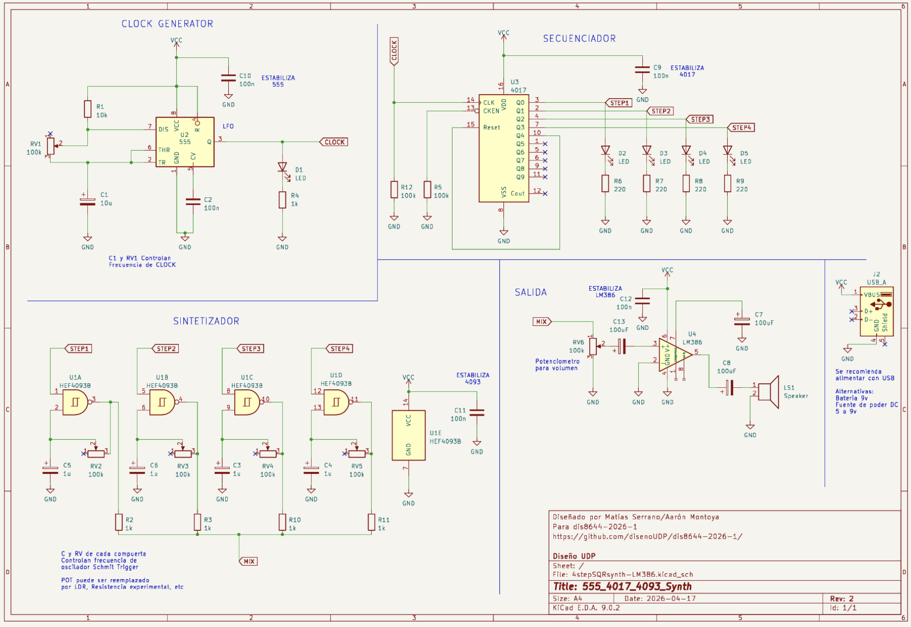
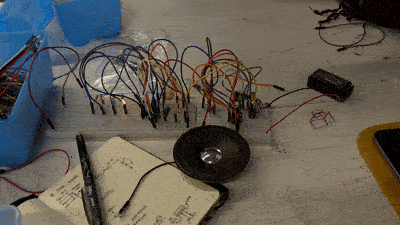

# sesion-06b

En esta clase nos entregaron el esquema actualizado con mejoras.

Revisamos los cambios y empezamos a aplicarlos en nuestro circuito para que funcionara mejor.

Ese día rehicimos todo el circuito desde cero, ordenando mejor las piezas para que quedara bien conectado, ya que antes algunos cables no estaban bien puestos. El 555 y el 4017 funcionaban sin problemas por separado, pero el resto del circuito no respondía.

Luego, al reconstruir el 4093 en clases, solo logramos que sonaran dos de las cuatro compuertas. Más tarde, Benjamín terminó las dos que faltaban en su casa  y ya todas funcionaban. Después unimos todo al circuito completo y quedó funcionando. 

Además, por recomendación de los profes, sacamos los LEDs para que no consumieran tanta corriente y así se pudiera escuchar más fuerte el sintetizador.

### Pruebas de compuertas

https://github.com/user-attachments/assets/8fc525cc-1c3f-4279-bfd2-4390d54c4a0b

https://github.com/user-attachments/assets/885d49eb-eff8-430f-b374-b1db1a6a6539

https://github.com/user-attachments/assets/fae4a4fc-64f2-4a89-bbd0-9fd7ce3c438a

