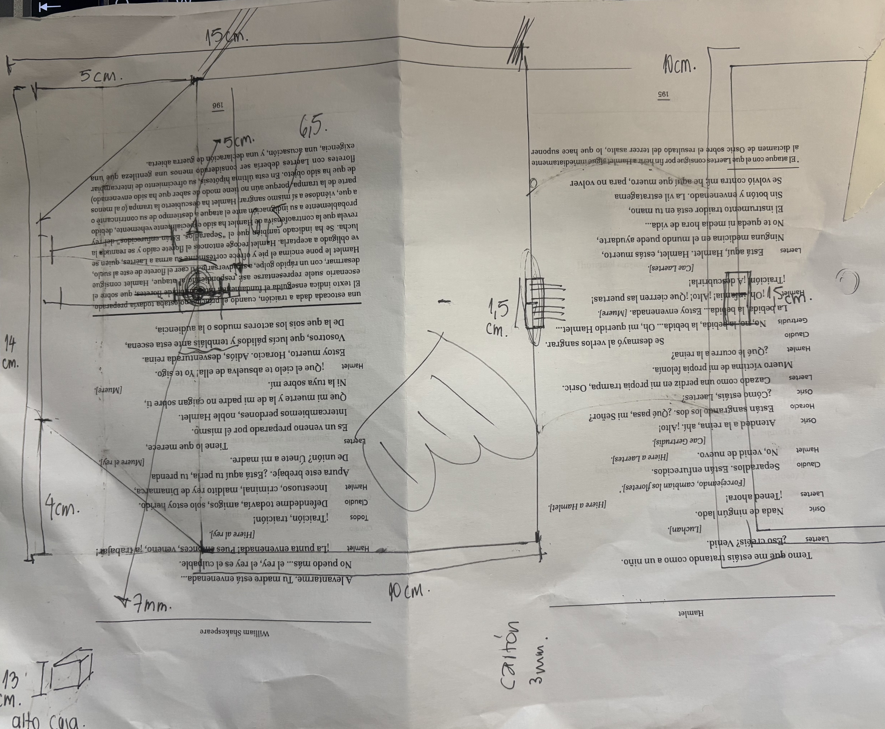
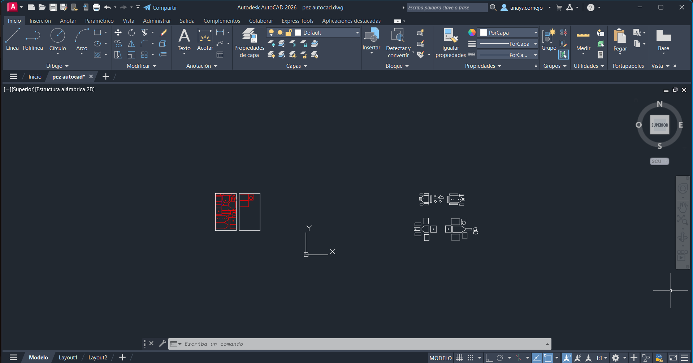
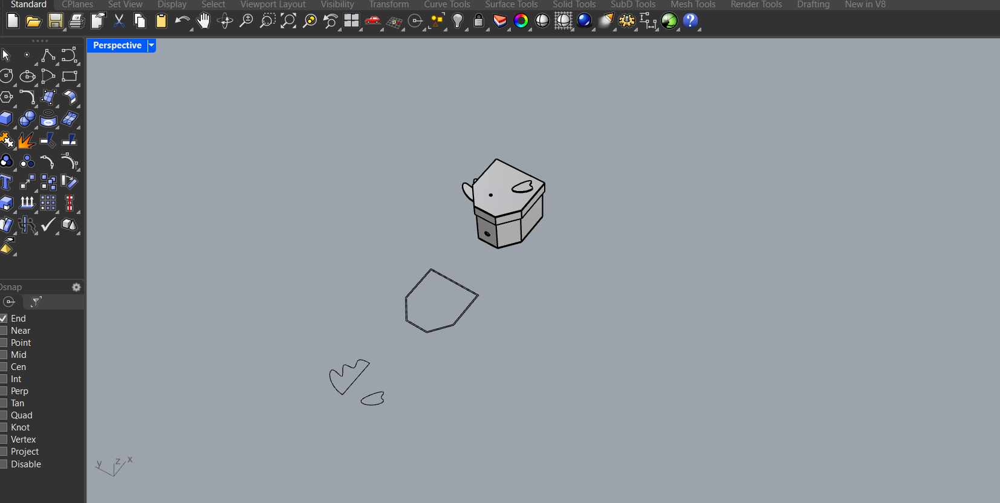
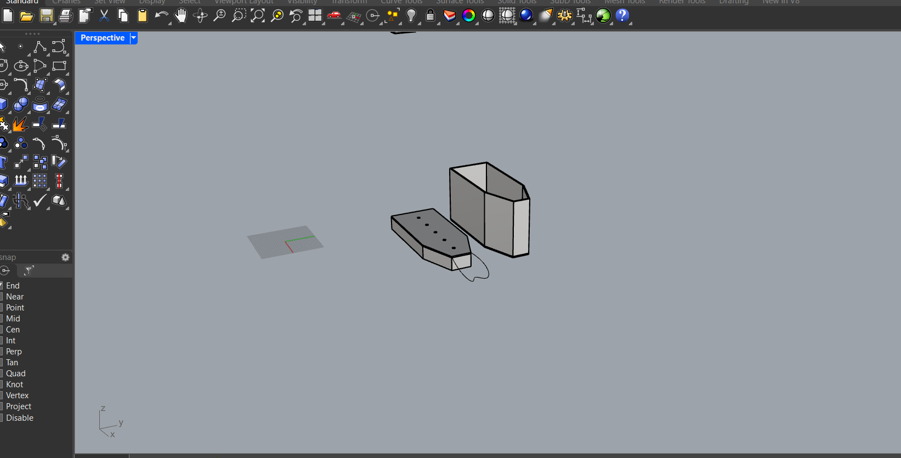
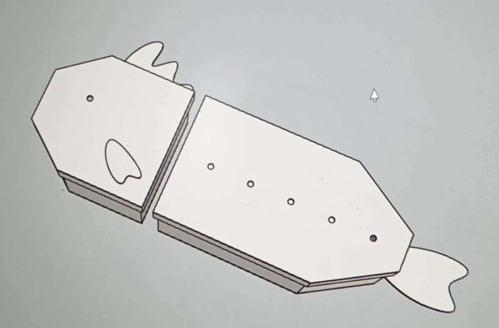

# sesion-07a

En esta clase ya teníamos el circuito listo y funcionando. 

https://github.com/user-attachments/assets/9cd177c2-e0ab-42a4-9acd-ded4639ec3b5

Yo llegué un poco tarde por temas de salud, así que me perdí la parte donde enseñaron a soldar, aunque no fue problema porque ya tenía experiencia previa en orfebrería, hacía accesorios :3. Además, mis compañeros me explicaron bien los pasos ( ദ്ദി ˙ᗜ˙ )

Me comentaron que les enseñaron una especie de ritmo para controlar el tiempo con el cautín, algo como: “1…2… pongo soldadura… 1…2…”, para no pasarse y soldar mejor ヾ(´〇`)ﾉ🎙️ ♪🎶♪ ♪

También hicimos pruebas con condensadores de 1uF, 10uF y 100uF, para ver cómo cambiaba el sonido y decidimos quedarnos con el de 100uF, ya que era el que sonaba mejor para nuestro gusto.

Luego por la tarde, en el LID, le agregamos al circuito un botón de encendido y apagado para hacerlo más cómodo de usar y para simular la boquita del pez.

### Bocetos del proyecto

Aquí intenté dimensionar cómo se vería en tamaño real y lo dibujé en mi texto de Hamlet de diseño escénico. Upsiii, pero era una impresión fallida  ( ദ്ദി ˙ᗜ˙ )

### Procesos Autocad y Rhino

Fotito extra de mi ayudante Miko que se metió a la caja donde guardábamos las protoboards

Yyyy el resto del proceso se puede ver en la carpeta 00-proyecto-01, grupo-02 ദ്ദി(˵ •̀ ᴗ - ˵ ) ✧
