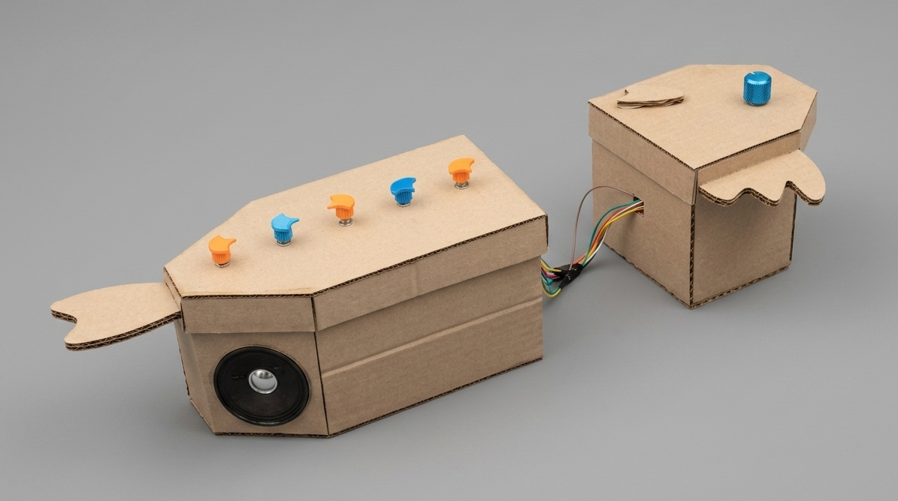
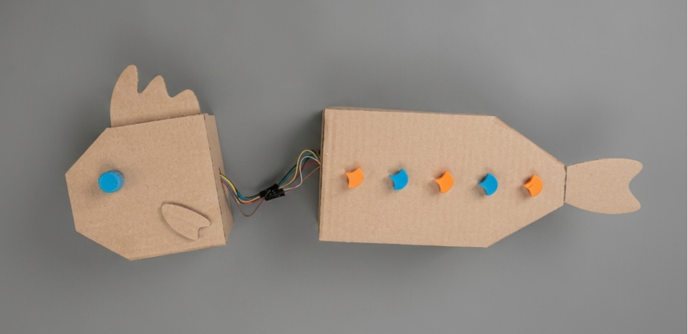

# sesion-07b

Hoy fueron las presentaciones de los proyectos del sintetizador. Me impresionó mucho el nivel que llegó a tener el curso, y me pareció muy interesante cómo algunos grupos explicaron las decisiones estéticas y todo su proceso de trabajo.

También me gusta mucho el apoyo que hay en el taller, tanto entre compañeros como con los profesores. Yo vengo de la sección de moda, donde lamentablemente hay mucha competencia y poco apoyo entre compañeros, esta nueva dinámica en taller realmente me impresionó demasiado y me hace sentir más cómoda y segura.

En la presentación me puse muy nerviosa ya que me da pánico hablar frente a mucha gente, por lo que olvidé algunas cosas. Además, como quedó poco tiempo al final, no pude explicar los aprendizajes, errores ni la conclusión (╥﹏╥;)

Me gustaría mejorar en no ponerme tan nerviosa al presentar, para poder explicar mejor todo mi proceso y que los demás entiendan bien el proyecto ( ◡̀_◡́)ᕤ

A pesar de todo, quedé muy contenta con la entrega y con todo lo que he podido aprender estas semanas.

### Fotos Pescado Rabioso

