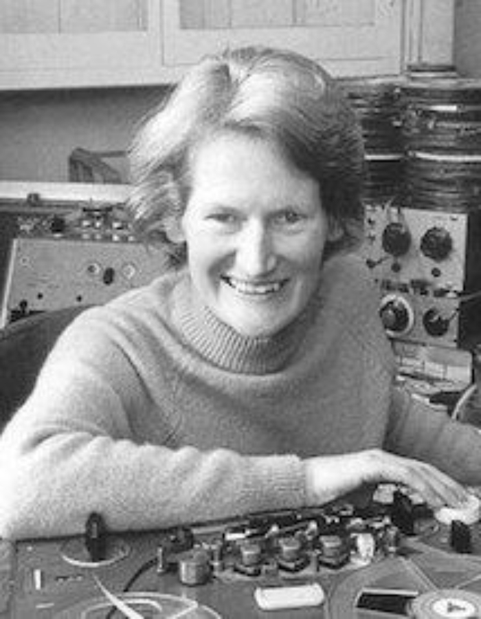
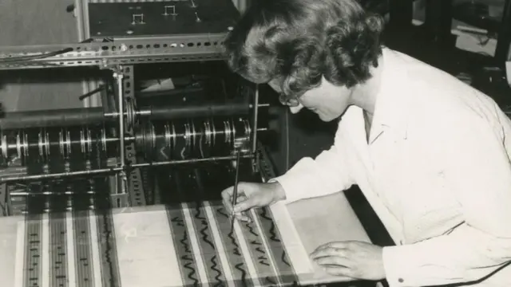

# sesion-01a

## Primer día de clases 

## Horario
Martes y Viernes 08:30 a 12:50 (sala 202 SS).

- 08:30 a 09:00 - tiempo de llegada.
- 09:00 a 10:30 - trabajo en clase/materia.
- 10:30 a 11:00 - descanso/receso.
- 11:00 a 12:30 - trabajo en clase/materia.
- 12:30 a 12:50 - ordenar.

---

## Apuntes
 
- Printed Circuit Board (PCB) Es una placa rígida donde se montan componentes electrónicos conectados mediante pistas de cobre, lo que permite la automatización de la producción, mejora la fiabilidad del sistema y reduce el tamaño del circuito en comparación con los montajes manuales.

- PCBA (Printed Circuit Board Assembly) Es una placa de circuito impreso ya ensamblada, con todos sus componentes electrónicos soldados sobre la PCB, lista para funcionar, lo que permite mayor fiabilidad, producción automatizada y mejor desempeño del circuito.

- Etch PCB Es el proceso de grabado de una placa de circuito impreso, en el cual se elimina el cobre sobrante para formar las pistas del circuito, permitiendo obtener un diseño preciso, compacto y funcional sobre la PCB.

- THT (Through-Hole Technology)  Es una tecnología de montaje electrónico en la que los componentes se insertan a través de orificios en la PCB y se sueldan por el lado opuesto, ofreciendo mayor resistencia mecánica y fiabilidad en conexiones.

- SMT (Surface-Mount Technology) Es una tecnología de montaje electrónico en la que los componentes se colocan y sueldan directamente sobre la superficie de la PCB, permitiendo circuitos más compactos, mayor automatización y reducción de tamaño y peso.

- Sintetizadores: Los sintetizadores son aparatos electrónicos que sintetizan sonidos: instrumentos musicales electrónicos que generan, manipulan y transforman señales eléctricas en sonido, permitiendo crear timbres desde cero o imitar sonidos tradicionales. Funcionan mediante osciladores, filtros y envolventes (ADSR), y son fundamentales en la producción musical moderna, tanto en formato analógico (como los de Moog y Behringer) como digital (hardware y software, por ejemplo Korg).

---

##Encargo
Ver la película Sisters with Transistors, y enfocarse en una de las artistas, investigar sobre su vida y obra, hacer un reporte escrito en texto, con fuentes y referencias.

###  Daphne Oram 

Daphne Oram (1925–2003) fue una compositora y pionera de la música electrónica británica. Inició su carrera en la BBC, donde fue cofundadora del BBC Radiophonic Workshop en 1958, un espacio dedicado a la experimentación sonora y al uso de nuevas tecnologías aplicadas a la música. Su trabajo se caracterizó por romper con las formas tradicionales de composición y por explorar nuevas relaciones entre sonido, tecnología y arte visual.

---

### La máquina Oramics (opinión personal)

Lo que encuentro más relevante e impresionante del trabajo de Daphne Oram es la máquina Oramics. Me parece increíble que sea posible crear música a partir del dibujo, utilizando líneas y formas visuales para generar sonidos. Esta idea cambia completamente la manera de entender la composición musical, ya que no depende de instrumentos clásicos ni de partituras tradicionales.

Para mí, Oramics es especialmente importante porque une el lenguaje visual con el sonido, haciendo que el proceso de componer se parezca más a dibujar o diseñar que a tocar un instrumento. Considero que esta forma de creación estaba muy adelantada a su época y que anticipa muchas de las herramientas digitales actuales, donde lo visual y lo sonoro están profundamente conectados.

---

### Legado

Aunque su trabajo no fue ampliamente reconocido en su tiempo, hoy Daphne Oram es considerada una figura fundamental en la historia de la música electrónica y el arte sonoro experimental. Su enfoque innovador sigue influyendo en músicos, artistas y diseñadores que buscan nuevas formas de expresión a través de la tecnología.

---

### Fuentes y referencias

- <https://www.bbc.com/mundo/vert-cul-40225071>
- <https://es.wikipedia.org/wiki/Daphne_Oram> 
- <https://sulponticello.com/iii-epoca/oramics-dibujar-la-musica/>
