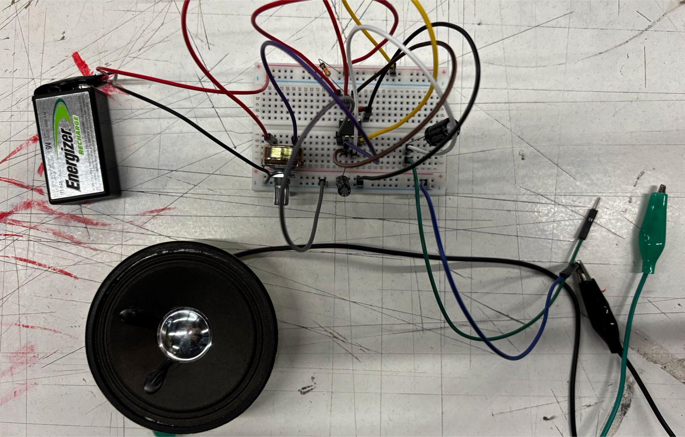

# sesion-03a

## materia 

+ el tiempo que hay que se repite un ciclo es una onda
+ periodo: cuanto dura una onda
+ frecuencia: cada cuanto ocurre algo, suceso  tiempo
+ si se el periodo puedo calcular la frecuencia

## sonamos 

+ transducción: conversión de una señal, estímulo o energía de una forma a otra

circuito A-estable con parlante 

## segundo bloque 
+ condensador en serie: atenua ciertos comportamientos de la onda
+ la resistencia hace que no sea tan agresivo el paso de los electrones
+ con resistencia y condensador se puede filtrar, escalersa de moog (mood filter ladder)
+ (R) atenua (C) filtra 
+ las diferencias son importantes porque son productivas 
