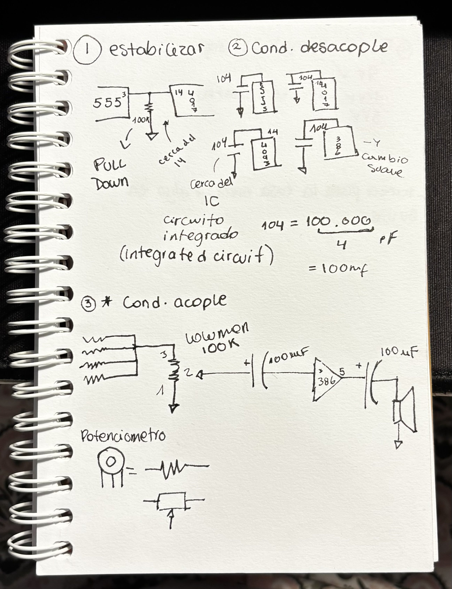
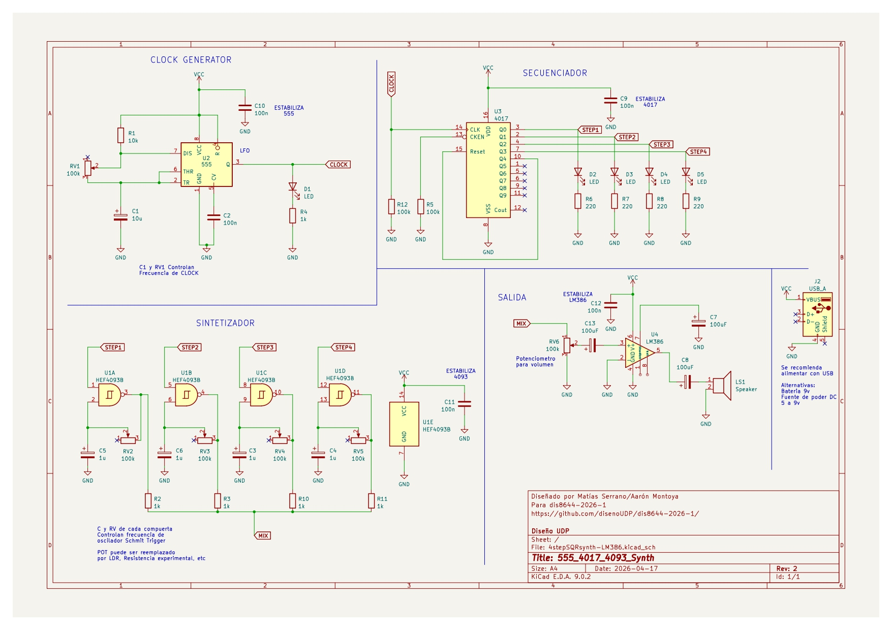

# sesion-06b
17 de abril 

## tarea para la casa, manejar algo en nuestra vida 

apuntes que tome al llegar

+ fuentes alternativas: 9v, 12v, paneles solares, 5v 

## 4 steps 

fue increiblemente frustrante hacer este circuito, nos costó horas lograr que sonaara pero a eso de las cuatro de la tarde sonamos!!

## nada es imposible ni una h***

