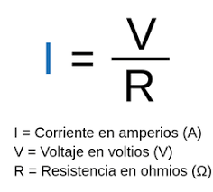
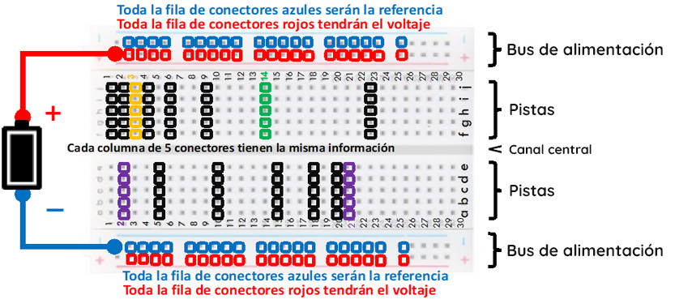

# sesion-01b
# tinkercad #

sirve para modelar y hacer circuitos ( entrar con mail udp)

+ resistencia (límite de velocidad)
+ flujo
+ potencial
+ corriente (flujo o desplazamiento de cargas eléctricas/electrones)
+ diferencia
+ poder
+ energía
+ materia (carbón, silicio, cobre)

# ley de ohm #

**diferencia de potencial** = voltaje

# protoboard #

# diodo led #

conduce electricidad de un sentido

+ pata larga: carga positiva (anodo)
+ pata corta: carga negativa (catodo)

# aaron swartz #
Aaron Swartz consideraba la programación como algo casi mágico, una herramienta que permitía crear cosas enormes desde una simple computadora. Para él, el internet no era solo tecnología, sino una forma de cambiar cómo las personas acceden al conocimiento y se conectan entre sí. El documental lo muestra como alguien extremadamente brillante e idealista. Para él, internet debía servir para liberar el conocimiento  no para restringirlo o convertirlo en un negocio cerrado. Su historia también plantea una pregunta importante: hasta qué punto el acceso a la información debería ser un derecho y no un privilegio.

Tim Berners-Lee
Aaron estaba muy influenciado por Tim Berners-Lee, el creador de la World Wide Web. Berners-Lee es visto como uno de los grandes genios de internet y decidió no patentar la web ni lucrar directamente con ella, permitiendo que se expandiera libremente. Esa visión de internet como un bien público marcó profundamente la forma de pensar de Aaron.

TheInfo.org
La desarrolló cuando tenía solo 12 años, en su propia habitación. Era una página colaborativa donde los usuarios podían compartir información y editar contenido, muy similar a lo que más tarde sería Wikipedia. 

RSS (Really Simple Syndication)
una tecnología que permite recibir actualizaciones de distintas páginas web en un solo lugar. Gracias a esto, los usuarios podían obtener extractos o resúmenes de contenido de otras webs, algo que hoy se usa mucho en blogs. Esto ayudó a construir parte de los cimientos del hipertexto moderno, facilitando la circulación de información en internet.

Y Combinator
Fue un espacio donde muchos proyectos de internet comenzaron a crecer rápidamente.

Infogami
una plataforma para construir páginas web de forma colaborativa. Si propósito era que las páginas pudieran editarse fácilmente, algo que reflejaba nuevamente su interés por democratizar la creación de contenido en internet.

Reddit
Infogami se fusionó con la empresa que desarrollaba Reddit, una plataforma dedicada principalmente a comunidades de internet y amantes de la informática. Aaron participó en su desarrollo temprano, ayudando a convertirla en un espacio donde los usuarios comparten y discuten contenido de la web.

PACER
 es un sistema de bases de datos del gobierno de Estados Unidos que permite acceder a documentos de tribunales federales, pero cobrando por cada página consultada. Aaron criticaba este modelo porque consideraba absurdo que documentos públicos pagados con dinero público no fueran realmente accesibles al público. Por eso liberó millones de documentos judiciales que estaban detrás de ese sistema de pago.

