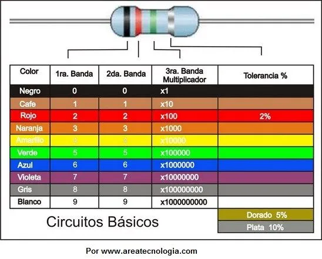
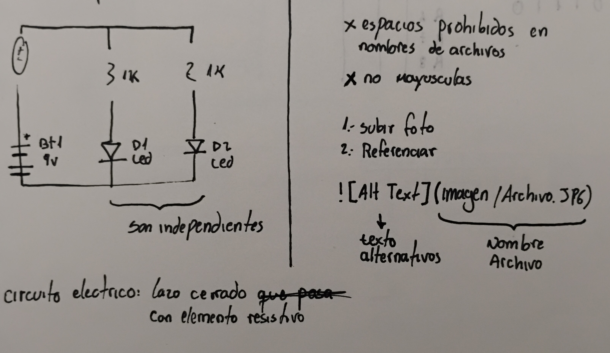
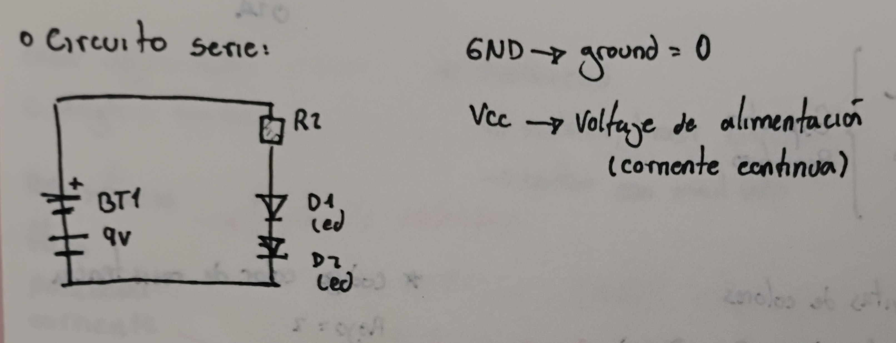

# sesion-02a

# codigo de color de resistencias #

+ café/negro: digitos
+ rojo: cantidad de ceros ( se escribe con exponencial)
+ dorado: tolerancia (ultimo color)

# circuito paralelo #

# circuito serie #

# ejercicio 1 #

# ejercicio 2 #

# ejercicio 3 #

#resultados#

# kraftwerk #

Kraftwerk se formó a finales de 1960 con una propuesta reconocida por el uso de sonidos sintéticos y repetitivos. Sus fundadores, Ralf Hütter y Florian Schneider buscaron reflejar la identidad alemana de postguerra, donde la mezcla entre ragos mecánicos y humanos se entrelaza entre sus canciones.

## THE MAN-MACHINE ##

Se publicó en el año 1978 en Alemania, una época aún marcada por al postguerra y pleno auge tecnológico. En esta propuesta se evidencia la estética que proponen los fundadores de mezclar lo humano con lo mecánico.

El álbum se caracteriza por canciones con ritmos planos y repetitivos, con sonidos artificiales e hipnóticos. Por otro lado la voz se caracteriza por crecer de emoción, casi artificial, algo que se puede relacionar a algunas canciones de la banda Rammstein.

Me llamó mucho la atención el uso de sonidos repetitivos, a nivel conceptual la combinación de sonidos mecánicos para generar una sensación tensa, en algunas partes de las canciones logré concentrarme únicamente en los sonidos, dejando de prestar atención a mi alrededor.
