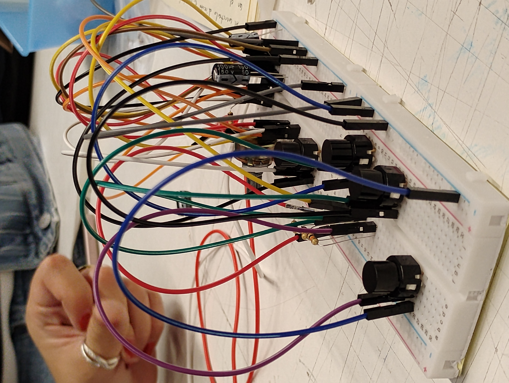

# sesion-03a

ldr = fotoresistor

**circuito astable:** circuito sin estabilidad

frecuencia: cada cuanto ocurre algo/ cuantas cosas pasan en un determinado tiempo

periodo: se mide en tiempo/ tiempo que hay entre que se repite el ciclo de una onda

# formula frecuencia #

f=1/t=1.44/(Ra+2rb)c

la oscilación se manifiesta en el led pero ocurre en la pata 3 del chip

how a timer 555 chip works

hicimos sonido, el iman recib eenergia y el movimiento rapido hacia adelante y hacia atras haciendo sonido

transducción: tomar un tipo de energia y transformarlo en otra

**victorian oscilator**

john cage (el silencio no existe)

ovcc: voltaje de corriente directa (positivo)
gnd: ground

# interruptor #

+ **switch** (ampolleta) sigue en el mismo estado que se deja
+ **temporales/puch/momentaneo** (timpre) es momentaneo

tiene patas duplicadas (conectar en diagonales)

tiene un gran circulo central y 2 que lo rodean

tiene un lado plano, ponerlo  hacia abajo

**cable caiman**

# toy organ #

