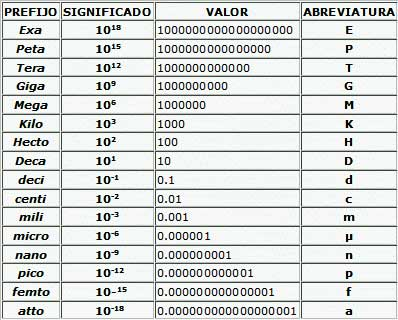

# sesion-04a

## Apuntes de la clase del 31 de marzo, 2026

Partimos armando el circuito con el 555.
Sucede que con los capacitores y resistencias tenemos la mala costumbre de colocarle prefijos incorrectos.

Existe una tabla que nos puede ayudar con eso.
Potencias de 10 y sus prefijos: Lo que hacen es que simplifican la notación de números muy grandes o muy pequeños.

A continuación armamos nuevamente el atari console punk en parejas, yo hice el circuito monoestable e Isidora el astable.
Por el pin de salida se conectó un potenciómetro para lograr subir y bajar el volumen.
