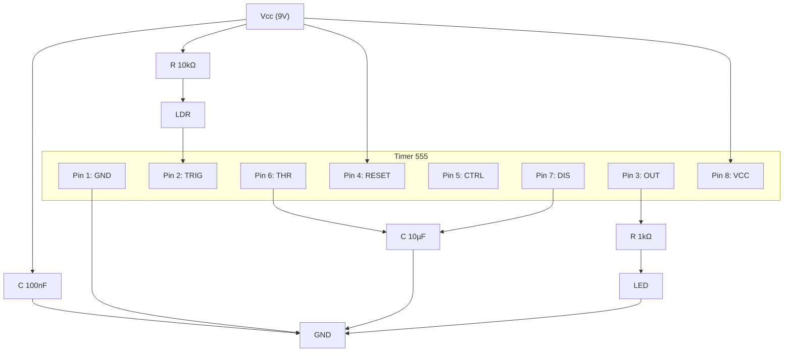

# sesion-04a 31.03

Izquierda afinaciones <- -> Derecha salidas

* 0,000.000.000.001 pico
* 0,000.000.001 nano           
* 0,000.001 M (micro)
* 0,001 mili
  
} (C)ondensador
  
* 1 -> Unidad
* 1.000 -> kilo (ohm)
* 1.000.000 -> Mega            
* 1.000.000.000 -> Giga
* 1.000.000.000.000 -> Tera

} (R)esistencia
10.000 picoF -> 100 nanoF -> 0,1 microF

(F)araday: según gemini: Representa la cantidad de electricidad transportada por 1 mol de electrones, derivada de la carga de un solo electrón multiplicada por el número de Avogadro.

## Falstad
<https://www.falstad.com/circuit/>

Mi circuito:

### Ejercicio en clase

No nos funcionó a la primera porque no conectamos las tierras (tood el circuito tiene solo una tierra (GND)

Cambiamos el fotoresistor por un potenciometro para probar cosas ;))))

Luego conectamos un potenciometro para controlar el volumen:

