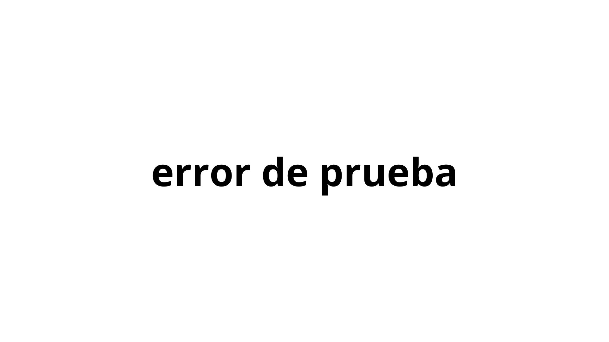
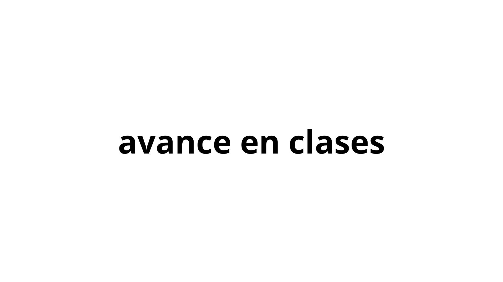
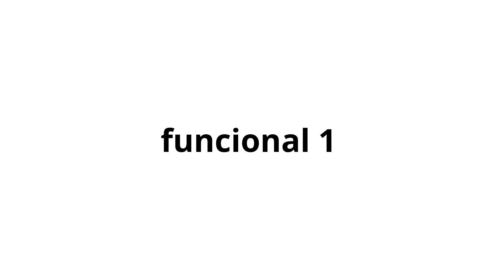

# sesion-07a

## Intro ##

Esta clase inicio con definiciones de conceptos claves para el 2do proyecto, que es la realización de una placa

> Por temas de tiempo no voy a ahondar en las definciones como otras veces

 

### SMT/THT ###

Son los 2 tipos de ensamblaje de una PCB, por ende cambian los tipos de componentes

- SMT (Surface Mount Technology): Es el proceso más automatizado. Hace referencia a los componentes soldados en la ***superficie***. **Utiliza componentes específicos de menor tamaño**

- THT (Through-Hole Technology): Era la norma antes de la automatización que vivimos. Su nombre viene de ***A través del orificio***, por lo que los componentes utilizados atraviesan la placa y son soldados por la parte trasera de esta. **Usa las mismas piezas que en el prototipado de protoboard**

   

### PCB - PCBA ###

- PCB (Printed Circuit Board): En español placa de circuito impresa. Es una placa sin componentes

- PCBA: (Printed Circuit Board Assembly): Acá se le agrega la **A** referenciando _ensamblada_. Esto quiere decir que se diferencia de la anterior por poseer componentes

 

### KICAD ###

Software desarrollado por el CERN, donde se puede:

1. Realizar esquematicos

2. Desarrollar una placa

3. Visualizar en 3D el resultado

>Los esquematicos entregados por misaa se realizan en Kicad

 

### Manual electrónica basica ###

https://misaa.cc/electronica/manualelecbasica.html

## Desarrollo Clase ##

### Re-conectar ###

La sesión se baso en revisar que todo estuviera conectado adecuadamente, porque al traer desde el LID a la sala, se desconectaron cables

Probamos lo investigado desde la sesión anterior, es decir, el uso de transistores, se conectaron según lo mencionado por **GEMINI**, obviamente no funcionó, conversando con los profes entendimos que la IA inventa cosas que parecen reales. Para fortuna del grupo fuimos a ver el sintetizador del grupo de Luisa, el cual habian implementado los leds en el 4017 mediante transistores. Luego de que nos explicara como funcionaba, llegamos a la conclusión de que no queriamos entrar en ese abismo, preferiamos centrar esfuerzos en otras áreas

Finalmente dejamos todos los circuitos conectados y **soNANDo**, el siguiente paso era clave, encapsular todo en sus respectivas cajas con sus terminales 

### Contexto trabajo grupal ###

Como punto importante, con Isidora y Dayana tuvimos un martes bastante intenso por entregas en otros ramos para el día miércoles, sumado a que tenemos clase ese dia desde 8:30am hasta 7pm, por lo que esto mermo en parte los avances. Cosa que hasta el dia jueves am no nos preocupaba, debido a que teniamos sonando el sinte, por lo que era cuestión de sumarle las cajas

## Post Clase ##

Por lo mencionado anteriormente, esto considera una pequeña sección el día miércoles y en su mayoría dia jueves

## Caida a la locura / todo falló ##
