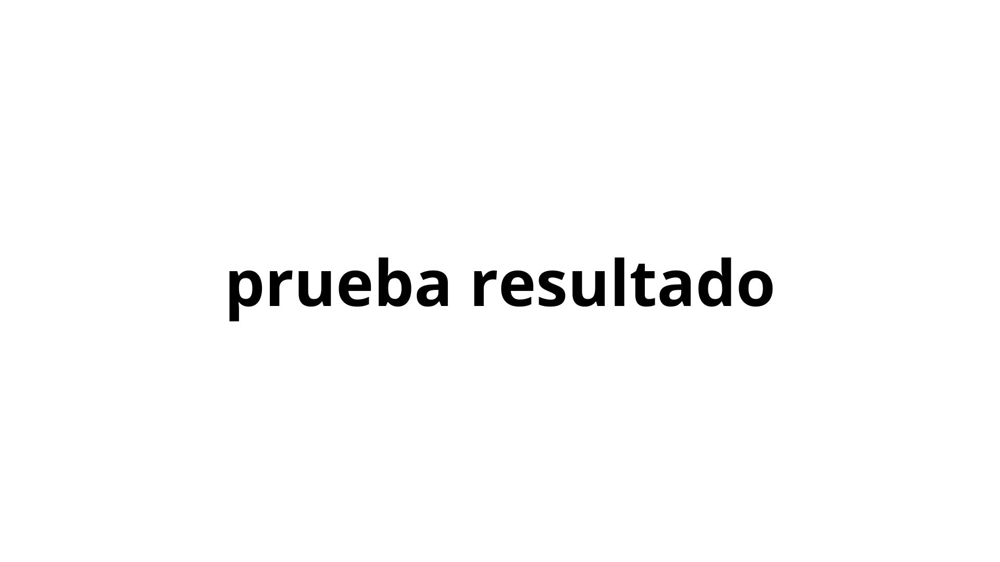

# sesion-07a

## Intro ##

Esta clase inicio con definiciones de conceptos claves para el 2do proyecto, que es la realización de una placa

> Por temas de tiempo no voy a ahondar en las definciones como otras veces

 

### SMT/THT ###

Son los 2 tipos de ensamblaje de una PCB, por ende cambian los tipos de componentes

- SMT (Surface Mount Technology): Es el proceso más automatizado. Hace referencia a los componentes soldados en la ***superficie***. **Utiliza componentes específicos de menor tamaño**

- THT (Through-Hole Technology): Era la norma antes de la automatización que vivimos. Su nombre viene de ***A través del orificio***, por lo que los componentes utilizados atraviesan la placa y son soldados por la parte trasera de esta. **Usa las mismas piezas que en el prototipado de protoboard**

   

### PCB - PCBA ###

- PCB (Printed Circuit Board): En español placa de circuito impresa. Es una placa sin componentes

- PCBA: (Printed Circuit Board Assembly): Acá se le agrega la **A** referenciando _ensamblada_. Esto quiere decir que se diferencia de la anterior por poseer componentes

 

### KICAD ###

Software desarrollado por el CERN, donde se puede:

1. Realizar esquematicos

2. Desarrollar una placa

3. Visualizar en 3D el resultado

>Los esquematicos entregados por misaa se realizan en Kicad

 

### Manual electrónica basica ###

https://misaa.cc/electronica/manualelecbasica.html

## Desarrollo Clase ##

### Re-conectar ###

La sesión se baso en revisar que todo estuviera conectado adecuadamente, porque al traer desde el LID a la sala, se desconectaron cables

Probamos lo investigado desde la sesión anterior, es decir, el uso de transistores, se conectaron según lo mencionado por **GEMINI**, obviamente no funcionó, conversando con los profes entendimos que la IA inventa cosas que parecen reales. Para fortuna del grupo fuimos a ver el sintetizador del grupo de Luisa, el cual habian implementado los leds en el 4017 mediante transistores. Luego de que nos explicara como funcionaba, llegamos a la conclusión de que no queriamos entrar en ese abismo, preferiamos centrar esfuerzos en otras áreas

Finalmente dejamos todos los circuitos conectados y **soNANDo**, el siguiente paso era clave, encapsular todo en sus respectivas cajas con sus terminales 

 

### Contexto trabajo grupal ###

Como punto importante, con Isidora y Dayana tuvimos un martes bastante intenso por entregas en otros ramos para el día miércoles, sumado a que tenemos clase ese dia desde 8:30am hasta 7pm, por lo que esto mermo en parte los avances. Cosa que hasta el dia jueves am no nos preocupaba, debido a que teniamos sonando el sinte, por lo que era cuestión de sumarle las cajas

## Post Clase ##

Por lo mencionado anteriormente, esto considera una pequeña sección el día miércoles y en su mayoría dia jueves

## Caida a la locura / todo falló ##

Por mi parte avance instalando el 4093 en su caja para empezar a visualizar el resultado final

 

Ya en el dia jueves iniciamos la jornada cortando las piezas que nos faltaron para el parlante

 

Una vez finalizado empezamos con el montaje de las protoboards a las cajas y terminales impresos en 3D, además de soldar los potenciómetros para evitar que se desconecten. En esta parte, nos separamos en duplas, una soldaba y la otra armaba los contenedores con terminales, luego de un rato estabamos casi listas, quisimos probar los potenciómetros soldado, pero surgió un gran problema, ya no sonaba...

Por los nervios, pasamos por alto todo lo aprendido de errores anteriores, es decir que empezamos a revisar de manera desorganizada para hayar el o los errores. Luego de aprox 3 horas, inciamos a estructurar la revisión, revisamos conexiones, y empezamos a abarcar todas las posibles variables, baterías, cables, conexiones, hasta que comenzamos a cuestionarnos que se quemaron los IC, probamos con el 555 y nada, la solución apareció cuando hicimos el 5to cambio, finalmente encontramos el primer error.

Una vez comprobado que el 555 funcionaba pasamos a corroborar los demás, incluimos los led al 4017 para corroborar el buen funcionamiento y nada, solo 2 led prendían pero no de manera alternada, eso ya era un indicador que el problema tenía 2 posibles casos, los led (el menos probable según yo, dado que al no haber alternancia en el patrón y mantener la luz constante, el error debía ser la segunda opción) y el IC. En efecto era el chip, una vez que cambiamos este elemento (3 veces, no nos podíamos creer que tuvieramos tantos chips quemados en nuestras cajitas) la primera parte estaba lista, faltaba el 4093 y el 386.

---

Acá hago un pequeño paréntesis, a las 8 Carla ya debía retirarse así que coordinamos como ibamos a terminar esto. Finalmente Carla iba a avanzar todo lo posible en la documentación, mientras nosotras nos quedabamos en una casa hasta terminar todo 

---

Para este momento nos encontrabamos en la casa de Isidora, nos enfocamos en terminar y solucionar lo que faltaba. Revisamos conexión por conexión del 4093 y todo estaba bien conectado (ayudo demasiado los códigos de colores implementados), hicimos el mismo proceso con el 386. Luego de algunos cables sueltos comenzó a sonar, pero había algo raro, de manera irregular algunos _step_ dejaban de sonar, esto nos mantuvo casi una hora buscando el problema, hasta que finalmente nos percatamos que los poteciómetros estaban mal soldados, por lo que la conexión debía ajustarse con la mano (básicamente era replicar lo que uno hacía con sus audífonos económicos cuando fallaban), se trato de solucionar la soldadura pero no había caso, lo dejamos así de momento, con mucho masking tape y fé de que no se iban a soltar. Hecho esto y siendo las 4am ya, Daya se encargó de la afinación, es decir mediante calculadoras de frecuencia, buscó el valor lo más cercano a tonos que conocía, mediante la suma de capacitores en serie. Por mi parte me encargue de la documentación, una vez Daya terminó finalmente se armaron las cajas.

Siendo ya las 7am nos dirigimos a la universidad a terminar esto de una vez por todas, se solucionó el problema de los potenciómetros utilizando cables Dupont (la idea inicial), esto fue muy sencillo gracías al diseño de las cajas, puesto que desacoplamos la tapa y listo. Se tomarón fotografías y se redactaron los últimos puntos de la documentación (lamentablemente algo tarde, puesto que cuando presentamos no se había actualizado, pero _anyways_)

### Proceso Videos ###

> Punto curioso, acá nos percatamos que el sonido logrado se asemeja al inicio de la canción Crystal Castles - Crimwave 
>
>>

 

### Proceso Imagenes ###

