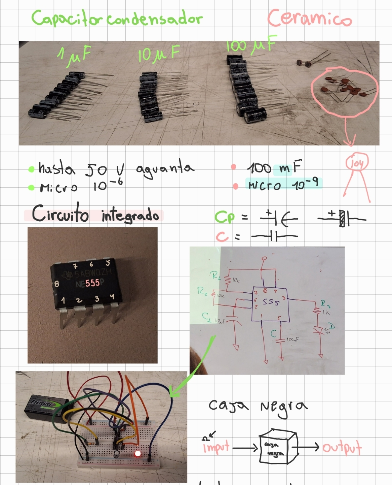

# sesion-02b
## Apuntes
hoy dia nos entregaron otros componentes como el condensador, el ceramico, el fotoresistor y un circuito integrado ic, aqui su definicion:
### 1. Capacitor (Condensador)
​Es un componente diseñado para almacenar energía en forma de un campo eléctrico. Actúa de forma similar a una pequeña batería temporal: se carga cuando recibe corriente y se descarga cuando el circuito lo requiere. Se utiliza comúnmente para filtrar señales, estabilizar voltajes o bloquear el paso de la corriente continua permitiendo solo la alterna. 
### 2. Capacitor Cerámico
Es un tipo específico de capacitor que utiliza materiales cerámicos como aislante (dieléctrico). A diferencia de los electrolíticos, no tiene polaridad (puedes conectarlo en cualquier dirección) y suele tener una capacidad de almacenamiento más pequeña. Son excelentes para trabajar a altas frecuencias y se usan mucho para eliminar el "ruido" eléctrico en los circuitos.
### ​3. Fotoresistor
​Es un componente cuya resistencia eléctrica varía según la intensidad de la luz que incide sobre él.  
+ Mucha luz: La resistencia baja, permitiendo que pase más corriente.
+ Oscuridad: La resistencia sube, dificultando el paso de la corriente.
### 4. Circuito Integrado 555 (IC Chip)
​Es un chip de 8 pines diseñado para funcionar como un reloj o temporizador. Su función principal es encender y apagar una señal eléctrica durante intervalos de tiempo específicos que tú mismo puedes configurar usando capacitores y resistencias externas.

Se utiliza principalmente en dos modos:
+ ​Modo Monoestable: Funciona como un temporizador de "un solo disparo" (por ejemplo, presionas un botón y una luz se queda encendida 10 segundos y luego se apaga).
+ ​Modo Astable: Funciona como un oscilador constante (por ejemplo, hace que un LED parpadee continuamente) 

Es la pieza fundamental en dispositivos que se activan automáticamente al anochecer, como las luces de los postes de la calle. 

**apuntes de la clase**

### Circuito Integrado 555

​Armamos un circuito con el chip IC 555 en el que la luz LED parpadeaba porque el chip está "vigilando" constantemente cómo se llena y se vacía el condensador. El 555 enciende y apaga la luz cada vez que el condensador llega a sus límites de carga y descarga. Después de comprobar su funcionamiento básico, realizamos diferentes pruebas cambiando algunos componentes para observar cómo variaba el comportamiento del circuito.

**Resumen de las Pruebas Realizadas**

+ **Cambio de capacitancia:** Al probar con diferentes condensadores (1mF, 10mF y 100mF), notamos que a mayor capacidad, el parpadeo se volvía más lento.
+ ​**Uso del potenciómetro:** Sustituimos al R2 con el potenciometro que tenia la capacidad de controlar manualmente la velocidad de la luz
+ **​Uso del fotoresistor (LDR):** Logramos que el circuito reaccionara a la luz ambiental, alterando la frecuencia del parpadeo según la claridad del entorno

### Imagenes de las pruebas realizadas

 

## encargo proxima clase 
1.¿Por qué un resistor de $1k\Omega$ hace que un LED brille más que uno de $100k\Omega$?

2.¿Qué pasa si conectas un LED a una batería de 9V sin ningún resistor?

3.¿Para qué sirve el potenciómetro en tu circuito de sonido?

4.¿Qué sucede con la velocidad del parpadeo si usas un condensador más grande?

5.¿Cómo influye la luz en una fotorresistencia (LDR)?

6.¿Qué significa que dos resistores estén en "serie"?

7.¿Qué pasa si un cable "positivo" toca uno "negativo" directamente?

8.¿Para qué sirven las bandas de colores en los resistores de tu foto?

9.¿Por qué usamos un protoboard en lugar de soldar los cables de una vez?

10.¿Qué función tiene el chip 555 en tu instrumento electrónico?
