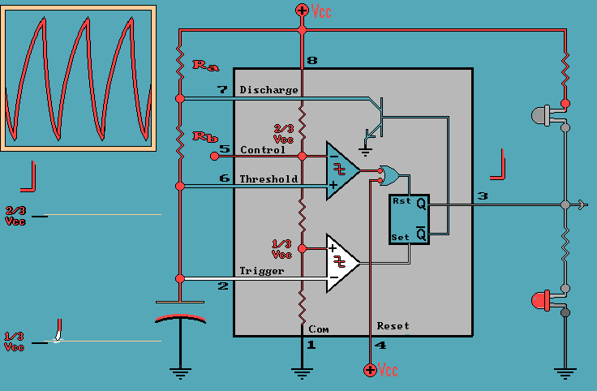

# sesion-03a
## Apuntes
### chip 555

 

Explicacion de gemini: Imagina que el chip 555 es como un vigilante que controla un tanque de agua (el capacitor). Su único trabajo es abrir y cerrar llaves siguiendo dos reglas muy simples:
+ Llenado: Cuando el tanque está casi vacío (llega a 1/3), el vigilante enciende la luz y deja que el agua entre. El agua sube lentamente porque tiene que pasar por unos tubos estrechos (las resistencias).
+ Vaciado: En cuanto el tanque se llena hasta cierto punto (2/3), el vigilante apaga la luz y abre un desagüe para que el agua salga.

Como el desagüe también es un tubo, el tanque tarda un tiempo en vaciarse. Cuando vuelve a estar casi vacío, el vigilante repite el proceso. Al hacerlo una y otra vez sin parar, la luz se prende y se apaga sola, creando ese "latido" constante que hace que el circuito sea astable.

### Velocidad de oscilación

En un circuito astable, la frecuencia de la señal (qué tan rápido ocurre el ciclo) depende directamente de la interacción entre las resistencias y el capacitor. No es un valor fijo, sino una relación de tiempo que se puede calcular y modificar según los componentes elegidos:
+ Capacitor más grande: Tarda más en llenarse y vaciarse, por lo que el parpadeo es más lento (frecuencia baja).
+ Resistencias más grandes: Frenan el paso de corriente, haciendo que el ciclo sea más largo.

### Circuito Astable

Se llama "astable" porque no tiene un estado estable. No se queda ni encendido ni apagado permanentemente; en cambio, oscila.

En esta configuración, el chip funciona como un interruptor automático que se prende y apaga solo, creando una onda cuadrada.

Para que el 555 oscile solo, usamos una combinación de resistencias R y un capacitor C.

**1. Carga:** La corriente pasa por las resistencias y comienza a llenar el capacitor. Mientras el capacitor se carga y su voltaje es bajo, la salida del chip está en ALTO (el LED se enciende).

**2. El límite superior:** Cuando el capacitor se llena y alcanza los 2/3 del voltaje, el chip lo detecta y cambia la salida a BAJO (el LED se apaga).

**3. Descarga:** En ese momento, el chip abre un camino interno (pin 7) para que el capacitor se vacíe a través de una de las resistencias.

**4. El límite inferior:** Cuando el capacitor se vacía y llega a 1/3 del voltaje, el chip vuelve a activar la salida y el ciclo comienza de nuevo.

---
## Encargo 1
### Oscilador de Tonos
​Trabajamos en equipo para armar un circuito con el chip 555, logrando que funcionara a la primera incluso después de agregarle cuatro interruptores extra. Algo curioso que notamos fue que el primer botón funcionaba "al revés": el parlante no paraba de sonar y solo se callaba cuando lo manteníamos presionado. Esto pasa porque, por cómo está conectado en el dibujo, el interruptor corta o deja pasar la corriente que hace vibrar el parlante; mientras no lo tocas, el circuito sigue completando su ciclo y por eso el sonido es constante.

​Al jugar con los otros botones, nos dimos cuenta de que podíamos cambiar las notas musicales que salían del parlante. Cada interruptor que agregamos cambia la facilidad con la que la electricidad fluye por el circuito, lo que hace que el sonido sea más grave o más agudo. Lo más divertido fue que, al apretar varios botones al mismo tiempo, los sonidos se mezclaban y se volvían mucho más agudos. Esto sucede porque la energía viaja más rápido y hace que el parlante vibre con más velocidad, permitiéndonos crear diferentes melodías según la combinación de botones que usemos.

**Aqui algunas imagenes del trabajo**

## Encargo 2
### José Vicente Asuar
​José Vicente Asuar fue una figura única que combinó dos mundos: la ingeniería civil y la composición musical. Esta mezcla fue la que le permitió no solo imaginar sonidos nuevos, sino construir las herramientas para crearlos. En una época donde la música se hacía solo con instrumentos tradicionales (cuerdas, vientos), Asuar entendió que la electricidad podía ser un nuevo lenguaje artístico.

### Obras claves
+ ​Variaciones Espectrales (1958): Es su obra más famosa y un hito para toda Latinoamérica. Fue la primera pieza creada puramente con sonidos sintéticos (generados por máquinas) sin usar instrumentos reales ni micrófonos.
+ El Comdasuar: A finales de los 70, diseñó y fabricó su propio computador dedicado exclusivamente a la música. Lo asombroso es que este aparato ya anticipaba tecnologías que hoy son estándar, como la capacidad de que una computadora central le dé órdenes a otros sintetizadores.
  

Para entender el trabajo de Asuar, el usaba componentes electrónicos básicos: en lugar de una cuerda que vibra, él utilizaba osciladores y chips para generar ondas eléctricas que se transforman en audio al pasar por un altoparlante, mientras que los potenciómetros eran fundamentales en sus paneles para manipular el volumen o el tono en tiempo real.

El documental menciona cómo hoy en día muchos artistas usan el "reciclaje" de componentes electrónicos antiguos para crear música experimental, una filosofía de "hágalo usted mismo" que Asuar practicaba por necesidad y visión.

El documental tiene un aire súper melancólico y humano. Muestra cómo, entre el contexto político de la época y la llegada de los sintetizadores digitales japoneses que inundaron el mercado, el trabajo de Asuar se fue quedando en la sombra.
​Su gran invento, el Comdasuar, terminó arrumbado en una casa de campo como un "tesoro olvidado" hasta que un grupo de investigadores y músicos jóvenes lo rescató del polvo. Este reencuentro es clave porque nos recuerda que la innovación no solo pasa en los países gigantes; aquí en Chile hubo mentes brillantes que, con un cautín en la mano, vieron en las máquinas una verdadera "palanca para la imaginación".

​El video concluye con una reflexión sobre la importancia de rescatar la memoria histórica de la vanguardia chilena, recordando que los avances actuales en música digital tienen sus raíces en el coraje y la experimentación de estos pioneros.

